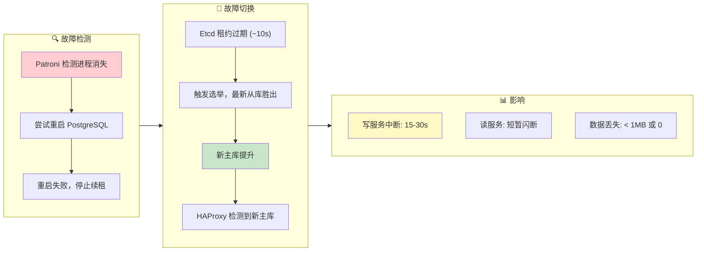
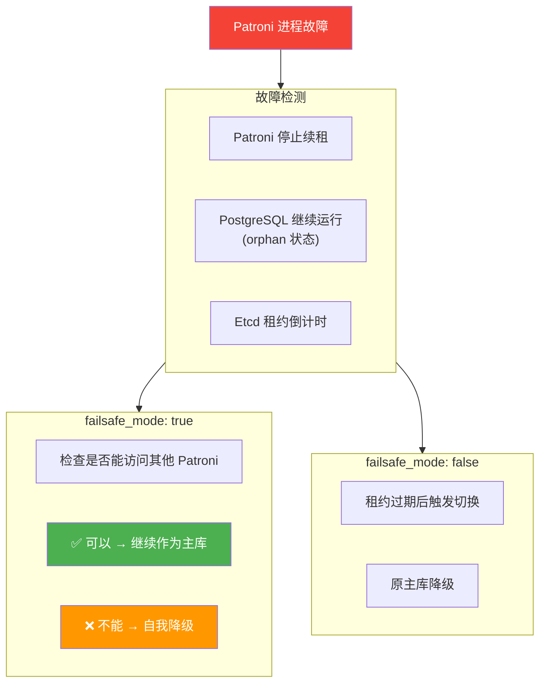
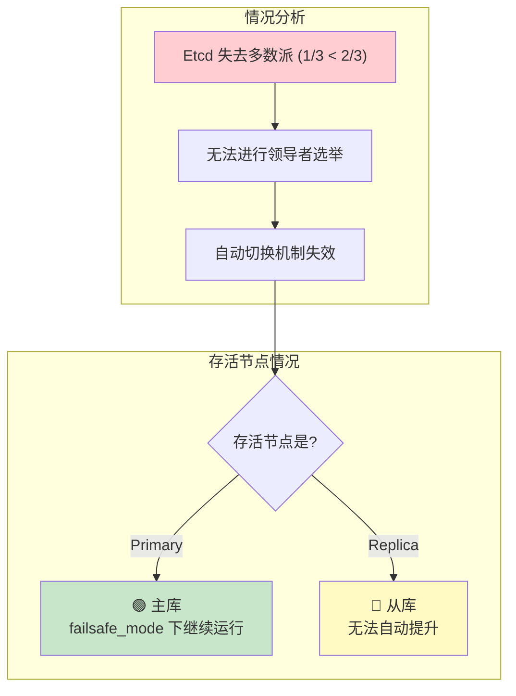
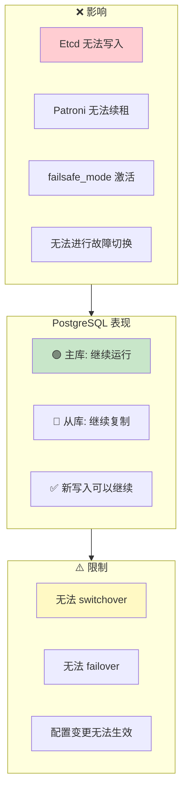
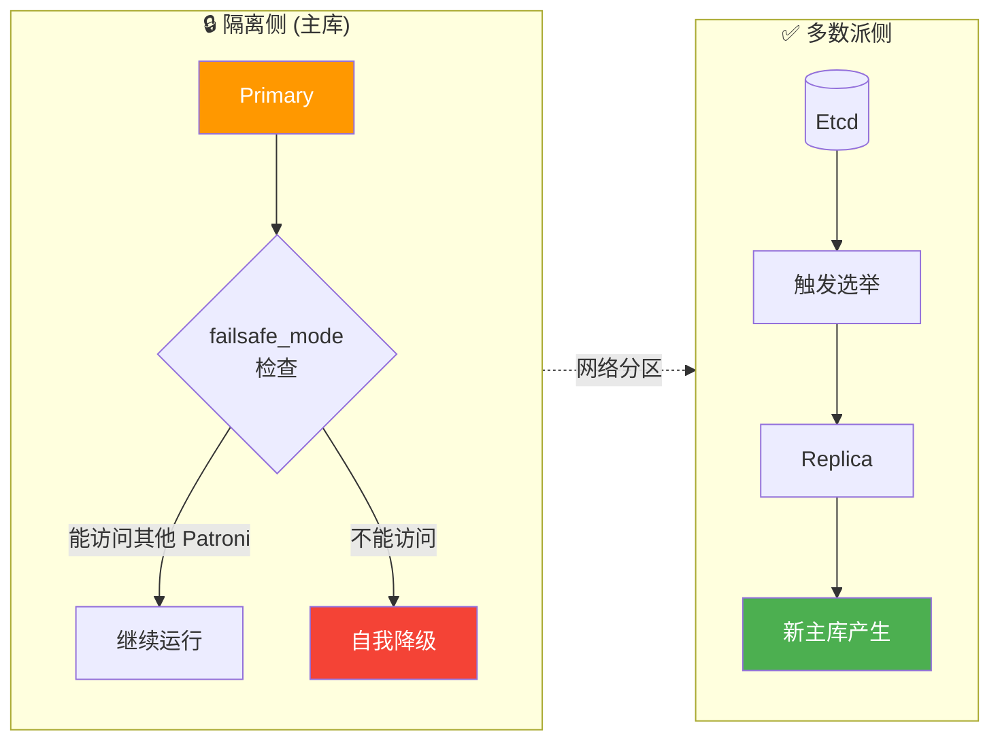

## 故障场景分析

### 单节点故障

#### 主库进程崩溃

**场景**：PostgreSQL 主库进程被 `kill -9` 或发生崩溃



#### Patroni 进程故障

**场景**：Patroni 进程被杀或崩溃



#### 从库故障

**场景**：任意从库节点故障

**影响**：
- 只读流量重新分配到其他从库
- 如果无其他从库，主库承担只读流量
- ✅ 写服务完全不受影响

**恢复**：
- 节点恢复后 Patroni 自动启动
- 自动从主库重新同步
- 恢复为从库角色

-----------------

### 多节点故障

#### 三节点坏两个（2/3 故障）

**场景**：3 节点集群，2 个节点同时故障



**紧急恢复流程**：

```bash
# 1. 确认存活节点状态
patronictl -c /etc/patroni/patroni.yml list

# 2. 如果存活节点是从库，手动提升
pg_ctl promote -D /pg/data

# 3. 或者使用 pg-promote 脚本
/pg/bin/pg-promote

# 4. 修改 HAProxy 配置，直接指向存活节点
# 注释掉健康检查，硬编码路由

# 5. 恢复 Etcd 集群后，重新初始化
```

#### 两节点坏一个（1/2 故障）

**场景**：2 节点集群，主库故障

**问题**：
- Etcd 只有 2 节点，无多数派
- 无法完成选举
- 从库无法自动提升

**解决方案**：
1. 方案 1：添加外部 Etcd 仲裁节点
2. 方案 2：人工介入提升从库
3. 方案 3：使用 Witness 节点

**手动提升步骤**：
1. 确认主库确实不可恢复
2. 停止从库 Patroni：`systemctl stop patroni`
3. 手动提升：`pg_ctl promote -D /pg/data`
4. 直接启动 PostgreSQL：`systemctl start postgres`
5. 更新应用连接串或 HAProxy 配置

-----------------

### Etcd 集群故障

#### Etcd 单节点故障

**场景**：3 节点 Etcd 集群，1 节点故障

**影响**：
- ✅ Etcd 仍有多数派（2/3）
- ✅ 服务正常运行
- ✅ PostgreSQL HA 不受影响

**恢复**：
- 修复故障节点
- 使用 etcd-add 重新加入
- 或替换为新节点

#### Etcd 多数派丢失

**场景**：3 节点 Etcd 集群，2 节点故障



**恢复优先级**：
1. 恢复 Etcd 多数派
2. 验证 PostgreSQL 状态
3. 检查 Patroni 是否正常续租

-----------------

### 网络分区

#### 主库网络隔离

**场景**：主库与 Etcd/其他节点网络不通



**脑裂防护**：
- Patroni failsafe_mode
- 旧主库自我检测
- fencing（可选）
- Watchdog（可选）

#### Watchdog 机制

**用于极端情况下的防护**：

```yaml
watchdog:
  mode: automatic                     # off|automatic|required
  device: /dev/watchdog
  safety_margin: 5                    # 安全边际（秒）
```

**工作原理**：
- Patroni 定期向 watchdog 设备写入
- 如果 Patroni 无响应，内核触发重启
- 确保旧主库不会继续服务
- 防止严重的脑裂场景

-----------------

## 最佳实践

### 生产环境检查清单

**基础设施**：
- [ ] 至少 3 个节点（PostgreSQL）
- [ ] 至少 3 个节点（Etcd，可与 PG 共用）
- [ ] 节点分布在不同故障域（机架/可用区）
- [ ] 网络延迟 < 10ms（同城）或 < 50ms（异地）
- [ ] 万兆网络（推荐）

**参数配置**：
- [ ] `pg_rto` 根据网络状况调整（15-60s）
- [ ] `pg_rpo` 根据业务需求设置（0 或 1MB）
- [ ] `pg_conf` 选择合适的模板（oltp/crit）
- [ ] `patroni_watchdog_mode` 评估是否需要

**监控告警**：
- [ ] Patroni 状态监控（领导者/复制延迟）
- [ ] Etcd 集群健康监控
- [ ] 复制延迟告警（lag > 1MB）
- [ ] failsafe_mode 激活告警

**灾备演练**：
- [ ] 定期执行故障切换演练
- [ ] 验证 RTO/RPO 是否符合预期
- [ ] 测试备份恢复流程
- [ ] 验证监控告警有效性

### 常见问题排查

**故障切换失败**：
```bash
# 检查 Patroni 状态
patronictl -c /etc/patroni/patroni.yml list

# 检查 Etcd 集群健康
etcdctl endpoint health

# 检查复制延迟
psql -c "SELECT * FROM pg_stat_replication"

# 查看 Patroni 日志
journalctl -u patroni -f
```

**脑裂场景处理**：
```bash
# 1. 确认哪个是"真正"的主库
psql -c "SELECT pg_is_in_recovery()"

# 2. 停止"错误"的主库
systemctl stop patroni

# 3. 使用 pg_rewind 同步
pg_rewind --target-pgdata=/pg/data --source-server="host=<true_primary>"

# 4. 重启 Patroni
systemctl start patroni
```

