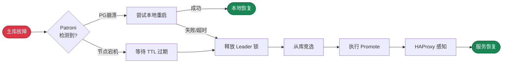

Patroni 故障按故障对象分类可以分为以下 10 类，按照检测路径不同，可以进一步归纳为五类，在本节内详细展开。

| #  | 故障场景          | 描述                  | 最终走哪条路径                 |
|----|---------------|---------------------|-------------------------|
| 1  | PG 进程崩溃       | crash、OOM killed    | **主动检测**                |
| 2  | PG 拒绝连接       | max_connections     | **主动检测**                |
| 3  | PG 假活         | 进程在但无响应             | **主动检测** (检测超时)         |
| 4  | Patroni 进程崩溃  | kill -9、OOM         | **被动检测**                |
| 5  | Patroni 假活    | 进程在但卡住              | **Watchdog**            |
| 6  | 节点宕机          | 断电、硬件故障             | **被动检测**                |
| 7  | 节点假活          | IO hang、CPU 饥饿      | **Watchdog**            |
| 8  | 主库 ↔ DCS 网络中断 | 防火墙、交换机故障           | **网络分区**                |
| 9  | 存储故障          | 磁盘坏、磁盘满、挂载失败        | **主动检测** 或 **Watchdog** |
| 10 | 手动切换          | Switchover/Failover | **手动触发**                |
{.full-width}

但是在 RTO 计算上，最终所有故障都会收敛到两条路径上，本节深入探讨了这两种情况下的 RTO 上下限与均值。

- [**Patroni 失联后被动触发选举**](/docs/concept/ha/failure/passive)：
- [**Patroni 主动检测故障并切换**](/docs/concept/ha/failure/active):

