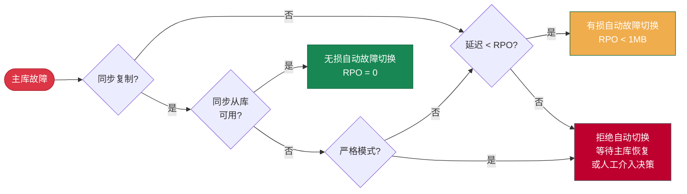

**RPO**（Recovery Point Objective，恢复点目标）定义了在主库发生故障时，**允许丢失的最大数据量**。

对于金融交易这类数据完整性至关重要的场景，通常要求 RPO = 0，即不允许任何数据丢失；

然而更为严格的 RPO 指标是有代价的，它会引入更高的写入延迟，降低系统吞吐量，并且存在从库故障导致主库不可用的风险。
因此对于常规场景，通常可以接受一定量的数据丢失（例如允许丢失不超过 1MB 的数据），以换取更高的可用性与性能。

--------

## 利弊权衡

通常在异步复制场景下，从库和主库之间会存在一定的复制延迟（取决于网络和吞吐量，正常在 10KB-100KB / 100µs-10ms 的数量级），
这意味着当主库发生故障时，从库可能还没有完全同步主库的最新数据。这时候如果出现故障切换，新的主库可能会丢失一些尚未复制的数据。

潜在数据丢失量的上限由 [**`pg_rpo`**](/docs/pgsql/param#pg_rpo) 参数控制，默认为 `1048576` （`1MB`），这意味着在故障转移期间最多可以容忍 1MiB 的数据丢失。

当集群主库宕机时，如果有任何一个从库的复制延迟在这个值以内，Pigsty 将自动提升该从库为新的主库。
然而当所有从库副本的复制延迟都超出这个阈值时，Pigsty 将拒绝进行 [**自动故障切换**] 以避免数据丢失。
此时需要人工介入进行决策 —— 等待主库恢复（可能永远也不会恢复），还是接受数据损失并强制提升一个从库为新的主库。

您需要根据业务的需求偏好配置这个值，在 **可用性** 和 **一致性** 之间进行 **利弊权衡**。
增大这个值可以提高自动故障切换的成功率，但也会增加潜在的数据丢失量上限。

当您指定 [**`pg_rpo`**](/docs/pgsql/param#pg_rpo)  = 0 时，Pigsty 将启用 **同步复制**，确保主库在确认至少一个从库持久化数据后才返回写入成功。
这种配置能确保没有复制延迟，但会带来显著的写入延迟，并降低整体的吞吐量。

-----------------

## 保护模式

Pigsty 提供三种保护模式，以帮助用户在不同的 RPO 要求下进行利弊权衡，类似于 [**Oracle Data Guard**](https://docs.oracle.com/en/database/oracle/oracle-database/21/sbydb/oracle-data-guard-protection-modes.html) 的数据保护模式。

{}
- **默认模式**，异步复制，事务提交仅需本地 WAL 持久化，无需等待从库，从库故障对主库完全透明，不影响服务
- 主库故障时可能丢失尚未发送/接收的 WAL（通常 < 1MB，正常网络条件通常在 10ms/100ms，10KB/100KB 量级）
- 针对性能优化，适用于常规业务场景，容许在故障时损失少量数据。
{}

{}
- 配置有 [**`pg_rpo = 0`**](/docs/pgsql/param#pg_rpo)，启用 Patroni 同步提交模式： `synchronous_mode: true`
- 正常情况下等待至少一个从库确认，实现零数据丢失。当 **所有** 同步从库故障时，**自动降级为异步模式继续服务**
- 兼顾数据安全与服务可用性，是生产环境 **核心业务** 的推荐配置
{}

{}
- 使用 `crit.yml` 模板，启用 Patroni 严格同步模式：`synchronous_mode: true` / `synchronous_mode_strict: true`
- 当所有同步从库故障时，**主库将拒绝写入**以防止数据丢失，事务必须在至少一个从库持久化后才返回成功。
- 适用于金融交易、医疗记录等对数据完整性要求极高的场景
{}

| **名称**     |               **最大性能** Performance               |                  **最大可用** Availability                   |                  **最大保护** Protection                   |
|:-----------|:------------------------------------------------:|:--------------------------------------------------------:|:------------------------------------------------------:|
| **复制方式**   |                     **异步复制**                     |                         **同步复制**                         |                       **严格同步复制**                       |
| **数据丢失**   | **可能丢失**（复制延迟量） |    **正常零丢失，降级少量丢失**    |       **零丢失**        |
| **主库写延迟**  |     **最低**     |    **中等**（+1 次网络往返）    |   **中等**（+1 次网络往返）   |
| **吞吐量**    |     **最高**     |         **降低**         |        **降低**        |
| **从库故障影响** |    **无影响**     |     **自动降级，继续服务**      |       **主库停写**        |
| **RPO**    |   **< 1MB**    | **= 0（正常）/ < 1MB（降级）** |       **= 0**        |
| **适用场景**   |                    常规业务、性能优先                     |                        重要业务、安全优先                         |                      金融核心、安全合规第一                       |
| **配置方法**   |                       默认配置                       |      [**`pg_rpo`**](/docs/pgsql/param#pg_rpo) = `0`      | [**`pg_conf`**](/docs/pgsql/param#pg_conf): `crit.yml` |
{.full-width}

------

## 实现原理

三种保护模式的区别在于 **Patroni** 的两个核心参数：[**`synchronous_mode`**](https://patroni.readthedocs.io/en/latest/replication_modes.html#synchronous-mode) 与 [**`synchronous_mode_strict`**](https://patroni.readthedocs.io/en/latest/replication_modes.html#synchronous-mode) 如何配置：

- **`synchronous_mode`**：Patroni 是否启用同步复制，如果启用，再看 **`synchronous_mode_strict`** 是否启用严格同步模式。
- **`synchronous_mode_strict = false`**，默认配置，允许当从库故障时降级为异步模式，**主库继续服务**（最大可用性）
- **`synchronous_mode_strict = true`**，禁止降级，**主库停止写入**直到同步从库恢复（最大保护）

|    模式    |            **`synchronous_mode`**            |        **`synchronous_mode_strict`**         | 复制模式       | 从库故障行为                                        |
|:--------:|:--------------------------------------------:|:--------------------------------------------:|------------|:----------------------------------------------|
| **最大性能** | **`false`** |                      -                       | **异步复制**   | **无影响**     |
| **最大可用** | **`true`** | **`false`** | **同步复制**   | **自动降级为异步** |
| **最大保护** | **`true`** | **`true`** | **严格同步复制** | **主库拒绝写入**   |
{.full-width}

通常情况下，您只需要将 [**`pg_rpo`**](/docs/pgsql/param#pg_rpo) 参数设置为 `0`，即可打开 `synchronous_mode` 开关，启用 **最大可用性模式**。
如果您使用 [**`pg_conf`**](/docs/pgsql/param#pg_conf) = [**`crit.yml`**](/docs/pgsql/template/crit) 模板，则会同时额外打开 `synchronous_mode_strict` 严格模式开关，启用 **最大保护模式**。

当然，您可以直接按需 [**配置**](/docs/pgsql/admin/patroni#修改配置) 这些 Patroni 参数，您还可以参阅 Patroni 与 PostgreSQL 文档，通过配置实现更强的数据保护，例如：

- 可以指定指定 [**同步从库列表**](/docs/pgsql/config/cluster#法定人数提交)，配置更多同步从库以提高容灾能力，使用法定人数同步，甚至要求所有从库都执行同步提交。
- 您可以 [**配置**](/docs/pgsql/admin/patroni#修改配置) [**`synchronous_commit`**](https://www.postgresql.org/docs/current/runtime-config-wal.html#GUC-SYNCHRONOUS-COMMIT): `'remote_apply'`，严格确保主从读写一致性。（Oracle 最大保护模式相当于 `remote_write`）

------

## 配置建议

**最大性能模式**（异步复制）是 Pigsty 默认使用的模式，对于绝大多数业务来说已经足够使用。
容许故障时丢失少量数据（正常在 几KB - 几百KB 的数量级），换来更大的性能吞吐量与服务可用性水平，是常规业务场景的推荐配置。
在这种情况下，您可以通过 [**`pg_rpo`**](/docs/pgsql/param#pg_rpo) 参数调整允许的最大数据丢失量，以适应不同的业务需求。

**最大可用性模式**（同步复制）适用于对据完整性要求高的场景，不允许数据丢失。
在这种模式下，最少需要一主一从的两节点 PostgreSQL 集群才有意义。
将 [**`pg_rpo`**](/docs/pgsql/param#pg_rpo) 设置为 0 即可启用该模式。

**最大保护模式** （严格同步复制） 适用于金融交易、医疗记录等对数据完整性要求极高的场景，我们建议至少使用一主二从的三节点集群，
因为两节点的情况下，只要从库故障，主库就会停止写入，导致业务不可用，这会降低系统的整体可靠性。而三节点的规格下，如果只有一个从库故障，主库仍然可以继续服务。

