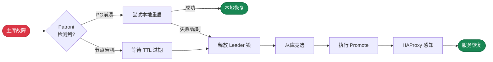

**RTO**（Recovery Time Objective，恢复时间目标）定义了在主库发生故障时，**系统恢复写入能力所需的最长时间**。

对于核心交易系统这类可用性至关重要的场景，通常要求 RTO 尽可能短，例如一分钟内。

然而更短的 RTO 指标是有代价的，它会增加误切风险：网络抖动可能被误判为故障，导致不必要的故障切换。
因此对于跨机房/跨地域部署的场景，通常需要放宽 RTO 要求（例如 1-2 分钟），以降低误切风险。

--------

## 利弊权衡

故障切换时的不可用时长上限由 [**`pg_rto`**](/docs/pgsql/param#pg_rto) 参数控制。Pigsty 提供了四种预设的 RTO 模式：
`fast`、`norm`、`safe`、`wide`，分别针对不同的网络条件与部署场景进行了优化，默认使用 `norm` 模式（约 30 秒）。
您也可以使用秒数直接指定 RTO 上限，系统会自动映射到最接近的模式。

当主库发生故障时，整个恢复流程涉及多个阶段：Patroni 检测故障、DCS 锁过期、新主选举、执行 promote、HAProxy 感知新主。
减小 RTO 意味着缩短各阶段的超时时间，这会使集群对网络抖动更加敏感，从而增加误切风险。

您需要根据实际网络条件选择合适的模式，在 **恢复速度** 与 **误切风险** 之间取得平衡。
网络质量越差，越应该选择保守的模式；网络质量越好，越可以选择激进的模式。




-----------------

## 四种模式

Pigsty 提供四种 RTO 模式，以帮助用户在不同的网络条件下进行利弊权衡。

{}
- 适用于网络延迟极低（< 1ms）且非常稳定的场景，例如同机柜或同交换机部署
- 平均 RTO: **14s**，最坏情况: **29s**，TTL 仅 20s，检测间隔 5s
- 对网络质量要求最高，任何抖动都可能触发切换，**误切风险较高**
{}

{}
- **默认模式**，适用于同机房部署，网络延迟 1-5ms，质量正常，丢包率合理
- 平均 RTO: **21s**，最坏情况: **43s**，TTL 为 30s，提供合理的容错窗口
- 平衡了恢复速度与稳定性，适合绝大多数生产环境
{}

{}
- 适用于同省/同区域跨机房部署，网络延迟 10-50ms，可能存在偶发抖动
- 平均 RTO: **43s**，最坏情况: **91s**，TTL 为 60s，更长的容错窗口
- 主库重启等待时间较长（60s），给予更多本地恢复机会，**误切风险较低**
{}

{}
- 适用于跨地域甚至跨大洲部署，网络延迟 100-200ms，可能有公网级别的丢包率
- 平均 RTO: **92s**，最坏情况: **207s**，TTL 为 120s，极宽的容错窗口
- 牺牲恢复速度换取极低的误切率，适合异地容灾场景
{}

| **名称**     |                 **fast**                  |                 **norm**                  |                 **safe**                  |                 **wide**                  |
|:-----------|:-----------------------------------------:|:-----------------------------------------:|:-----------------------------------------:|:-----------------------------------------:|
| **适用场景**   |                    同机柜                    |                 同机房内（默认）                  |                   同省跨机房                   |                  跨地域/跨洲                   |
| **网络条件**   |                 < 1ms，极稳定                 |                 1-5ms，正常                  |                10-50ms，跨机房                |               100-200ms，公网                |
| **平均 RTO** | <span class="text-success">**14s**</span> | <span class="text-primary">**21s**</span> | <span class="text-warning">**43s**</span> | <span class="text-danger">**92s**</span>  |
| **最坏 RTO** | <span class="text-success">**29s**</span> | <span class="text-primary">**43s**</span> | <span class="text-warning">**91s**</span> | <span class="text-danger">**207s**</span> |
| **误切风险**   |  <span class="text-danger">**较高**</span>  | <span class="text-primary">**中等**</span>  | <span class="text-success">**较低**</span>  | <span class="text-success">**极低**</span>  |
| **配置方法**   |              `pg_rto: fast`               |            `pg_rto: norm`（默认）             |              `pg_rto: safe`               |              `pg_rto: wide`               |
{.full-width}


- **主动检测**：Patroni 存活，但是 PostgreSQL 崩溃
- **被动检测**：
- **手动触发**：


RTO 由多个阶段组成，不同故障场景的恢复时间计算方式不同。以下是三种典型故障场景的 RTO 计算结果：

|      场景      |        Fast        |        Norm        |        Safe        |         Wide         |
|:------------:|:------------------:|:------------------:|:------------------:|:--------------------:|
|              |    最好 / 平均 / 最坏    |    最好 / 平均 / 最坏    |    最好 / 平均 / 最坏    |     最好 / 平均 / 最坏     |
| **A. PG 崩溃** |  4s /   8s /  19s  |  6s /  15s /  33s  |  8s /  42s /  91s  |  17s /  90s / 207s   |
| **B. 节点宕机**  | 11s /  17s /  29s  | 16s /  25s /  43s  | 28s /  45s /  81s  |  57s /  97s / 177s   |
| **C. 网络分区**  |  9s /  16s /  29s  | 16s /  23s /  43s  | 28s /  42s /  81s  |  47s /  90s / 177s   |
|    **综合**    | **4s / 14s / 29s** | **6s / 21s / 43s** | **8s / 43s / 91s** | **17s / 92s / 207s** |
{.full-width}

**场景说明**：

- **A. PG 崩溃**：Patroni 存活但 PostgreSQL 进程崩溃，Patroni 主动检测并尝试本地重启，失败后触发切换。
- **B. 节点宕机**：整个节点或 Patroni 进程宕机，依赖 TTL 过期被动检测，是最常见的故障场景。
- **C. 网络分区**：主库与 DCS 隔离，主库侧主动降级，集群侧等待 TTL 过期后选举新主。

**快速估算公式**：

```bash
# 典型 RTO 估算（节点宕机场景）
RTO_typical ≈ ttl × 0.7 + inter × fall

# 最坏 RTO 上界
RTO_max ≈ ttl + loop_wait + inter × fall + 5s
```


------

## 实现原理

四种 RTO 模式的区别在于 **Patroni** 与 **HAProxy** 的相关参数如何配置。

**Patroni 参数**：

|            参数             | fast | norm | safe | wide |        说明        |
|:-------------------------:|:----:|:----:|:----:|:----:|:----------------:|
|          **ttl**          |  20  |  30  |  60  | 120  | Leader 锁生存时间（秒）  |
|       **loop_wait**       |  5   |  5   |  10  |  30  |   HA 循环检查间隔（秒）   |
|     **retry_timeout**     |  5   |  10  |  20  |  30  |  DCS 操作重试超时（秒）   |
| **primary_start_timeout** |  5   |  15  |  60  | 120  |   主库重启等待时间（秒）    |
|     **safety_margin**     |  5   |  5   |  10  |  15  | Watchdog 安全边际（秒） |
{.full-width}

- **ttl**：Leader 锁的生存时间。主库必须在此时间内续租，否则锁过期，触发新选举。此值直接影响故障检测速度。
- **loop_wait**：Patroni 主循环间隔。每个循环执行一次健康检查与状态同步，影响故障发现的及时性。
- **retry_timeout**：DCS（Etcd）操作的重试超时。网络短暂中断不超过此时间，主库不会主动降级。
- **primary_start_timeout**：主库进程崩溃后，Patroni 尝试本地重启的等待时间。超时后才会触发故障切换。

**HAProxy 参数**：

|      参数       | fast  | norm | safe | wide |        说明        |
|:-------------:|:-----:|:----:|:----:|:----:|:----------------:|
|   **inter**   |  1s   |  2s  |  3s  |  5s  |     正常状态检查间隔     |
| **fastinter** | 500ms |  1s  |  1s  |  2s  |    状态变化期检查间隔     |
| **downinter** |  1s   |  2s  |  2s  |  5s  |   DOWN 状态检查间隔    |
|   **rise**    |   2   |  2   |  2   |  3   |  标记 UP 所需连续成功次数  |
|   **fall**    |   2   |  3   |  3   |  5   | 标记 DOWN 所需连续失败次数 |
{.full-width}

- **inter × fall** = HAProxy 感知故障的延迟（T_haproxy_down）
- **inter × rise** = HAProxy 感知恢复的延迟（T_haproxy_up）

通常情况下，您只需要将 [**`pg_rto`**](/docs/pgsql/param#pg_rto) 参数设置为模式名称即可，Pigsty 会自动配置相应的 Patroni 与 HAProxy 参数。
当然，您也可以直接按需 [**配置**](/docs/pgsql/admin/patroni#修改配置) 这些参数。


------

## 配置建议

**fast 模式** 适用于对 RTO 要求极高的场景，但需要确保网络质量足够好（延迟 < 1ms，极低丢包率）。
建议仅在同机柜或同交换机部署时使用，并在生产环境充分测试后再启用。

**norm 模式**（**默认**）是 Pigsty 默认使用的配置，对于绝大多数同机房部署的业务来说已经足够使用。
平均 21 秒的恢复时间在可接受范围内，同时提供了合理的容错窗口，避免网络抖动导致的误切。

**safe 模式** 适用于同城跨机房部署，网络延迟较高或存在偶发抖动的场景。
更长的容错窗口可以有效避免网络抖动导致的误切，是跨机房容灾的推荐配置。

**wide 模式** 适用于跨地域甚至跨大洲部署，网络延迟高且可能存在公网级别的丢包率。
这种场景下，稳定性比恢复速度更重要，因此使用极宽的容错窗口来确保极低的误切率。

| 场景         | 推荐模式 | 理由            |
|:-----------|:-----|:--------------|
| 开发/测试环境    | fast | 快速反馈，误切影响小    |
| 同机房生产环境    | norm | 默认选择，平衡性好     |
| 同城双活/跨机房容灾 | safe | 容忍网络抖动，降低误切   |
| 异地容灾/跨国部署  | wide | 适应高延迟公网，极低误切率 |
| 网络质量不确定    | safe | 保守选择，避免误切     |
{.full-width}


------

## 兼容性

为了向后兼容，[**`pg_rto`**](/docs/pgsql/param#pg_rto) 参数也支持直接指定秒数，系统会自动映射到最接近的模式：

| pg_rto 值 | 映射模式 |
|:---------|:-----|
| < 30     | fast |
| 30-44    | norm |
| 45-89    | safe |
| ≥ 90     | wide |

```yaml
# 以下两种写法等效
pg_rto: norm
pg_rto: 30
```

建议使用模式名称而非秒数，更清晰地表达配置意图。


