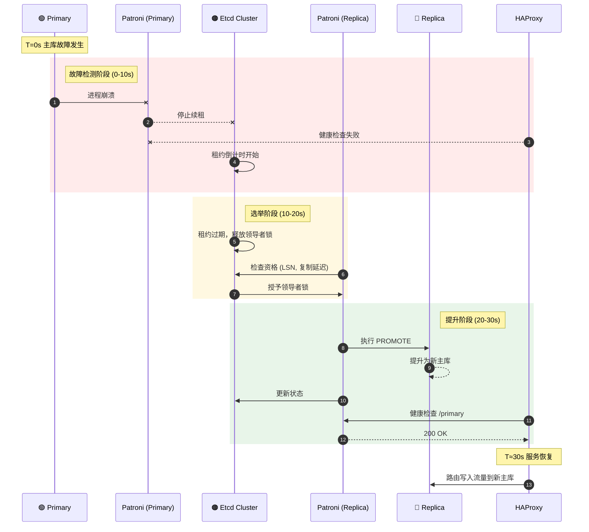

## 概览

**故障恢复时间目标**（**RTO**）与 **数据恢复点目标**（**RPO**）是高可用集群设计时需要仔细进行利弊权衡的两个参数。

* **RTO**（Recovery Time Objective，恢复时间目标）定义了在主库发生故障时，**系统恢复写入能力所需的最长时间**。
* **RPO**（Recovery Point Objective，恢复点目标）定义了在主库发生故障时，**允许丢失的最大数据量**。

Pigsty 使用的 **RTO** 与 **RPO** 默认值满足绝大多数场景下的可靠性要求，您可以根据您的硬件水平，网络质量，业务需求进行调整。

{}
过小的 RTO 将增大误报几率，过小的 RPO 将降低成功自动切换的概率。两者均需要付出性能作为代价。
{}

故障切换时的不可用时长上限由 [**`pg_rto`**](/docs/pgsql/param#pg_rto) 参数控制，**RTO** 默认值为 `30s`，增大它将导致更长的主库故障转移写入不可用时长，而减少它将增加误报故障转移率（例如，由短暂网络抖动导致的反复切换）。

潜在数据丢失量的上限由 [**`pg_rpo`**](/docs/pgsql/param#pg_rpo) 参数控制，默认为 `1MB`，减小这个值可以降低故障切换时的数据损失上限，但也会增加故障时因为从库不够健康（落后太久）而拒绝自动切换的概率。


-----------

## 参数解释

### [**`pg_rto`**](/docs/pgsql/param#pg_rto)

以秒为单位的恢复时间目标（RTO），默认为 `30` 秒，意味着可以预期主库能在故障后 30 秒内恢复写入能力。

如果主实例在这么长时间内失踪，将触发新的领导者选举，此值并非越低越好，它涉及到利弊权衡：
减小这个值可以减少集群故障转移期间的不可用时间（无法写入）， 但会使集群对短期网络抖动更加敏感，从而增加误报触发故障转移的几率。
您需要根据网络状况和业务约束来配置这个值，在 **故障几率** 和 **故障影响** 之间做出**权衡**。


### [**`pg_rpo`**](/docs/pgsql/param#pg_rpo)

以字节为单位的恢复点目标（RPO），默认值：`1048576`，即 1MiB，这意味着在故障转移期间最多可以容忍 1MiB 的数据丢失。

当主节点宕机并且所有副本都滞后时，你必须做出一个艰难的选择：
是马上提升一个从库成为新的主库，付出可接受的数据丢失代价（例如，少于 1MB），并尽快将系统恢复服务。
还是等待主库重新上线（可能永远不会）以避免任何数据丢失，或放弃自动故障切换，等人工介入作出最终决策。
您需要根据业务的需求偏好配置这个值，在 **可用性** 和 **一致性** 之间进行 **利弊权衡**。

此外，您始终可以通过启用同步提交（例如：使用 `crit.yml` 模板），通过牺牲集群一部分延迟/吞吐性能来强制确保 RPO = 0。


-----------------

## 保护模式

关于 RPO （数据丢失）的利弊权衡，可以参考 Oracle Data Guard 的三种保护模式设计理念。

Oracle Data Guard 提供三种保护模式，PostgreSQL 也可以通过配置实现这三种经典的高可用切换策略。

**最大性能（Maximum Performance）**
- 默认模式，使用 `crit.yml` 之外的 Patroni 配置模板，Patroni `synchronous_mode: false`，不启用同步复制
- 事务提交仅需本地 WAL 持久化，无需等待从库，从库故障对主库完全透明，不影响服务
- 主库故障时可能丢失尚未发送/接收的 WAL（通常 < 1MB，正常网络条件通常在 10ms/100ms，10KB/100KB 量级）
- 针对性能优化，适用于常规业务场景，容许在故障时损失少量数据。

**最大可用性（Maximum Availability）**
- Pigsty 使用 `crit.yml` 模板，配置有 `synchronous_mode: true` + `synchronous_mode_strict: false`
- 正常情况下等待至少一个从库确认，实现零数据丢失。当 **所有** 同步从库故障时，**自动降级为异步模式继续服务**
- 兼顾数据安全与服务可用性，是生产环境核心业务的推荐配置

**最大保护（Maximum Protection）**
- Pigsty 使用 `crit.yml` 模板，启用 Patroni `synchronous_mode: true` 并进一步配置为严格同步模式。
- 配置 `synchronous_mode_strict: true`，当所有同步从库故障时，**主库将拒绝写入**以防止数据丢失
- 可以配置 `synchronous_commit: 'remote_apply'`，确保读写一致性。
- 事务必须在至少一个从库持久化后才返回成功，可以指定指定同步从库列表，配置更多同步从库以提高容灾能力
- 适用于金融交易、医疗记录等对数据完整性要求极高的场景


| 维度            | 最大性能                                             | 最大可用性                                                    | 最大保护                                               |
|:--------------|:-------------------------------------------------|:---------------------------------------------------------|:---------------------------------------------------|
| **名称**        | Maximum Performance                              | Maximum Availability                                     | Maximum Protection                                 |
| **复制方式**      | <span class="text-warning">**异步**</span>         | <span class="text-success">**同步**</span>                 | <span class="text-success">**同步**</span>           |
| **数据丢失**      | <span class="text-danger">**可能丢失**</span>（复制延迟量） | <span class="text-primary">**正常零丢失，降级少量丢失**</span>       | <span class="text-success">**零丢失**</span>          |
| **主库写延迟**     | <span class="text-success">**最低**</span>         | <span class="text-warning">**中等**</span>（+1 次网络往返）       | <span class="text-warning">**中等**</span>（+1 次网络往返） |
| **吞吐量**       | <span class="text-success">**最高**</span>         | <span class="text-warning">**较低**</span>                 | <span class="text-danger">**较低**</span>            |
| **从库故障影响**    | <span class="text-success">**无影响**</span>        | <span class="text-primary">**自动降级，继续服务**</span>          | <span class="text-danger">**主库停写**</span>          |
| **RPO**       | <span class="text-warning">**< 1MB**</span>      | <span class="text-primary">**= 0（正常）/ < 1MB（降级）**</span> | <span class="text-success">**= 0**</span>          |
| **适用场景**      | 常规业务、性能优先                                        | 重要业务、安全优先                                                | 金融核心、安全合规第一                                        |
| **Pigsty 配置** | 默认配置                                             | `pg_conf: crit.yml`                                      | `pg_conf: crit.yml` + 严格模式                         |
{.full-width}

三种模式的区别在于 **Patroni** 的两个核心参数：[**`synchronous_mode`**](https://patroni.readthedocs.io/en/latest/replication_modes.html#synchronous-mode) 与 [**`synchronous_mode_strict`**](https://patroni.readthedocs.io/en/latest/replication_modes.html#synchronous-mode) 如何配置

- **`synchronous_mode`**：Patroni 是否启用同步复制，如果启用，再看 **`synchronous_mode_strict`** 是否启用严格同步模式。
- **`synchronous_mode_strict = false`**，默认配置，允许当从库故障时降级为异步模式，**主库继续服务**（最大可用性）
- **`synchronous_mode_strict = true`**，禁止降级，**主库停止写入**直到同步从库恢复（最大保护）

| 模式        |            **`synchronous_mode`**            |        **`synchronous_mode_strict`**         | 从库故障行为                                        |
|:----------|:--------------------------------------------:|:--------------------------------------------:|:----------------------------------------------|
| **最大性能**  | <span class="text-danger">**`false`**</span> |                      -                       | <span class="text-success">**无影响**</span>     |
| **最大可用性** | <span class="text-success">**`true`**</span> | <span class="text-danger">**`false`**</span> | <span class="text-primary">**自动降级为异步**</span> |
| **最大保护**  | <span class="text-success">**`true`**</span> | <span class="text-success">**`true`**</span> | <span class="text-danger">**主库拒绝写入**</span>   |
{.full-width}


Pigsty 默认使用**可用性优先**模式，这意味着当主库故障时，它将尽快进行故障转移，尚未复制到从库的数据可能会丢失（常规万兆网络下，复制延迟在通常在几KB到100KB）。
如果您需要确保故障切换时不丢失任何数据，您可以使用 [**`crit.yml`**](/docs/pgsql/param#pg_conf) 模板使用一致性优先模式，来确保在故障转移期间没有数据丢失，但这会牺牲一些性能（延迟/吞吐量）作为代价。

**最大保护** 模式需要额外配置 `synchronous_mode_strict: true`，在从库全部故障时会导致主库停止写入服务！请确保至少有 **两个同步从库**，或接受这一风险后再启用此模式。


-----------------

## 故障切换时序

关于 RTO （故障恢复时长）的利弊权衡，可以通过下面的 Patroni 故障检测与切换时序图进行分析。

**恢复时间目标（RTO）** 由多个阶段组成：

```mermaid
gantt
    title RTO 时间分解 (默认配置 pg_rto=30s)
    dateFormat ss
    axisFormat %S秒

    section 故障检测
    Patroni 检测/停止续租    :a1, 00, 10s

    section 选举阶段
    Etcd 租约过期           :a2, after a1, 2s
    候选者竞选 (比较 LSN)    :a3, after a2, 3s

    section 提升阶段
    执行 promote            :a4, after a3, 3s
    更新 Etcd 状态          :a5, after a4, 2s

    section 流量切换
    HAProxy 检测新主库      :a6, after a5, 5s
    HAProxy 确认 (rise)     :a7, after a6, 3s
    服务恢复                :milestone, after a7, 0s
```




| 参数          | 影响                              | 调优建议            |
|:------------|:--------------------------------|:----------------|
| `pg_rto`    | TTL/loop_wait/retry_timeout 的基准 | 网络稳定可减小到 15-20s |
| `ttl`       | 故障检测时间窗口                        | = pg_rto        |
| `loop_wait` | Patroni 检查间隔                    | = pg_rto / 3    |
| `inter`     | HAProxy 健康检查间隔                  | 可减小到 1-2s       |
| `fall`      | 故障判定次数                          | 可减小到 2          |
| `rise`      | 恢复判定次数                          | 可减小到 2          |

当主库发生故障时，系统经历以下阶段：



**关键时序公式**：

```
RTO ≈ TTL + Election_Time + Promote_Time + HAProxy_Detection

其中：
- TTL = pg_rto (默认 30s)
- Election_Time ≈ 1-2s
- Promote_Time ≈ 1-5s
- HAProxy_Detection = fall × inter + rise × fastinter ≈ 12s

实际 RTO 通常在 15-40s 之间，取决于：
- 网络延迟
- 从库 WAL 回放进度
- PostgreSQL 恢复速度
```


