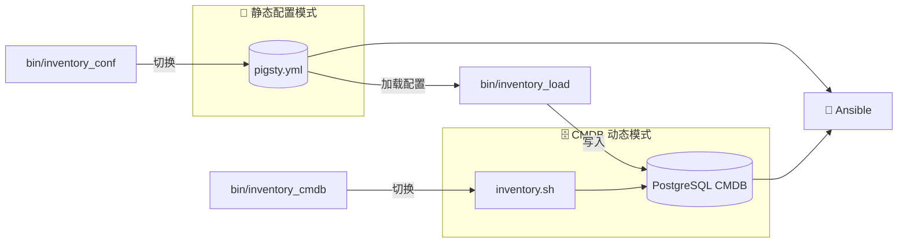

Pigsty 允许您使用 PostgreSQL **元数据库** 作为动态配置源，取代静态的 YAML 配置文件，实现更强大的配置管理能力。

------

## 概览

**CMDB**（Configuration Management Database，配置管理数据库）是一种将配置信息存储在数据库中进行管理的方式。

在 Pigsty 中，默认的配置源是一个静态 YAML 文件 `pigsty.yml`，
它作为 Ansible 的 [**配置清单**](/docs/concept/iac/inventory/) 使用。

这种方式简单直接，但当基础设施规模扩大、需要复杂精细的管理与外部集成时，单一的静态文件难以满足需求。

|    特性    | 静态 YAML 文件    | CMDB 元数据库            |
|:--------:|:--------------|:---------------------|
| **查询能力** | 手工搜索/grep     | SQL 任意条件查询，聚合分析      |
| **版本控制** | 依赖 Git 或手工备份  | 数据库事务，审计日志，时间旅行快照    |
| **权限控制** | 文件系统权限，粗粒度    | PostgreSQL 数据库精细访问控制 |
| **并发编辑** | 需要锁文件或合并冲突    | 数据库事务天然支持并发          |
| **外部集成** | 需要解析 YAML     | 标准 SQL 接口，任意语言轻松对接   |
| **规模扩展** | 文件过大时难以维护     | 管理规模伸缩至物理极限          |
| **动态生成** | 静态文件，修改后需手动应用 | 即时生效，实时反映配置变更        |

Pigsty 在样板数据库 [**`pg-meta.meta`**](https://github.com/pgsty/pigsty/blob/main/conf/meta.yml#L52) 的模式基线定义中，提供了 Pigsty CMDB 的数据库模式。


-----------------

## 工作原理

CMDB 的核心思想是用一个 **动态脚本** 替换静态配置文件。
Ansible 支持使用可执行脚本作为配置清单，只要脚本输出符合 JSON 格式的清单数据即可。
当您启用 CMDB 后，Pigsty 会创建一个名为 `inventory.sh` 的动态清单脚本：

```bash
#!/bin/bash
psql ${METADB_URL} -AXtwc 'SELECT text FROM pigsty.inventory;'
```

这个脚本的作用很简单：每次 Ansible 需要读取配置清单时，它会从 PostgreSQL 数据库的 `pigsty.inventory` 视图中查询配置数据，并以 JSON 格式返回。

整体架构如下：




-----------------

## 数据模型

CMDB 的数据库模式定义在 [`files/cmdb.sql`](https://github.com/pgsty/pigsty/blob/main/files/cmdb.sql) 文件中，所有对象都位于 `pigsty` 模式下。

### 核心数据表

| 表名 | 说明 | 主键 |
|:---:|:---|:---:|
| `pigsty.group` | 集群/分组定义，对应 Ansible 的 group | `cls` |
| `pigsty.host` | 主机定义，属于某个分组 | `(cls, ip)` |
| `pigsty.global_var` | 全局变量，对应 `all.vars` | `key` |
| `pigsty.group_var` | 分组变量，对应 `all.children.<cls>.vars` | `(cls, key)` |
| `pigsty.host_var` | 主机变量，对应主机级别的变量 | `(cls, ip, key)` |
| `pigsty.default_var` | 默认变量定义，存储参数的元信息 | `key` |
| `pigsty.job` | 作业记录表，记录执行的任务 | `id` |

### 表结构详解

**集群表 `pigsty.group`**

```sql
CREATE TABLE pigsty.group (
    cls     TEXT PRIMARY KEY,        -- 集群名称，主键
    ctime   TIMESTAMPTZ DEFAULT now(), -- 创建时间
    mtime   TIMESTAMPTZ DEFAULT now()  -- 修改时间
);
```

**主机表 `pigsty.host`**

```sql
CREATE TABLE pigsty.host (
    cls    TEXT NOT NULL REFERENCES pigsty.group(cls),  -- 所属集群
    ip     INET NOT NULL,                               -- 主机 IP 地址
    ctime  TIMESTAMPTZ DEFAULT now(),
    mtime  TIMESTAMPTZ DEFAULT now(),
    PRIMARY KEY (cls, ip)
);
```

**全局变量表 `pigsty.global_var`**

```sql
CREATE TABLE pigsty.global_var (
    key   TEXT PRIMARY KEY,           -- 变量名
    value JSONB NULL,                 -- 变量值（JSON 格式）
    mtime TIMESTAMPTZ DEFAULT now()   -- 修改时间
);
```

**分组变量表 `pigsty.group_var`**

```sql
CREATE TABLE pigsty.group_var (
    cls   TEXT NOT NULL REFERENCES pigsty.group(cls),
    key   TEXT NOT NULL,
    value JSONB NULL,
    mtime TIMESTAMPTZ DEFAULT now(),
    PRIMARY KEY (cls, key)
);
```

**主机变量表 `pigsty.host_var`**

```sql
CREATE TABLE pigsty.host_var (
    cls   TEXT NOT NULL,
    ip    INET NOT NULL,
    key   TEXT NOT NULL,
    value JSONB NULL,
    mtime TIMESTAMPTZ DEFAULT now(),
    PRIMARY KEY (cls, ip, key),
    FOREIGN KEY (cls, ip) REFERENCES pigsty.host(cls, ip)
);
```


### 核心视图

CMDB 提供了一系列视图，用于查询和展示配置数据：

| 视图名 | 说明 |
|:---:|:---|
| `pigsty.inventory` | **核心视图**：生成 Ansible 动态清单 JSON |
| `pigsty.raw_config` | 原始配置的 JSON 格式展示 |
| `pigsty.global_config` | 全局配置视图，合并默认值和全局变量 |
| `pigsty.group_config` | 分组配置视图，包含主机列表和分组变量 |
| `pigsty.host_config` | 主机配置视图，合并分组和主机级别变量 |
| `pigsty.pg_cluster` | PostgreSQL 集群视图 |
| `pigsty.pg_instance` | PostgreSQL 实例视图 |
| `pigsty.pg_database` | PostgreSQL 数据库定义视图 |
| `pigsty.pg_users` | PostgreSQL 用户定义视图 |
| `pigsty.pg_service` | PostgreSQL 服务定义视图 |
| `pigsty.pg_hba` | PostgreSQL HBA 规则视图 |
| `pigsty.pg_remote` | 远程 PostgreSQL 实例视图 |

**`pigsty.inventory`** 是最核心的视图，它将数据库中的配置数据转换为 Ansible 所需的 JSON 格式：

```sql
SELECT text FROM pigsty.inventory;
```


-----------------

## 工具脚本

Pigsty 提供了三个便利脚本来管理 CMDB：

| 脚本 | 功能 |
|:---:|:---|
| [`bin/inventory_load`](https://github.com/pgsty/pigsty/blob/main/bin/inventory_load) | 将 YAML 配置文件加载到 PostgreSQL 数据库中 |
| [`bin/inventory_cmdb`](https://github.com/pgsty/pigsty/blob/main/bin/inventory_cmdb) | 切换配置源为 CMDB（动态清单脚本） |
| [`bin/inventory_conf`](https://github.com/pgsty/pigsty/blob/main/bin/inventory_conf) | 切换配置源为静态配置文件 `pigsty.yml` |


### inventory_load

将 YAML 配置文件解析并导入到 CMDB 中：

```bash
bin/inventory_load                     # 加载默认的 pigsty.yml 到默认 CMDB
bin/inventory_load -p /path/to/conf.yml  # 指定配置文件路径
bin/inventory_load -d "postgres://..."   # 指定数据库连接 URL
bin/inventory_load -n myconfig           # 指定配置名称
```

脚本会执行以下操作：

1. 清空 `pigsty` 模式中的现有数据
2. 解析 YAML 配置文件
3. 将全局变量写入 `global_var` 表
4. 将集群定义写入 `group` 表
5. 将集群变量写入 `group_var` 表
6. 将主机定义写入 `host` 表
7. 将主机变量写入 `host_var` 表

**环境变量**

- `PIGSTY_HOME`：Pigsty 安装目录，默认为 `~/pigsty`
- `METADB_URL`：数据库连接 URL，默认为 `service=meta`


### inventory_cmdb

切换 Ansible 使用 CMDB 作为配置源：

```bash
bin/inventory_cmdb
```

脚本会执行以下操作：

1. 创建动态清单脚本 `${PIGSTY_HOME}/inventory.sh`
2. 修改 `ansible.cfg` 将 `inventory` 设置为 `inventory.sh`

生成的 `inventory.sh` 内容如下：

```bash
#!/bin/bash
psql ${METADB_URL} -AXtwc 'SELECT text FROM pigsty.inventory;'
```


### inventory_conf

切换回使用静态 YAML 配置文件：

```bash
bin/inventory_conf
```

脚本会修改 `ansible.cfg` 将 `inventory` 设置回 `pigsty.yml`。


-----------------

## 使用流程

### 首次启用 CMDB

1. **初始化 CMDB 模式**（通常在安装 Pigsty 时已自动完成）：

```bash
psql -f ~/pigsty/files/cmdb.sql
```

2. **加载配置到数据库**：

```bash
bin/inventory_load
```

3. **切换到 CMDB 模式**：

```bash
bin/inventory_cmdb
```

4. **验证配置**：

```bash
ansible all --list-hosts          # 列出所有主机
ansible-inventory --list          # 查看完整清单
```


### 查询配置

启用 CMDB 后，您可以使用 SQL 灵活查询配置：

```sql
-- 查看所有集群
SELECT cls FROM pigsty.group;

-- 查看某集群的所有主机
SELECT ip FROM pigsty.host WHERE cls = 'pg-meta';

-- 查看全局变量
SELECT key, value FROM pigsty.global_var;

-- 查看某集群的变量
SELECT key, value FROM pigsty.group_var WHERE cls = 'pg-meta';

-- 查看所有 PostgreSQL 集群
SELECT cls, name, pg_databases, pg_users FROM pigsty.pg_cluster;

-- 查看所有 PostgreSQL 实例
SELECT cls, ins, ip, seq, role FROM pigsty.pg_instance;

-- 查看所有数据库定义
SELECT cls, datname, owner, encoding FROM pigsty.pg_database;

-- 查看所有用户定义
SELECT cls, name, login, superuser FROM pigsty.pg_users;
```


### 修改配置

您可以直接通过 SQL 修改配置：

```sql
-- 添加新集群
INSERT INTO pigsty.group (cls) VALUES ('pg-new');

-- 添加集群变量
INSERT INTO pigsty.group_var (cls, key, value)
VALUES ('pg-new', 'pg_cluster', '"pg-new"');

-- 添加主机
INSERT INTO pigsty.host (cls, ip) VALUES ('pg-new', '10.10.10.20');

-- 添加主机变量
INSERT INTO pigsty.host_var (cls, ip, key, value)
VALUES ('pg-new', '10.10.10.20', 'pg_seq', '1'),
       ('pg-new', '10.10.10.20', 'pg_role', '"primary"');

-- 修改全局变量
UPDATE pigsty.global_var SET value = '"new-value"' WHERE key = 'some_param';

-- 删除集群（级联删除主机和变量）
DELETE FROM pigsty.group WHERE cls = 'pg-old';
```

修改后立即生效，无需重新加载或重启任何服务。


### 切换回静态配置

如需切换回静态配置文件模式：

```bash
bin/inventory_conf
```


-----------------

## 高级用法

### 配置导出

将 CMDB 中的配置导出为 YAML 格式：

```bash
psql service=meta -AXtwc "SELECT jsonb_pretty(jsonb_build_object('all', jsonb_build_object('children', children, 'vars', vars))) FROM pigsty.raw_config;"
```

或者使用 `ansible-inventory` 命令：

```bash
ansible-inventory --list --yaml > exported_config.yml
```


### 配置审计

利用 `mtime` 字段追踪配置变更：

```sql
-- 查看最近修改的全局变量
SELECT key, value, mtime FROM pigsty.global_var
ORDER BY mtime DESC LIMIT 10;

-- 查看某时间点之后的变更
SELECT * FROM pigsty.group_var
WHERE mtime > '2024-01-01'::timestamptz;
```


### 与外部系统集成

CMDB 使用标准 PostgreSQL，可以轻松与其他系统集成：

- **Web 管理界面**：通过 REST API（如 PostgREST）暴露配置数据
- **CI/CD 流水线**：在部署脚本中直接读写数据库
- **监控告警**：基于配置数据生成监控规则
- **ITSM 系统**：与企业 CMDB 系统同步


-----------------

## 注意事项

1. **数据一致性**：修改配置后，需要重新执行相应的 Ansible 剧本才能将变更应用到实际环境

2. **备份**：CMDB 中的配置数据非常重要，请确保定期备份

3. **权限**：建议为 CMDB 配置适当的数据库访问权限，避免误操作

4. **事务**：批量修改配置时，建议在事务中进行，以便出错时回滚

5. **连接池**：`inventory.sh` 脚本每次执行都会建立新连接，如果 Ansible 执行频繁，建议考虑使用连接池


-----------------

## 小结

CMDB 是 Pigsty 配置管理的高级方案，适用于需要管理大量集群、复杂查询、外部集成或精细权限控制的场景。通过将配置数据存储在 PostgreSQL 中，您可以充分利用数据库的强大能力来管理基础设施配置。

|      功能      |           说明           |
|:------------:|:----------------------:|
|   **数据存储**   | PostgreSQL `pigsty` 模式 |
|   **动态清单**   |   `inventory.sh` 脚本    |
|   **配置加载**   |  `bin/inventory_load`  |
| **切换到 CMDB** |  `bin/inventory_cmdb`  |
| **切换到 YAML** |  `bin/inventory_conf`  |
|   **核心视图**   |   `pigsty.inventory`   |
