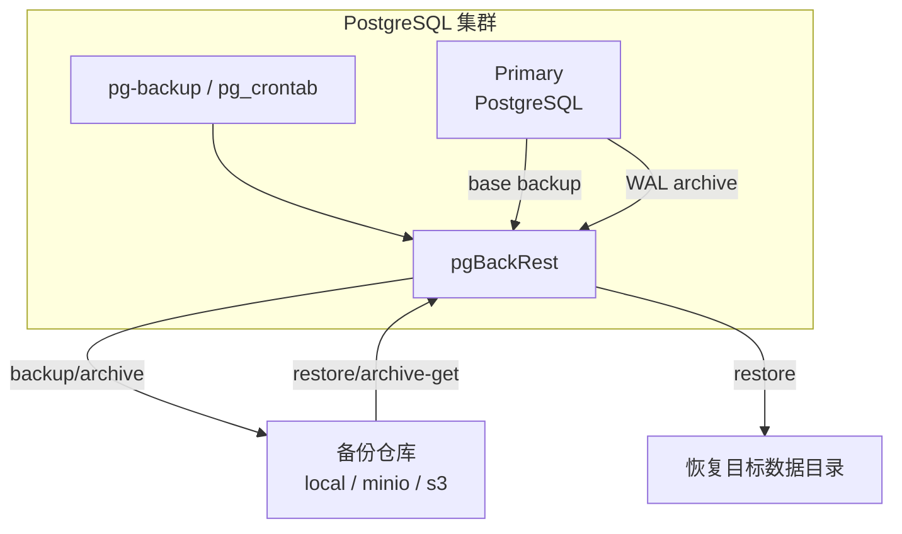

Pigsty 使用 [**pgBackRest**](https://pgbackrest.org/) 作为 PostgreSQL 备份与恢复引擎，提供开箱即用的时间点恢复（PITR）能力。

本文从架构层面说明：**备份由谁执行、数据流向哪里、仓库如何组织、故障切换后如何保持连续性**。


--------

## 概览

PITR 架构由三条主线构成：**备份执行链路**、**WAL 归档链路**、**恢复执行链路**。

| 链路       | 入口                                 | 引擎                              | 终点                              |
|:-----------|:--------------------------------------|:----------------------------------|:----------------------------------|
| 备份       | `pg-backup` + `pg_crontab`            | `pgbackrest backup`               | 备份仓库 `backup/`                |
| WAL 归档   | PostgreSQL `archive_command`          | `pgbackrest archive-push`         | 备份仓库 `archive/`               |
| 恢复       | `pg_pitr` / `pg-pitr` / `pgsql-pitr.yml` | `pgbackrest restore`              | 目标数据目录                      |
{.full-width}

更多执行细节见 [**备份机制**](/docs/pgsql/backup/mechanism/) 与 [**恢复操作**](/docs/pgsql/backup/restore/)。


--------

## 组件与职责

| 组件                     | 角色       | 描述                                                                 |
|:-------------------------|:-----------|:---------------------------------------------------------------------|
| **PostgreSQL**           | 数据源     | 产生数据文件与 WAL 归档流                                             |
| **pgBackRest**           | 备份引擎   | 执行备份、接收/拉取 WAL、执行恢复                                     |
| **pg-backup**            | 备份入口   | Pigsty 封装脚本，执行 `pgbackrest backup`                              |
| **pg_pitr / pg-pitr**    | 恢复入口   | Pigsty 封装参数/脚本，执行 `pgbackrest restore`                        |
| **备份仓库**             | 存储后端   | 保存 `backup/` 与 `archive/`，支持 `local` / `minio` / `s3` 等仓库      |
| **pgbackrest_exporter**  | 监控输出   | 导出备份状态指标，默认监听 `9854` 端口                                |
{.full-width}


--------

## 数据流



要点：

- **备份** 由 `pg-backup` 触发，执行 `pgbackrest backup` 将基础备份写入仓库。
- **归档** 由 PostgreSQL 的 `archive_command` 触发，持续将 WAL 段写入仓库。
- **恢复** 从仓库读取备份与 WAL，通过 `pgbackrest restore` 重建数据目录。


--------

## 部署与角色

pgBackRest 安装在 **所有 PostgreSQL 节点** 上，但只有 **主库** 实际执行备份：

- `pg-backup` 会自动检测节点角色，从库执行时直接退出。
- 发生 **故障切换** 后，新主库自动接管备份与归档，备份连续性不受影响。

这使得备份链路与高可用拓扑解耦，避免因主从切换导致备份中断。


--------

## 仓库与隔离

### Stanza（集群标识）

pgBackRest 使用 **stanza** 隔离不同集群的备份，Pigsty 将其映射为 `pg_cluster`：

```
备份仓库
├── pg-meta/
│   ├── backup/
│   └── archive/
└── pg-test/
    ├── backup/
    └── archive/
```

### 仓库类型

Pigsty 通过 [`pgbackrest_method`](/docs/pgsql/param#pgbackrest_method) 选择仓库，通过
[`pgbackrest_repo`](/docs/pgsql/param#pgbackrest_repo) 定义仓库参数：

| 类型        | 特点                       | 适用场景                   |
|:------------|:---------------------------|:---------------------------|
| **local**   | 本地磁盘，恢复最快           | 开发/测试、单机部署         |
| **minio**   | 对象存储，集中式备份         | 生产环境、异地容灾          |
| **s3**      | 云对象存储                  | 云上部署、跨区域容灾        |
{.full-width}

生产环境建议使用远程仓库（MinIO/S3），以避免主机故障导致 **数据与备份同时丢失**。
详见 [**备份仓库**](/docs/pgsql/backup/repository/)。


--------

## 配置映射

Pigsty 会将 `pgbackrest_repo` 定义渲染为 `/etc/pgbackrest/pgbackrest.conf`。
备份日志位于 `/pg/log/pgbackrest/`，恢复过程生成临时配置并记录恢复日志。

更多细节请参阅 [**备份机制**](/docs/pgsql/backup/mechanism/)。


--------

## 可观测性

`pgbackrest_exporter` 会导出备份状态指标（最近备份时间、类型、大小等），默认启用，监听端口 `9854`。
您可以通过 [`pgbackrest_exporter_enabled`](/docs/pgsql/param#pgbackrest_exporter_enabled) 控制该组件。


--------

## 相关文档

- [**备份机制**](/docs/pgsql/backup/mechanism/)
- [**备份策略**](/docs/pgsql/backup/policy/)
- [**备份仓库**](/docs/pgsql/backup/repository/)
- [**恢复操作**](/docs/pgsql/backup/restore/)
