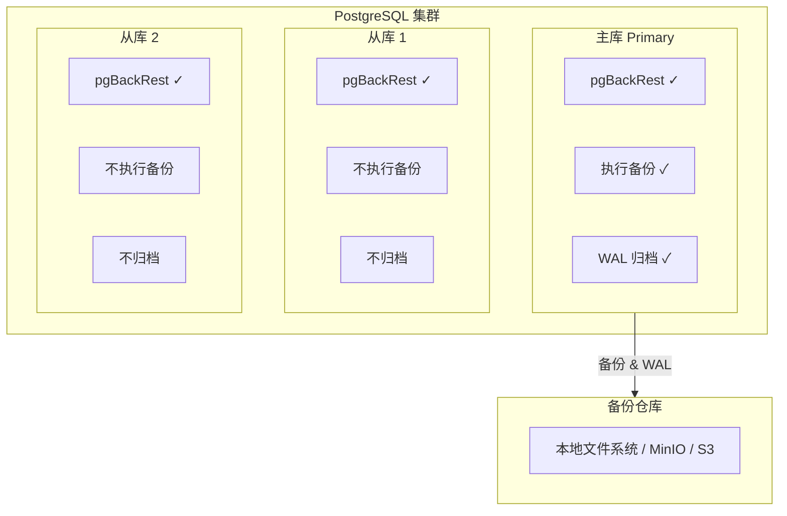

Pigsty 使用 [**pgBackRest**](https://pgbackrest.org/) 作为备份工具，实现 PostgreSQL 的时间点恢复能力。

本文介绍 PITR 的实现架构，帮助您理解备份系统的工作方式。


--------

## pgBackRest 简介

[**pgBackRest**](https://pgbackrest.org/) 是 PostgreSQL 生态中最成熟、功能最强大的备份恢复工具。Pigsty 选择它作为默认备份方案，主要基于以下优势：

### 为什么选择 pgBackRest

| 特性         | pgBackRest              | pg_basebackup | Barman     |
|:-------------|:------------------------|:--------------|:-----------|
| 增量备份     | ✅ 原生支持             | ❌ 不支持     | ✅ 支持    |
| 并行备份恢复 | ✅ 多进程并行           | ❌ 单进程     | ✅ 支持    |
| 压缩         | ✅ 多种算法             | ✅ gzip/lz4   | ✅ 支持    |
| 加密         | ✅ AES-256              | ❌ 不支持     | ❌ 不支持  |
| 多仓库       | ✅ 同时备份到多个仓库   | ❌ 不支持     | ❌ 不支持  |
| 对象存储     | ✅ S3/MinIO/Azure/GCS   | ❌ 不支持     | ✅ S3      |
| 块级增量     | ✅ 支持                 | ❌ 不支持     | ❌ 不支持  |

### 核心能力

- **增量备份**：仅备份变更的数据块，大幅减少备份时间与存储空间
- **并行处理**：多进程并行备份和恢复，充分利用系统资源
- **透明加密**：AES-256-CBC 加密，保护备份数据安全
- **多仓库支持**：同时备份到本地和远程，实现多级容灾
- **自动 WAL 管理**：自动归档和清理 WAL 文件，无需人工干预

### 在 Pigsty 中的集成

Pigsty 对 pgBackRest 进行了开箱即用的集成：

- **默认启用**：所有 PostgreSQL 集群自动配置备份
- **自动配置**：根据集群名称自动生成 stanza 和仓库配置
- **封装脚本**：提供 `pg-backup`、`pg-pitr` 等便捷命令
- **监控集成**：pgbackrest_exporter 导出备份指标到 Prometheus


--------

## 核心概念

理解 pgBackRest 的两个核心概念，是掌握备份架构的关键。

### Stanza（数据库集群标识）

**Stanza** 是 pgBackRest 中用于标识一个 PostgreSQL 集群的名称。在 Pigsty 中：

- 每个 PostgreSQL 集群对应一个 stanza
- Stanza 名称 = 集群名称（[`pg_cluster`](/docs/pgsql/param#pg_cluster)）
- 例如：集群 `pg-meta` 的 stanza 就是 `pg-meta`

Stanza 的作用是在备份仓库中隔离不同集群的数据。一个仓库可以存储多个集群的备份，通过 stanza 加以区分。

```
备份仓库
├── pg-meta/          # pg-meta 集群的 stanza
│   ├── backup/       # 基础备份
│   └── archive/      # WAL 归档
├── pg-test/          # pg-test 集群的 stanza
│   ├── backup/
│   └── archive/
└── pg-prod/          # pg-prod 集群的 stanza
    ├── backup/
    └── archive/
```

### Repository（备份仓库）

**Repository** 是存储备份数据和 WAL 归档的位置。Pigsty 支持多种仓库类型：

| 类型       | 说明               | 典型用途               |
|:-----------|:-------------------|:-----------------------|
| **local**  | 本地文件系统       | 开发环境、单机部署     |
| **minio**  | MinIO 对象存储     | 生产环境、多集群共享   |
| **s3**     | AWS S3 及兼容存储  | 云上部署、异地容灾     |

一个集群可以同时配置多个仓库，实现多级备份策略。


--------

## 备份架构

### 部署模式

pgBackRest 部署在**所有** PostgreSQL 节点上，但实际的备份操作仅在**主库**执行：



### 故障切换后的备份

定时备份任务（crontab）在所有节点上配置，但只有主库才会实际执行备份：

- 备份脚本会检查当前节点角色
- 仅主库节点执行备份操作
- 从库节点的备份任务静默跳过

**故障切换后**：

1. 新主库（原从库）自动开始执行备份
2. 新主库自动接管 WAL 归档
3. 备份连续性不受影响

这种设计确保了高可用环境下备份的无缝切换。


--------

## 仓库类型

### 本地文件系统（local）

**默认选项**，将备份存储在主库本地磁盘：

| 优势                       | 劣势                             |
|:---------------------------|:---------------------------------|
| 配置简单，开箱即用         | 无异地容灾能力                   |
| 恢复速度快（本地 I/O）     | 受限于本地磁盘空间               |
| 无网络依赖                 | 主机故障时备份可能一起丢失       |

**适用场景**：开发测试环境、单机部署、对容灾要求不高的场景。

### 对象存储（MinIO/S3）

将备份存储在远程对象存储服务：

| 优势                         | 劣势                       |
|:-----------------------------|:---------------------------|
| 异地容灾，独立于数据库主机   | 恢复速度较慢（网络传输）   |
| 几乎无限的存储容量           | 需要额外基础设施           |
| 多集群共享同一仓库           | 依赖网络可用性             |
| 支持加密和版本控制           | 配置相对复杂               |

**适用场景**：生产环境、关键业务、需要异地容灾的场景。

### 如何选择

| 场景               | 推荐仓库                 |
|:-------------------|:-------------------------|
| 单机开发环境       | local                    |
| 生产集群（单机房） | local + minio            |
| 生产集群（多机房） | minio / s3               |
| 关键业务           | local + minio（双仓库）  |

详细的仓库配置请参阅 [**备份仓库**](/docs/pgsql/backup/repository/)。
