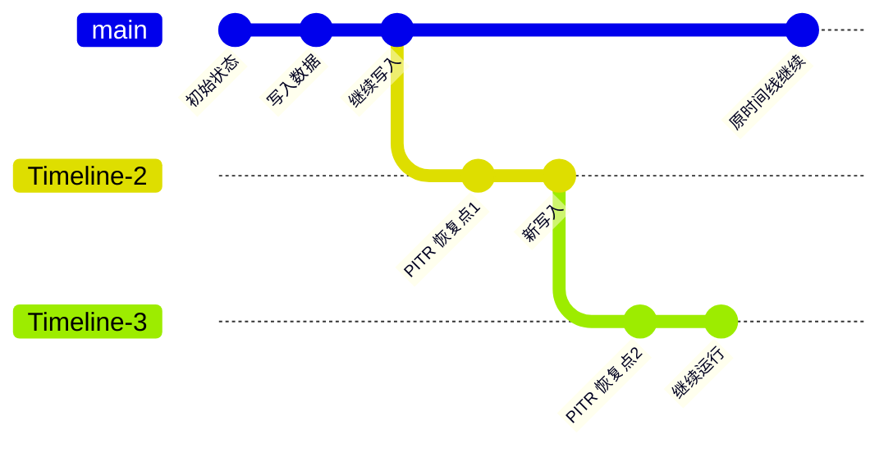

```mermaid
gantt
    title 事务边界与恢复目标
    dateFormat X
    axisFormat %s
    section 事务 A
    BEGIN → COMMIT (已提交) :done, a1, 0, 2
    section 事务 B
    BEGIN → 未提交 :active, b1, 1, 4
    section 恢复
    恢复目标点 :milestone, m1, 2, 0
```

时间点恢复（PITR）的核心原理是：**基础备份 + WAL 归档 = 任意时间点恢复能力**。
在 Pigsty 中，这一能力由 **pgBackRest** 实现，并通过 **定时备份 + WAL 归档** 自动运行。

--------

## 三要素

| 要素         | 作用                       | Pigsty 实现                                                |
|:------------|:---------------------------|:----------------------------------------------------------|
| **基础备份** | 提供一致的物理快照，决定恢复起点 | `pg-backup` + `pgbackrest` + [`pg_crontab`](/docs/pgsql/param#pg_crontab) |
| **WAL 归档** | 记录备份后的所有变更，决定恢复路径 | `archive_mode=on` + `archive_command=pgbackrest ... archive-push`      |
| **恢复目标** | 指定恢复停止位置            | `pg_pitr` 参数 / `pg-pitr` 脚本 / `pgbackrest restore`     |
{.full-width}

--------

## 基础备份

**基础备份**是数据库在某一时刻的物理快照，是 PITR 的恢复起点。Pigsty 通过 `pgBackRest` 生成基础备份，并提供 `pg-backup` 脚本封装常用操作。

### 备份类型

| 类型                       | 说明                     | 恢复开销                 |
|:--------------------------|:-------------------------|:-------------------------|
| **全量备份**（Full）         | 复制全部数据文件           | 恢复最快，空间占用最大       |
| **差异备份**（Differential） | 相对最近一次全量备份的变化    | 恢复需要全量 + 差异          |
| **增量备份**（Incremental）  | 相对最近一次任意备份的变化    | 空间最省，恢复需要完整链路    |
{.full-width}

### Pigsty 的默认行为

- `pg-backup` **默认执行增量备份**，若不存在全量备份会自动补一次全量。
- 备份任务通过 [`pg_crontab`](/docs/pgsql/param#pg_crontab) 配置，写入 `postgres` 用户的 crontab。
- 脚本会自动识别节点角色，**只有主库实际执行**，从库会直接退出。

备份频率越高，需要重放的 WAL 越少，恢复速度越快。
更多细节请参阅 [**备份机制**](/docs/pgsql/backup/mechanism/) 与 [**备份策略**](/docs/pgsql/backup/policy/)。

--------

## WAL 归档

**WAL**（Write-Ahead Log）记录了数据库的每一次变更。PITR 通过持续归档 WAL，确保能够把数据库从基础备份重放到指定时刻。

### Pigsty 的归档链路

Pigsty 默认开启 WAL 归档，并将归档动作交给 pgBackRest：

- `archive_mode = on`
- `archive_command = pgbackrest --stanza=<cluster> archive-push %p`

pgBackRest 会持续接收 WAL 段文件，并依据保留策略自动清理过期归档。
恢复时，pgBackRest 负责通过 `archive-get` 拉取所需 WAL。

### 关键影响

- **归档延迟**会缩短恢复窗口的右边界。
- **仓库不可用**会导致归档中断，直接影响 PITR 能力。

更多细节请参阅 [**备份机制**](/docs/pgsql/backup/mechanism/) 与 [**备份仓库**](/docs/pgsql/backup/repository/)。

--------

## 恢复目标与事务边界

PITR 的恢复目标由 PostgreSQL 的 `recovery_target_*` 系列参数定义，Pigsty 通过 `pg_pitr` 或 `pg-pitr` 进行封装。

### 目标类型

| 目标类型          | 参数                | 说明            | 常见场景       |
|:--------------|:------------------|:--------------|:-----------|
| **latest**    | 无                 | 恢复到 WAL 归档流末尾 | 机房灾难后的最新恢复 |
| **time**      | `time`            | 恢复到指定时间点      | 误删数据       |
| **xid**       | `xid`             | 恢复到指定事务 ID    | 错误事务回滚     |
| **lsn**       | `lsn`             | 恢复到指定 LSN     | 精确回退       |
| **name**      | `name`            | 恢复到命名恢复点      | 预设检查点      |
| **immediate** | `type: immediate` | 第一一致点停止       | 最快恢复       |
{.full-width}

### 包含与排除

恢复目标默认是**包含**（inclusive）的。
若要回退到目标点**之前**，在 `pg_pitr` 中设置 `exclusive: true`，对应 PostgreSQL 的 `recovery_target_inclusive = false`。

### 事务边界

PITR 会保留目标点前的**已提交事务**，并回滚未提交事务。

更多操作细节请参阅 [**恢复操作**](/docs/pgsql/backup/restore/)。

--------

## 恢复窗口

**恢复窗口**由两个边界决定：

- **左边界**：最早可用的基础备份
- **右边界**：最新已归档的 WAL

窗口长短取决于备份频率、备份保留与 WAL 归档保留策略：

- `local` 仓库默认保留 **2 个全量备份**，窗口通常为 **24～48 小时**。
- `minio` 仓库默认按时间保留 **14 天**备份，窗口通常为 **1～2 周**。

具体策略配置请参阅 [**备份策略**](/docs/pgsql/backup/policy/) 与 [**备份仓库**](/docs/pgsql/backup/repository/)。

--------

## 时间线

**时间线**（Timeline）用于区分不同历史分支。以下操作会生成新时间线：

1. PITR 恢复
2. 从库提升（Promote）
3. 故障切换（Failover）

当仓库存在多个时间线时，可通过 `timeline` 指定目标；Pigsty 默认使用 `latest`。
更多细节请参阅 [**恢复操作**](/docs/pgsql/backup/restore/)。
