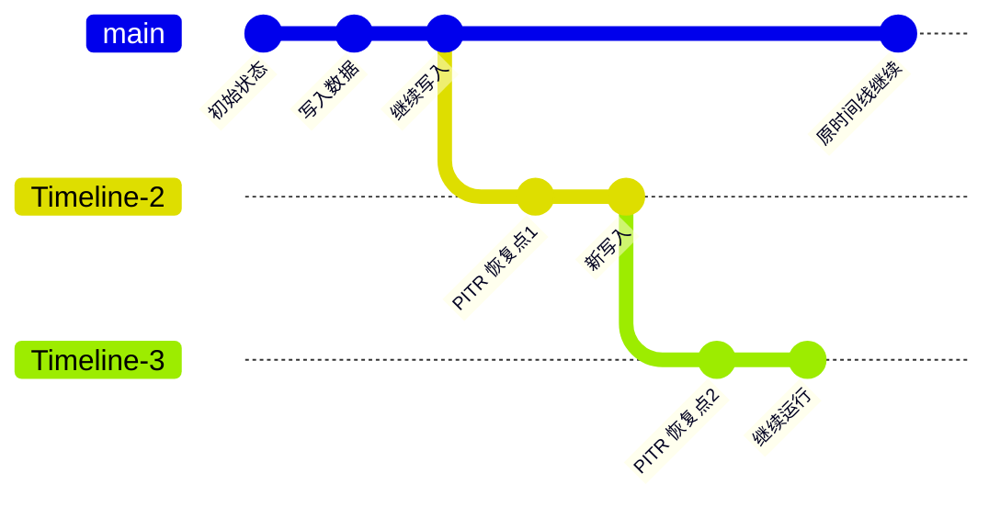

时间点恢复（PITR）的核心原理是：**基础备份 + WAL 归档 = 任意时间点恢复能力**。

--------

## 基础备份

**基础备份**（Base Backup）是数据库在某个时刻的完整物理快照，包含所有数据文件、配置文件和表空间——相当于给数据库拍了一张「全家福」。

基础备份是 PITR 的**起点**：没有基础备份，就没有恢复的基础；有了基础备份，再配合 WAL 归档，就能恢复到备份之后的任意时间点。

### 备份类型

pgBackRest 支持三种备份类型：

| 类型                       | 说明                   | 适用场景       |
|:---------------------------|:-----------------------|:---------------|
| **全量备份**（Full）       | 完整复制所有数据文件   | 作为恢复的基准点 |
| **差异备份**（Differential） | 仅记录与**上次全量备份**的差异 | 平衡空间与恢复速度 |
| **增量备份**（Incremental） | 仅记录与**上次任意备份**的差异 | 最省空间，恢复较慢 |

全量备份是独立的，可以单独用于恢复；差异备份和增量备份则依赖于之前的备份链条。

### 为什么需要定期备份

基础备份的时间点决定了恢复时需要重放多少 WAL 日志：

- 备份**越新**，需要重放的 WAL **越少**，恢复**越快**
- 备份**越旧**，需要重放的 WAL **越多**，恢复**越慢**

因此，生产环境通常采用每日备份策略。具体操作请参阅 [**备份机制**](/docs/pgsql/backup/mechanism/) 与 [**备份策略**](/docs/pgsql/backup/policy/)。

--------

## WAL 归档

**WAL**（Write-Ahead Log，预写式日志）是 PostgreSQL 的事务日志。数据库的每一次写操作——`INSERT`、`UPDATE`、`DELETE`、DDL——都会**先**写入 WAL，**然后**才修改实际的数据文件。

这就是「预写式」的含义：先写日志，后写数据。

### WAL 归档的作用

**WAL 归档**是将已完成的 WAL 段文件持久化保存到备份仓库的过程，其作用包括：

- **记录变更**：捕获基础备份之后发生的所有数据变更
- **连续保护**：从备份点到当前时刻，所有变更都被完整记录
- **任意恢复**：配合基础备份，可恢复到归档范围内的任意时间点

### 恢复的本质

PITR 恢复的本质是：

1. **还原**基础备份——回到备份时刻的状态
2. **重放** WAL 归档——逐条应用备份之后的变更
3. **停止**在目标时间点——达到期望的状态

这就像「录像回放」：基础备份是起点画面，WAL 是录像带，恢复就是从起点开始播放到指定时刻。

### 自动归档

Pigsty 默认在集群主库上启用 WAL 归档，pgBackRest 会自动完成以下工作：

- 接收并存储 WAL 段文件
- 根据保留策略清理过期的归档文件
- 在恢复时自动获取所需的 WAL 归档

您无需手动管理 WAL 归档，一切都是自动的。

--------

## 恢复窗口

**恢复窗口**（Recovery Window）是指您可以恢复到的时间范围，由两个边界决定：

- **左边界**：最早可用的基础备份时间点
- **右边界**：最新的 WAL 归档时间点（通常接近当前时刻）

### 影响因素

恢复窗口受以下因素影响：

| 因素             | 影响                           |
|:-----------------|:-------------------------------|
| **备份保留数量** | 保留的备份越多，左边界越早     |
| **备份保留时间** | 保留时间越长，左边界越早       |
| **WAL 归档保留** | WAL 归档与备份保留策略联动     |

### 默认配置

Pigsty 提供两种默认配置：

- **本地仓库**：保留 2 个全量备份，恢复窗口约 **24～48 小时**
- **MinIO/S3 仓库**：保留 14 天备份，恢复窗口约 **1～2 周**

只要存储空间充足，您可以配置任意长度的恢复窗口。详细配置请参阅 [**备份策略**](/docs/pgsql/backup/policy/) 与 [**备份仓库**](/docs/pgsql/backup/repository/)。

--------

## 事务边界

当您指定「恢复到某个时间点」时，PostgreSQL 实际上是恢复到该时刻**已提交事务**的状态。

### 事务状态

在任意时刻，事务有两种状态：

- **已提交**（Committed）：事务已完成，数据变更永久生效
- **未提交**（Uncommitted）：事务进行中，数据变更尚未最终确认

### 恢复时的事务处理

PITR 恢复时：

- **已提交事务**：变更被保留
- **未提交事务**：变更被回滚

```mermaid
gantt
    title 事务边界与恢复目标
    dateFormat X
    axisFormat %s
    section 事务 A
    BEGIN → COMMIT (已提交) :done, a1, 0, 2
    section 事务 B
    BEGIN → 未提交 :active, b1, 1, 4
    section 恢复
    恢复目标点 :milestone, m1, 2, 0
```

恢复结果：事务 A 的变更保留，事务 B 的变更回滚。

### 包含与排除

恢复目标默认是**包含**（inclusive）的——恢复会包含目标点的事务。

如果您想恢复到某个「坏事务」**之前**的状态，需要使用 `exclusive` 参数。例如，事务 ID 250000 执行了误删操作：

- `xid: 250000`：恢复**包含**该事务（数据仍被删除）
- `xid: 250000, exclusive: true`：恢复**不包含**该事务（数据保留）

详细操作请参阅 [**恢复操作**](/docs/pgsql/backup/restore/)。

--------

## 时间线

**时间线**（Timeline）是 PostgreSQL 用来区分不同「历史分支」的机制。

### 何时产生新时间线

以下操作会创建新的时间线：

1. **PITR 恢复后**：恢复到过去某点后，从该点开始新的历史
2. **从库提升**（Promote）：从库变主库后，开启新的历史
3. **故障切换**（Failover）：主从切换后，新主库开启新历史

### 时间线分叉示意

每次 PITR 恢复都会产生新的时间线分支，如同版本控制中的「分支」。

### 恢复时指定时间线

如果备份仓库中存在多个时间线的 WAL 归档，恢复时需要指定目标时间线：

- `timeline: latest`（默认）：恢复到最新的时间线
- `timeline: 1`：恢复到指定的时间线编号

对于大多数场景，使用默认的 `latest` 即可。只有在需要恢复到「历史分支」时，才需要指定具体的时间线编号。
