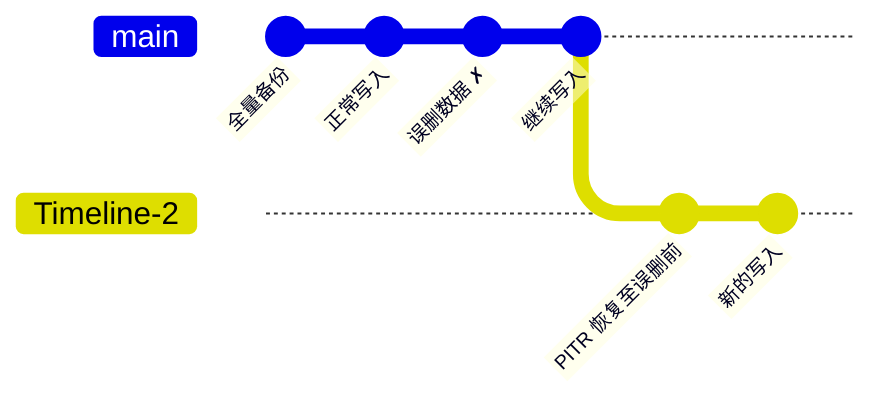

如果把数据库看作一台状态机，那么 **WAL**（Write-Ahead Log，预写式日志）就是它的完整变更历史 ——
PostgreSQL 的每一次写入，都会先以日志记录的形式落盘，然后才应用到数据文件上。
这个为崩溃恢复而生的机制带来了一个副产品：只要把某个时刻的数据文件快照保存下来，
再持续保留此后产生的 WAL，就可以把数据库 **重放** 到这段历史所覆盖的任意时间点。

这就是时间点恢复的全部原理。它不是魔法，而是三个朴素概念的组合：**快照**（基础备份）、**历史**（WAL 归档）、**目标**（恢复到哪一刻）。


----------------

## 快照：基础备份

**基础备份**（Base Backup）是数据库集群在某一时刻的物理快照，它决定了恢复的 **起点**。
Pigsty 使用 [**pgBackRest**](https://pgbackrest.org/) 制作与管理基础备份，支持三种备份类型：

| 类型 | 内容 | 特点 |
|:---|:---|:---|
| **全量备份**（full） | 复制整个数据库集群 | 独立可用，恢复最快，占用空间最大 |
| **差异备份**（diff） | 相对最近一次 **全量备份** 的变化 | 恢复需要：全量 + 差异 |
| **增量备份**（incr） | 相对最近一次 **任意备份** 的变化 | 空间最省，恢复需要完整备份链 |
{.full-width}

备份通过封装脚本 `pg-backup [full|diff|incr]` 触发，不带参数时默认执行增量备份，
若仓库中尚无全量备份则自动升级为全量。备份任务由 [**`pg_crontab`**](/docs/pgsql/param#pg_crontab) 参数声明，
写入 `postgres` 用户的 crontab 定时执行。

基础备份的频率决定了恢复的速度：备份越新，恢复时需要重放的 WAL 就越少。
这是 [**策略权衡**](/docs/concept/pitr/tradeoff/) 中的关键变量之一。


----------------

## 历史：WAL 归档

快照只能让您回到备份的那一刻，而 **WAL 归档** 补全了此后的每一步。
Pigsty 默认在集群上开启归档，由 PostgreSQL 在每个 WAL 段文件（16 MB）写满后触发归档命令，交给 pgBackRest 推送至备份仓库：

```yaml
archive_mode: 'on'                                            # 开启 WAL 归档
archive_command: 'pgbackrest --stanza=pg-meta archive-push %p' # 交由 pgBackRest 推送
archive_timeout: 300                                          # 低写入时最多五分钟触发切段归档
```

两个细节值得注意：

* **`archive_timeout: 300`** 给恢复窗口的右边界上了一道保险：只要期间产生过 WAL，即使段文件迟迟写不满，
  五分钟后也会触发切段归档，通常把归档延迟控制在分钟级。
* **异步归档**（`archive-async=y`）：pgBackRest 使用本地假脱机目录（`/pg/spool`）异步批量推送 WAL，
  避免归档吞吐成为主库写入的瓶颈。Pigsty 将归档队列上限设为 4 GiB —— 队列指主库上尚未归档的 WAL 积压；
  仓库长期不可用导致积压超限时，pgBackRest 会丢弃这些 WAL 以保护主库磁盘，代价是归档断链 ——
  需要执行新的全量备份才能重新建立 PITR 能力。

归档的清理是自动的：pgBackRest 在过期备份被清除时，一并清理不再被任何备份需要的 WAL 归档。


----------------

## 恢复窗口

快照与历史合在一起，构成了 **恢复窗口**（Recovery Window）—— 您能够回到的时间范围：

* **左边界**：仓库中最早的那个基础备份的完成时刻 —— 再往前的历史已被保留策略清除。
* **右边界**：最新已归档的 WAL 位置 —— 通常距当前时刻不超过几分钟。

恢复窗口是滑动的：新备份不断产生，旧备份按保留策略过期，窗口随时间整体前移。
在 Pigsty 的仓库预设中，本地仓库保留最近两个全量备份（每日全备时窗口约一至两天），
MinIO / S3 仓库按时间至少保留十四天。每周全备时，稳态窗口约为十四至二十一天。
窗口的长短本质上是空间与需求的权衡，详见 [**策略权衡**](/docs/concept/pitr/tradeoff/)。


----------------

## 目标：恢复到哪一刻

恢复窗口内的定位方式不止"时间"一种。PostgreSQL 提供了六类恢复目标，Pigsty 通过
[**`pg_pitr`**](/docs/concept/pitr/restore/) 参数统一封装：

| 目标类型        | 说明                | 典型场景                               |
|:------------|:------------------|:-----------------------------------|
| `default`   | 重放全部 WAL，恢复到归档流末尾 | 整库丢失后的灾难恢复                         |
| `time`      | 恢复到指定时间戳          | 误删数据 —— 最常用                        |
| `xid`       | 恢复到指定事务 ID        | 精确回退某个错误事务                         |
| `lsn`       | 恢复到指定 WAL 位点      | 按日志位置精确定位                          |
| `name`      | 恢复到命名还原点          | 事先用 `pg_create_restore_point()` 打点 |
| `immediate` | 到达一致状态即停止         | 最快可用，验证备份                          |
{.full-width}

### 边界语义

恢复目标默认是 **包含**（inclusive）的：目标点上的那个事务会被保留。
若要停在目标 **之前**（例如 `xid` 正是那个误删事务），使用 `exclusive: true`，
对应 PostgreSQL 的 `recovery_target_inclusive = false`。

事务是恢复的原子单位：重放停止后，目标点前已提交的事务全部保留，未提交的事务全部回滚 ——
数据库最终呈现的一定是某个一致的瞬间，而不会出现"半个事务"。


----------------

## 时间线

恢复到过去并继续写入，历史就产生了 **分叉**。PostgreSQL 用 **时间线**（Timeline）来区分这些平行历史：
每次 PITR 恢复完成并提升后，都会创建一条新时间线，此后产生的 WAL 归属于新时间线，不会覆盖旧历史。


```mermaid
gitGraph
    commit id: "全量备份"
    commit id: "正常写入"
    commit id: "误删数据 ✗"
    commit id: "继续写入"
    branch Timeline-2
    checkout Timeline-2
    commit id: "PITR 恢复至误删前"
    commit id: "新的写入"
```

时间线的意义在于 **可以反悔**：旧时间线的 WAL 仍在仓库中，如果发现恢复的时间点选早了，
可以再次恢复到旧时间线上更晚的位置 —— 甚至"回到未来"。除 PITR 外，从库提升（Promote）与故障切换（Failover）同样会产生新时间线。

恢复时可以用 `timeline` 参数指定目标时间线，Pigsty 默认使用 `latest`。

----------------

想知道这套机制在 Pigsty 中如何落地为具体的组件与配置？请继续阅读 [**实现架构**](/docs/concept/pitr/arch/)。
