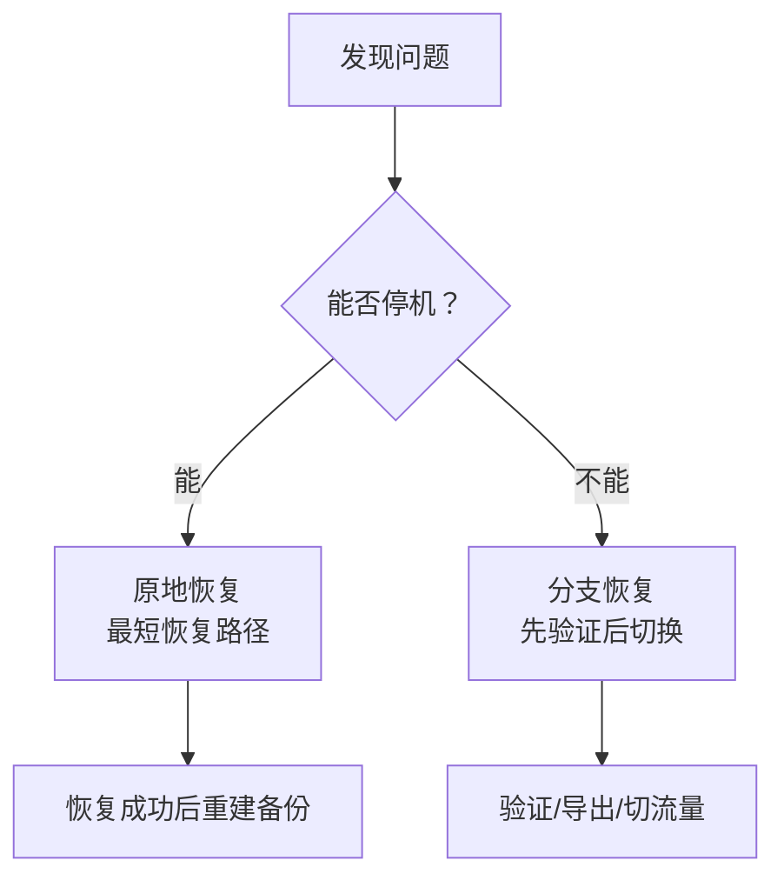
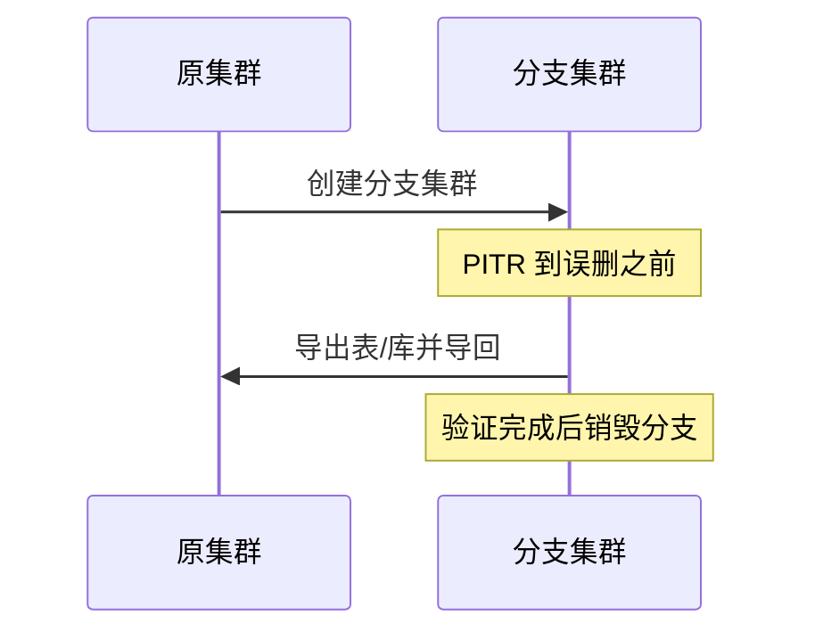

PITR 的价值不在于“回滚数据库”本身，而在于**把不可逆的人为/软件错误变回可恢复的问题**。
它覆盖的场景从“误删一张表”到“整个机房不可用”，本质上解决的是**逻辑错误与灾难恢复**。


--------

## 整体认知（Overview）

PITR 解决以下问题：

| 场景类型                     | 典型问题                                         | 推荐策略             | 恢复目标          |
|:----------------------------|:-------------------------------------------------|:---------------------|:------------------|
| 误删/误更新数据（DML）        | `DELETE/UPDATE` 无条件执行，脚本误操作            | 分支恢复优先         | `time` / `xid`    |
| 误删表/库/Schema（DDL）       | `DROP TABLE/DATABASE`、错误迁移                 | 分支恢复             | `time` / `name`   |
| 批量错误/发布事故            | Bug 批量污染数据，修复脚本失败                    | 分支恢复 + 验证       | `time` / `xid`    |
| 数据审计/问题复盘            | 需要查看历史状态，核对差异                        | 分支恢复（只读）       | `time` / `lsn`    |
| 机房级灾难/全量丢失           | 硬件故障、勒索、机房断电                           | 原地恢复或重建集群     | `latest` / `time` |
{.full-width}

### 一个简单的判断原则

- **只要写入已经造成业务错误，就应该考虑 PITR**。
- **需要在线验证或只恢复部分数据 → 分支恢复**。
- **必须尽快恢复服务 → 原地恢复**（可接受停机）。




--------

## 场景详情

### 误删/误更新数据（DML）

**典型问题**：

- `DELETE` 缺少 `WHERE`
- 错误的 `UPDATE` 覆盖关键字段
- 批处理脚本逻辑错误导致脏数据扩散

**处理思路**：

1. **止损**：暂停相关应用或写入作业，防止数据继续被污染。
2. **定位时间点**：结合日志、监控、业务反馈，确定错误发生时间。
3. **选择策略**：
   - 能停机：原地恢复到错误之前
   - 不能停机：分支恢复，导出正确数据再合并回主库

**恢复目标建议**：

- 有明确事务：`xid` + `exclusive: true`
- 仅知道时间：`time` + `exclusive: true`

```yaml
pg_pitr: { xid: "250000", exclusive: true }
# 或
pg_pitr: { time: "2025-01-15 14:30:00+08", exclusive: true }
```


--------

### 误删表 / 误删库（DDL）

**典型问题**：

- `DROP TABLE` / `DROP DATABASE`
- 执行了错误迁移脚本
- 清理测试数据时误删生产对象

**为何推荐分支恢复**：

DDL 操作不可逆，**原地恢复意味着全库回滚**，风险高。
分支恢复可将误删对象导出并导回原库，影响最小。

**推荐流程**：

1. 创建分支集群并 PITR 到误删前
2. 校验表结构/数据正确性
3. `pg_dump` 导出目标对象
4. 导回生产库




--------

### 批量错误 / 发布事故

**典型问题**：

- 某次版本发布写入错误数据
- ETL 或批处理作业造成全量污染
- 修复脚本执行失败或影响范围不清晰

**处理原则**：

- **优先分支恢复**：先验证恢复点，再决定是否切流量
- 对比原库与分支库数据差异，确认影响范围

**建议流程**：

1. 确定错误发布的时间窗口
2. 分支恢复到“错误发生前”
3. 校验关键业务表
4. 决定导回部分数据，或整体切流量

这个场景通常需要结合业务复盘，因此分支恢复更安全、更可控。


--------

### 数据审计 / 问题复盘

**典型问题**：

- 需要查看某一时刻的数据状态
- 排查“历史正确状态”以比对差异

**推荐方式**：分支恢复（只读）

**优点**：

- 不影响生产
- 可多次尝试不同时间点
- 适合审计、核对与取证

```yaml
pg_pitr: { time: "2025-01-15 10:00:00+08" }  # 创建只读分支
```


--------

### 机房级灾难 / 全量丢失

这是 **PITR 的终极兜底场景**。当高可用无法应对时（主从同时不可用、机房断电、勒索攻击），PITR 是最后防线。

**关键前提**：

> **必须使用远程仓库（MinIO/S3）**。

本地仓库在主机故障时会与数据一同丢失，无法恢复。

**恢复流程**：

1. 准备新主机或新机房资源
2. 还原集群配置并指向远程仓库
3. 执行 PITR 恢复（通常 `latest`）
4. 验证数据后恢复服务

```bash
./pgsql-pitr.yml -l pg-meta   # 恢复到 WAL 归档末尾
```


--------

## 原地恢复 vs 分支恢复

| 维度           | 原地恢复                     | 分支恢复                           |
|:---------------|:-----------------------------|:-----------------------------------|
| 是否停机       | 需要停机                     | 无需停机                           |
| 风险           | 高（直接影响生产）           | 低（可验证后操作）                 |
| 复杂度         | 低                           | 中（需要新集群与数据导出）         |
| 推荐场景       | 快速恢复服务、容灾           | 误操作恢复、审计、复杂场景         |
{.full-width}

对于绝大多数生产场景，**分支恢复是默认推荐策略**。
只有在 **必须尽快恢复服务** 时，才建议原地恢复。


--------

## 相关文档

- [**恢复操作**](/docs/pgsql/backup/restore/)
- [**备份机制**](/docs/pgsql/backup/mechanism/)
- [**备份策略**](/docs/pgsql/backup/policy/)
