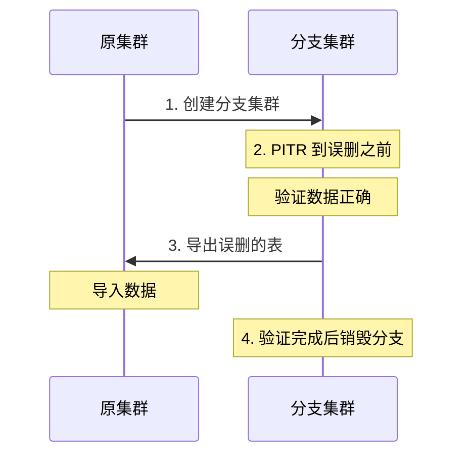
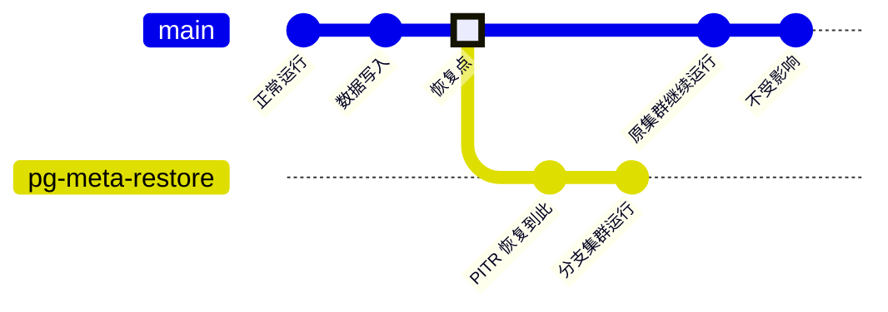

本文介绍 PITR 的典型应用场景，帮助您理解「遇到什么问题时应该想到 PITR」。


--------

## 恢复思路

PITR 恢复并非「按下按钮即完成」的操作，而是一个需要分析、决策、执行、验证的过程。

### 核心流程


**Step 1：发现问题**
- 用户反馈数据异常
- 监控告警触发
- 运维巡检发现

**Step 2：定位时间点**
- 查询 PostgreSQL 日志（CSVLOG）
- 查看监控仪表盘（事务 ID、LSN）
- 询问相关人员（操作时间）

**Step 3：确定恢复目标**

| 已知信息   | 恢复目标类型             |
|:-----------|:-------------------------|
| 大概时间   | `time`（时间点）         |
| 精确事务   | `xid`（事务 ID）         |
| WAL 位置   | `lsn`（日志序列号）      |
| 预设检查点 | `name`（命名恢复点）     |

**Step 4：执行恢复**
- 选择恢复策略：原地回滚或分支恢复
- 执行 PITR 操作

**Step 5：验证结果**
- 检查数据是否恢复正确
- 确认业务功能正常
- 决定后续操作

### 关键原则

> **先确定目标，再执行恢复。**

不要急于执行恢复操作。花时间定位准确的恢复目标，比匆忙恢复后发现时间点不对要好得多。

详细操作请参阅 [**恢复操作**](/docs/pgsql/backup/restore/)。


--------

## 误删数据

### 场景描述

应用程序缺陷或人为操作失误，导致数据被错误删除或覆盖：

- 开发环境的 SQL 误在生产执行
- `DELETE` 语句缺少 `WHERE` 条件
- `UPDATE` 语句覆盖了错误的字段
- 批处理脚本的逻辑错误

### 症状表现

- 用户反馈数据不见了
- 报表数据突然归零或异常
- 某些记录的字段值被错误修改

### 处理思路

**1. 阻止损害扩大**

如果问题仍在持续，先暂停相关应用或脚本。

**2. 定位问题事务**

从 PostgreSQL 日志中找到问题 SQL：

```bash
# 查找包含 DELETE 的最近日志
grep "DELETE" /pg/log/postgresql-*.csv | tail -20
```

或从监控仪表盘查看事务 ID（TXID）。

**3. 选择恢复策略**

| 策略         | 适用场景               | 优点       | 缺点         |
|:-------------|:-----------------------|:-----------|:-------------|
| **原地回滚** | 确定时间点，可接受停机 | 简单直接   | 有停机时间   |
| **分支恢复** | 需要验证，不能停机     | 不影响生产 | 操作较复杂   |

**4. 执行恢复**

如果知道精确的事务 ID，使用 `exclusive` 参数恢复到该事务**之前**：

```yaml
pg_pitr: { xid: "250000", exclusive: true }
```

如果只知道大概时间：

```yaml
pg_pitr: { time: "2025-01-15 14:30:00+08" }
```


--------

## 误删表或库

### 场景描述

执行了 `DROP TABLE` 或 `DROP DATABASE`：

- 清理测试数据时误删生产表
- 脚本中的库名或表名写错
- 权限控制不当，普通用户执行了危险操作

### 与误删数据的区别

误删表或库的影响通常更大，但处理思路类似。关键区别在于：

- 误删数据：可能只影响部分记录
- 误删表或库：整个对象消失，影响范围更大

### 为什么推荐分支恢复

对于误删表或库，**强烈推荐分支恢复**而非原地回滚：

1. **风险隔离**：不影响生产系统运行
2. **精确恢复**：可以只导出需要的表
3. **验证充分**：有时间确认恢复结果正确
4. **灵活处理**：可选择性地合并数据

### 处理流程




--------

## 分支恢复

**分支恢复**是云厂商 RDS 的标准实践，也是 Pigsty 推荐的恢复方式。

### 什么是分支恢复

分支恢复并非在原集群上「回滚」，而是：

1. 使用同一备份仓库创建**新集群**
2. 新集群 PITR 到目标时间点
3. 形成原集群的「历史分支」



### 操作示例

在配置中定义分支集群，使用原集群的备份：

```yaml
pg-meta-restore:
  hosts: { 10.10.10.11: { pg_seq: 1, pg_role: primary } }
  vars:
    pg_cluster: pg-meta-restore
    pg_pitr:
      cluster: pg-meta              # 使用 pg-meta 的备份
      time: "2025-01-15 14:00:00+08"
```

然后执行 PITR：

```bash
./pgsql-pitr.yml -l pg-meta-restore
```

### 恢复后的选择

分支集群恢复完成后，有两条路可走：

**选项 A：导出数据，合并回原集群**

```bash
# 从分支集群导出需要的表
pg_dump -h pg-meta-restore -t important_table > data.sql

# 导入到原集群
psql -h pg-meta -f data.sql
```

适用于：只需恢复部分数据，原集群仍在正常服务。

**选项 B：直接切流量到分支集群**

修改应用配置或负载均衡，将流量切到分支集群。

适用于：需要完整回滚，或原集群已不可用。

### 优势

- ✅ **不影响生产**：原集群继续运行
- ✅ **可以验证**：确认恢复结果正确后再操作
- ✅ **可以后悔**：发现恢复点不对，可重新创建分支
- ✅ **灵活处理**：可选择导出部分数据或整体切换


--------

## 集群级灾难

### 场景描述

这是最极端的场景——整个集群不可用：

- 主机硬件故障（磁盘损坏、主板故障）
- 机房级灾难（断电、火灾、自然灾害）
- 主从全部故障
- 数据被恶意加密（勒索软件）

### PITR 的「终极兜底」

当 [**高可用方案**](/docs/concept/ha/) 无法应对时，PITR 是最后的保障：

| 场景         | 高可用方案     | PITR 方案                |
|:-------------|:---------------|:-------------------------|
| 单节点故障   | ✅ 自动切换    | ✅ 可恢复                |
| 主从都故障   | ❌ 无法切换    | ✅ 可恢复                |
| 机房灾难     | ❌ 全军覆没    | ✅ 可恢复（需远程仓库）  |
| 数据被删     | ❌ 同步删除    | ✅ 可恢复                |

### 前提条件

> **备份必须存储在远程仓库（MinIO/S3）。**

如果备份存储在本地磁盘，主机故障时备份也会一同丢失。这就是生产环境需要使用远程仓库的原因：

```yaml
pgbackrest_method: minio   # 使用远程仓库
```

### 恢复流程

1. **准备新主机**：提供新的服务器资源
2. **配置集群**：使用相同的集群名和仓库配置
3. **执行 PITR**：从远程仓库恢复
4. **验证数据**：确认恢复结果
5. **恢复服务**：切换流量到新集群

```bash
# 恢复到 WAL 归档的最新点
./pgsql-pitr.yml -l pg-meta
```

### 为什么需要远程仓库

此场景说明了为何关键业务必须使用远程仓库：

- **本地仓库**：主机故障 = 数据 + 备份同时丢失 = **永久丢失**
- **远程仓库**：主机故障 = 仅丢数据，备份仍在 = **可以恢复**

详细的仓库配置请参阅 [**备份仓库**](/docs/pgsql/backup/repository/)。
