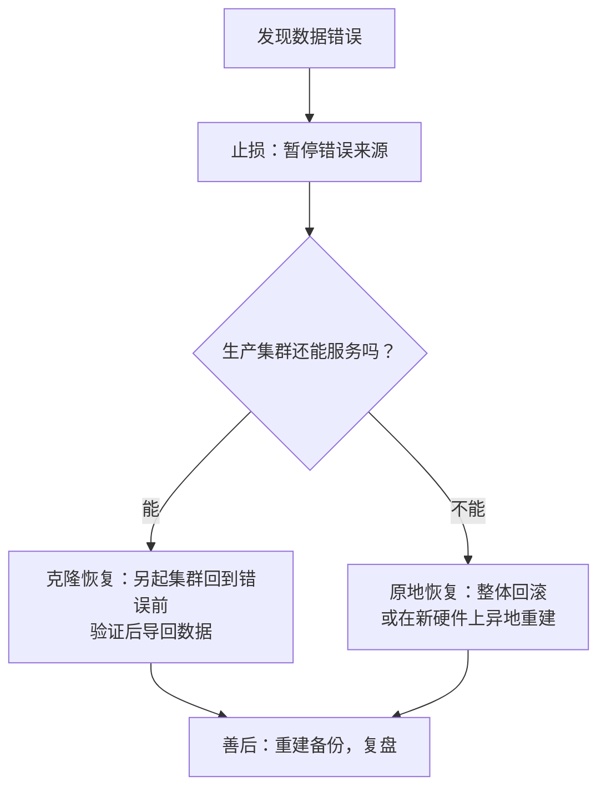

事故发生时，最贵的不是恢复本身，而是 **决策时间**。
恢复的机械步骤已经被 [**工具编排**](/docs/concept/pitr/restore/) 好了，真正需要人来回答的只有三个问题：
**恢复到哪一刻？原地恢复还是克隆恢复？如何验证数据是对的？**

本文为最常见的几类事故给出决策框架 —— 最好在事故发生之前读完它。


----------------

## 判断框架

| 场景 | 典型问题 | 推荐方式 | 恢复目标 |
|:---|:---|:---|:---|
| 误删 / 误更新数据（DML） | `DELETE` / `UPDATE` 忘加 `WHERE` | 克隆恢复，导回数据 | `time` / `xid` |
| 误删表 / 库 / Schema（DDL） | `DROP TABLE` / 错误迁移脚本 | 克隆恢复，导回对象 | `time` / `name` |
| 发布事故 / 批量污染 | 缺陷代码批量写坏数据 | 克隆恢复，比对后决策 | `time` / `xid` |
| 审计 / 取证 / 复盘 | 需要查看历史某刻的数据 | 克隆恢复（只读） | `time` / `lsn` |
| 整库损毁 / 机房灾难 | 硬件全灭、勒索加密 | 原地恢复或异地重建 | `default` / `time` |
{.full-width}

贯穿所有场景的两条原则：

* **先止损，再恢复**。第一动作永远是阻止错误继续扩散：暂停问题应用、吊销问题账号的写权限。
  恢复窗口在流逝，但慌乱中启动错误的恢复造成的二次伤害更大。
* **克隆恢复是默认选项**。它不触碰生产集群、可以反复尝试不同时间点、可以先验证再动手；代价是目标集群会被覆盖。
  只有当集群已经整体不可用 —— 也就是"没有什么可失去"的时候，原地恢复才是首选。


```mermaid
flowchart TD
    A["发现数据错误"] --> B["止损：暂停错误来源"]
    B --> C{"生产集群还能服务吗？"}
    C -->|能| D["克隆恢复：另起集群回到错误前<br/>验证后导回数据"]
    C -->|不能| E["原地恢复：整体回滚<br/>或在新硬件上异地重建"]
    D --> F["善后：重建备份，复盘"]
    E --> F
```


----------------

## 误删数据（DML）

没加 `WHERE` 的 `DELETE`、写错条件的 `UPDATE`、逻辑出错的批处理脚本 —— 这是 PITR 最高频的用武之地。

关键动作是 **定位错误时刻**：从应用日志、PostgreSQL 日志或监控曲线中找到错误发生的时间
（若启用了 [**审计日志**](/docs/concept/sec/data)，定位会更加精确）。
如果能定位到确切的事务号，`xid` 目标配合 `exclusive` 可以精确地停在错误事务 **之前**，一条数据都不多丢：

```bash
# 已知误删发生在 10:15 左右：克隆恢复到 10:14
./pgsql-pitr.yml -l pg-test -e '{"pg_pitr": { "cluster": "pg-meta", "time": "2026-07-11 10:14:00+08", "archive": false, "action": "promote" }}'

# 已知误删事务号为 250000：精确停在该事务之前
./pgsql-pitr.yml -l pg-test -e '{"pg_pitr": { "cluster": "pg-meta", "xid": "250000", "exclusive": true, "archive": false, "action": "promote" }}'
```

数据在克隆集群中验证无误后，用 `pg_dump` / `COPY` 把受影响的行导回生产库。

如果集群配置了 [**延迟集群**](/docs/pgsql/config/cluster#延迟集群)，且误删仍在延迟窗口之内，
直接从延迟从库读取数据更快 —— 这是 PITR 之外的第二条时间通道。


----------------

## 误删对象（DDL）

`DROP TABLE`、`DROP DATABASE`、跑错环境的迁移脚本。与 DML 场景同理，但有一个更强的约束：
**DDL 误删几乎不应该原地恢复** —— 为了找回一张表就把整个库回滚到过去，等于把误删之后所有正常业务写入一并抹掉。

标准流程是克隆恢复：另起集群恢复到误删之前，校验对象完整性，`pg_dump` 导出误删的表 / 库，导回生产。
如果变更前用 `pg_create_restore_point()` 打过还原点，`name` 目标可以让"恢复到变更之前"变得毫无歧义 ——
在高危变更前打点，是成本几乎为零的好习惯。


----------------

## 发布事故与批量污染

某次发布带着缺陷上线，几个小时里持续写入错误数据 —— 这类场景的难点不是恢复，而是 **影响范围不清楚**。

克隆恢复在这里的价值是提供一个 **干净的对照组**：把克隆集群恢复到发布之前，与生产库做数据比对，
量化污染范围，再决定是修复数据（把正确值从克隆库导回）还是整体回滚（切换到克隆集群）。
因为克隆恢复可以反复执行，您可以多次尝试不同时间点，逐步逼近"最后一个干净时刻"。


----------------

## 审计与取证

"上个月月底这个账户的余额是多少？"—— 有些问题只有历史数据能回答。
克隆恢复到指定时刻、以只读方式查询、用后即焚，是回答这类问题的标准做法：
不影响生产、不修改历史、可审计可复现。指定时间、LSN、XID 或命名恢复点并配合 `action: pause`，
集群可以停在目标点上供检查，而不推进到新时间线；`immediate` 只表示尽快恢复到首个一致点，不用于选择历史时刻。


----------------

## 机房级灾难

主从全灭、磁盘阵列损毁、勒索软件加密了所有主机 —— 高可用在这类灾难面前无能为力，PITR 是最后一道防线。
其中最关键的前提是：**备份仓库在灾难的故障域之外**。使用 [**远程备份仓库**](/docs/concept/pitr/tradeoff/) 时，
数据库主机全部丢失也不影响恢复；使用本地仓库时，这道防线并不存在。

恢复流程是在新硬件上重建：准备新节点，恢复配置清单（它本身应在 git 中，见 [**声明式配置**](/docs/concept/iac/)），
将集群指向远程仓库，恢复到归档流末尾：

```bash
./pgsql-pitr.yml -l pg-meta -e '{"pg_pitr": {"action": "promote"}}'  # default：重放到归档流末尾并提升
```

配置清单与远程备份仓库是重建的两块核心拼图，但不是全部：还需要 Pigsty 安装介质或软件仓库、
备份访问凭据与加密口令、PKI/CA、自定义文件，以及 DNS 和其他外部依赖。配置清单可以纳入私有版本控制，
秘密与私钥则应加密保存并与备份分离 —— 这才是独立故障域真正的意义。


----------------

## 把事故排练成肌肉记忆

以上每个场景的第一次实战，都不应该发生在生产事故中。

克隆恢复给了您一个不触碰生产的演练场：可以把可访问的集群备份恢复成一套新集群，验证、计时、销毁；目标集群会被覆盖。
建议把恢复演练作为例行运维的一部分 —— 每季度（或每次重大架构变更后）完整走一遍克隆恢复流程，回答三个问题：

1. **备份可用吗？** 端到端还原成功，数据完整。
2. **RTO 是多少？** 实测还原耗时，而不是估算 —— 数据库在增长，去年的答案今年未必成立。
3. **人熟练吗？** 值班工程师能否不翻文档完成恢复。

没有演练过的备份只是一种心理安慰。演练过的备份，才是真正的时间机器。

具体操作步骤请参阅 [**恢复操作**](/docs/pgsql/backup/restore/) 与 [**克隆数据库集群**](/docs/pgsql/backup/cluster/)。
