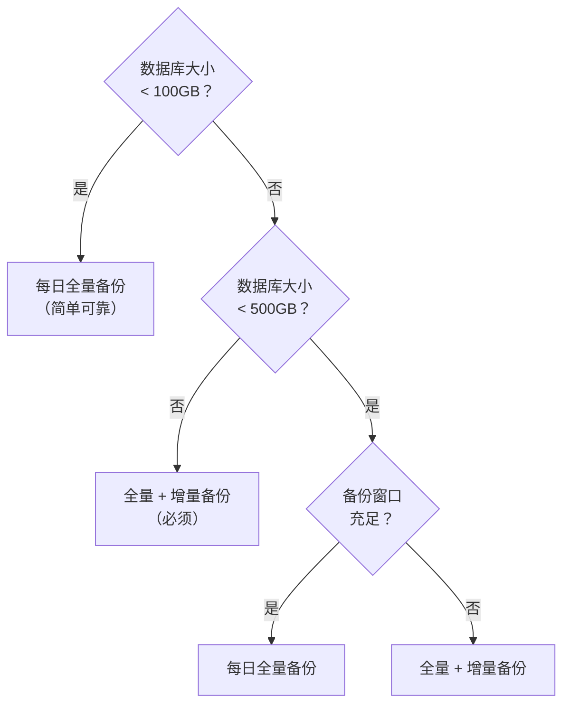

设计 PITR 策略需要在多个维度进行权衡：存储位置、空间消耗、恢复窗口、恢复速度。

本文帮助您理解这些权衡点，做出适合自身场景的决策。


--------

## 本地 vs 远程

备份仓库的位置选择，是 PITR 策略设计的首要决策。

### 本地仓库

将备份存储在主库本地磁盘（默认 `/pg/backup`）：

**优势**：
- ✅ **配置简单**：开箱即用，无需额外基础设施
- ✅ **恢复快速**：本地 I/O，无网络延迟
- ✅ **无依赖**：不依赖网络和外部服务

**劣势**：
- ❌ **无异地容灾**：主机故障时，备份可能一同丢失
- ❌ **空间受限**：受本地磁盘容量限制
- ❌ **单点风险**：备份与数据位于同一物理位置

### 远程仓库

将备份存储在 MinIO、S3 或其他对象存储：

**优势**：
- ✅ **异地容灾**：备份独立于数据库主机
- ✅ **空间无限**：对象存储容量几乎无限
- ✅ **多集群共享**：多个集群可共用同一仓库
- ✅ **安全增强**：支持加密、版本控制、防删锁定

**劣势**：
- ❌ **恢复较慢**：需要网络传输，恢复耗时更长
- ❌ **依赖网络**：网络故障会影响备份和恢复
- ❌ **额外成本**：需要部署和维护对象存储服务

### 如何选择

| 场景     | 推荐方案     | 理由                   |
|:---------|:-------------|:-----------------------|
| 开发测试 | 本地仓库     | 简单够用，容灾要求低   |
| 单机生产 | 远程仓库     | 主机故障时仍可恢复     |
| 集群生产 | 本地 + 远程  | 兼顾速度与容灾         |
| 关键业务 | 多远程仓库   | 多地容灾，最高保护     |


--------

## 空间 vs 窗口

恢复窗口与存储空间是一对此消彼长的关系：窗口越长，空间消耗越大。

### 空间消耗因素

备份存储空间受以下因素影响：

| 因素             | 影响                           |
|:-----------------|:-------------------------------|
| **数据库大小**   | 基础消耗，决定全量备份大小     |
| **备份保留数量** | 保留越多，空间消耗越大         |
| **数据变更速率** | 变更越多，WAL 归档越大         |
| **备份类型**     | 增量备份比全量备份节省空间     |

### 空间估算

以 100GB 数据库、每日 10GB 变更为例：

**每日全量备份策略**（保留 2 个备份）：


- 全量备份：100GB × 2 = **200GB**
- WAL 归档：10GB × 2 = **20GB**
- 总计约：**220GB**（数据库的 2～3 倍）

**周全量 + 每日增量策略**（保留 2 周）：


- 全量备份：100GB × 2 = **200GB**
- 增量备份：约 10GB × 12 = **120GB**
- WAL 归档：10GB × 14 = **140GB**
- 总计约：**460GB**

### 空间与窗口的权衡

| 目标             | 策略调整           | 代价             |
|:-----------------|:-------------------|:-----------------|
| **更长恢复窗口** | 增加保留数量/时间  | 更多存储空间     |
| **更快恢复速度** | 增加备份频率       | 更多存储空间     |
| **节省存储空间** | 使用增量备份       | 恢复速度略慢     |
| **最省存储空间** | 减少保留数量       | 恢复窗口缩短     |


--------

## 策略选择

### 每日全量备份

**最简单可靠的策略**，适合大多数场景：

- 每天凌晨执行全量备份
- 保留最近 2 个备份
- 恢复窗口：24～48 小时

**优点**：
- 配置简单，不易出错
- 恢复速度快（无需合并增量）
- 每个备份独立，互不依赖

**适用场景**：
- 数据库 < 500GB
- 备份窗口充足
- 对空间不敏感

### 全量 + 增量备份

**空间优化策略**，适合大型数据库：

- 每周一凌晨执行全量备份
- 其他工作日执行增量备份
- 保留最近 14 天

**优点**：
- 节省存储空间
- 更长的恢复窗口
- 备份耗时更短

**适用场景**：
- 数据库 > 500GB
- 使用对象存储
- 需要更长恢复窗口

### 决策指南




--------

## 推荐配置

### 开发测试环境

```yaml
# 本地仓库，每日全量，保留 2 个备份
node_crontab: [ '00 01 * * * postgres /pg/bin/pg-backup full' ]
pgbackrest_method: local
```

- **恢复窗口**：24～48 小时
- **空间消耗**：数据库的 2～3 倍
- **特点**：配置最简，开箱即用

### 生产集群

```yaml
# MinIO 仓库，全量 + 增量，保留 2 周
node_crontab:
  - '00 01 * * 1 postgres /pg/bin/pg-backup full'
  - '00 01 * * 2,3,4,5,6,7 postgres /pg/bin/pg-backup'
pgbackrest_method: minio
```

- **恢复窗口**：7～14 天
- **空间消耗**：取决于变更速率
- **特点**：异地容灾，空间充足

### 关键业务

```yaml
# 双仓库：本地（快速恢复）+ 远程（异地容灾）
pgbackrest_method: local
# 同时配置 minio 仓库用于异地备份
```

- **恢复窗口**：可配置更长
- **空间消耗**：双倍存储
- **特点**：双重保护，最高可靠性

详细配置请参阅 [**备份策略**](/docs/pgsql/backup/policy/) 与 [**备份仓库**](/docs/pgsql/backup/repository/)。
