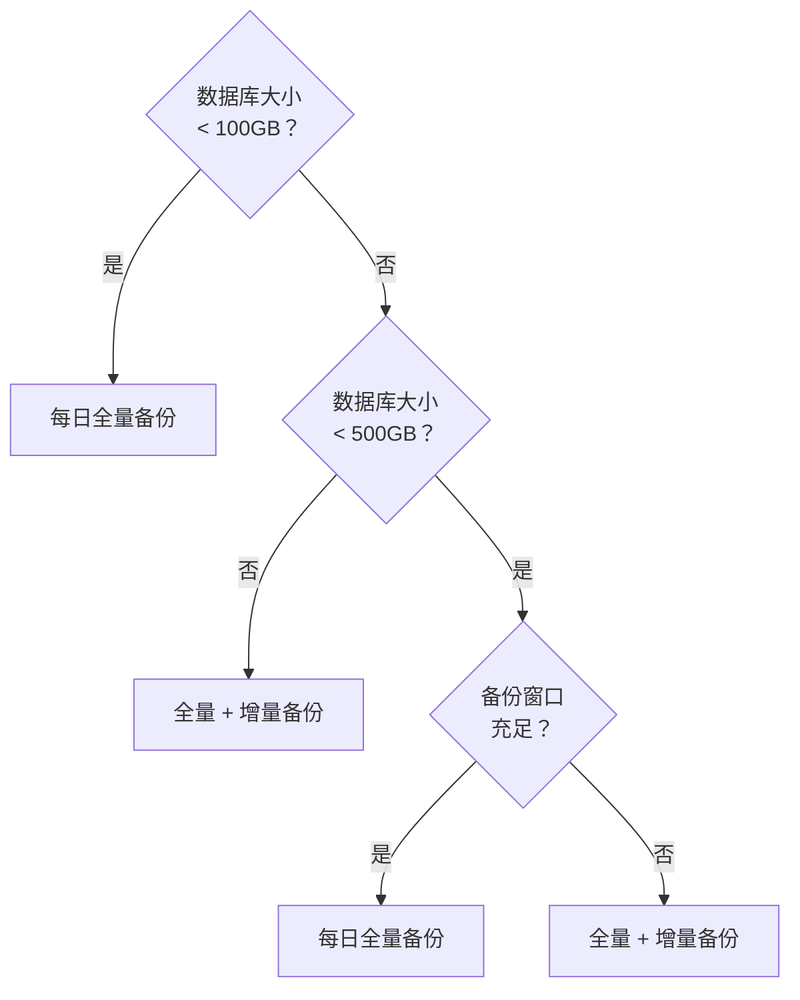

设计 PITR 策略时，最核心的权衡来自三个维度：
**备份仓库位置**、**恢复窗口长度**、**恢复速度与空间成本**。

本文帮助您在这些维度之间做出可操作的选择。


--------

## 本地 vs 远程

备份仓库的位置是 PITR 策略设计的第一步。

### 本地仓库

将备份存储在主库本地磁盘（`pgbackrest_method = local`）：

**优势**
- 配置简单，开箱即用
- 恢复速度快（本地 I/O）
- 无外部依赖

**劣势**
- 无异地容灾能力，主机故障时备份可能一同丢失
- 受限于本地磁盘容量
- 备份与生产数据位于同一故障域

### 远程仓库

将备份存储到 MinIO / S3 等对象存储（`pgbackrest_method = minio|s3`）：

**优势**
- 异地容灾，备份独立于数据库主机
- 容量几乎无限，多集群可共享
- 可配合加密、版本控制等安全策略

**劣势**
- 恢复速度受网络带宽影响
- 依赖对象存储的可用性
- 部署与运维成本更高

### 如何选择

| 场景         | 推荐仓库            | 理由                         |
|:-------------|:--------------------|:-----------------------------|
| 开发测试     | local               | 简单够用，容灾要求低         |
| 单机生产     | minio / s3           | 主机故障仍可恢复             |
| 集群生产     | local + minio        | 兼顾恢复速度与异地容灾       |
| 关键业务     | 多远程仓库           | 多地容灾，最高保护           |
{.full-width}

仓库配置细节请参阅 [**备份仓库**](/docs/pgsql/backup/repository/)。


--------

## 空间 vs 窗口

恢复窗口越长，所需存储空间越大。窗口长度由 **备份保留策略 + WAL 归档保留** 决定。

### 影响因素

| 因素             | 影响                                           |
|:-----------------|:-----------------------------------------------|
| **数据库规模**   | 决定全量备份基准空间                           |
| **变更速率**     | 影响增量备份与 WAL 归档大小                     |
| **备份频率**     | 频率越高，恢复越快，但空间增长更快               |
| **保留时间**     | 保留越久，恢复窗口越长，空间需求越大             |
{.full-width}

### 直观示例

假设数据库 100GB，每天变更 10GB：

**每日全量备份（保留 2 份）**


- 全量备份：100GB × 2 ≈ 200GB
- WAL 归档：10GB × 2 ≈ 20GB
- 总计：约 2～3 倍数据库空间

**周全量 + 每日增量（保留 14 天）**


- 全量备份：100GB × 2 ≈ 200GB
- 增量备份：约 10GB × 12 ≈ 120GB
- WAL 归档：10GB × 14 ≈ 140GB
- 总计：约 4～5 倍数据库空间

空间与窗口的关系是刚性约束，无法通过配置“同时更长窗口 + 更少空间”。


--------

## 策略选择

### 每日全量备份

**最简单可靠的策略**，也是 Pigsty 本地仓库的默认思路：

- 每天一次全量备份
- 保留 2 份备份
- 恢复窗口约 24～48 小时

适用场景：
- 数据库规模中小（< 500GB）
- 备份窗口充足
- 对存储空间不敏感

### 全量 + 增量备份

**空间优化策略**，适合大库或需要更长恢复窗口：

- 每周一次全量备份
- 其他日期执行增量备份
- 保留 14 天

适用场景：
- 数据库规模较大
- 使用对象存储
- 需要 1～2 周恢复窗口




--------

## 推荐配置

### 开发测试环境

```yaml
pg_crontab:
  - '00 01 * * * /pg/bin/pg-backup full'
pgbackrest_method: local
```

- 恢复窗口：24～48 小时
- 特点：配置最简，成本最低

### 生产集群

```yaml
pg_crontab:
  - '00 01 * * 1 /pg/bin/pg-backup full'
  - '00 01 * * 2,3,4,5,6,7 /pg/bin/pg-backup'
pgbackrest_method: minio
```

- 恢复窗口：7～14 天
- 特点：异地容灾，适合生产环境

### 关键业务

**双仓库策略**（本地 + 远程）：

```yaml
pgbackrest_method: local
pgbackrest_repo:
  local: { path: /pg/backup, retention_full: 2 }
  minio: { type: s3, retention_full_type: time, retention_full: 14 }
```

- 本地仓库用于快速恢复
- 远程仓库用于异地容灾

更多配置细节请参阅 [**备份策略**](/docs/pgsql/backup/policy/) 与 [**备份仓库**](/docs/pgsql/backup/repository/)。
