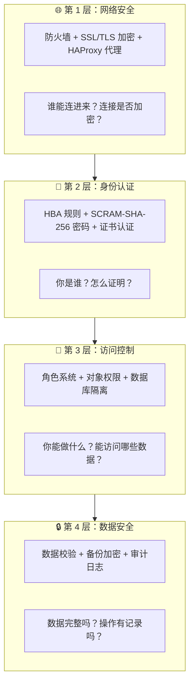
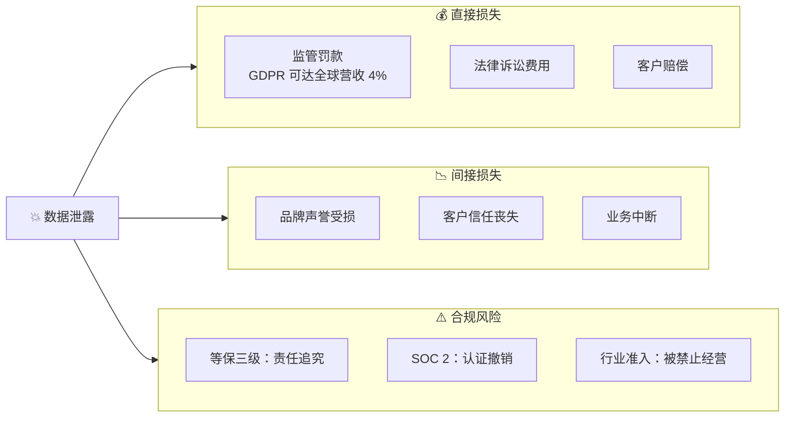
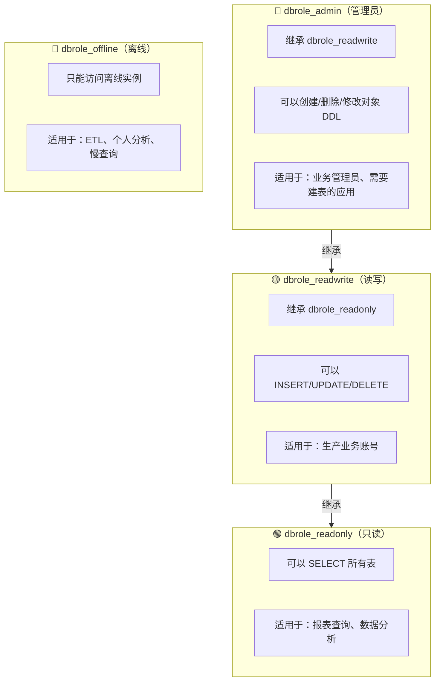
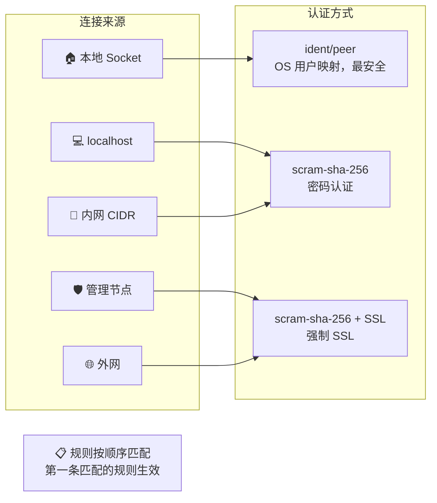
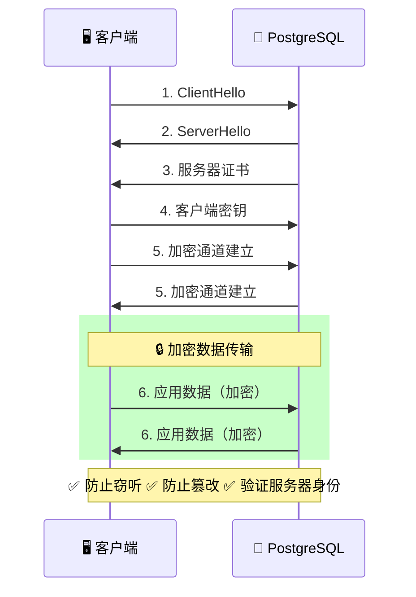

**Pigsty 的安全理念**

**默认安全**：开箱即用的安全配置，无需额外设置即可获得基本保护。

**渐进配置**：企业级用户可根据需求，通过配置逐步增强安全措施。

**纵深防御**：多层安全机制，即使某一层被突破，仍有其他层保护。

**最小权限**：只授予用户完成任务所需的最低权限，降低风险。

--------

## 概览

**加密备份一应俱全，只要硬件与密钥安全，您无需操心数据库的安全性。**

**Pigsty 针对高标准，严要求的企业级场景设计**，采用业界领先的 [安全最佳实践](/docs/setup/security) 保护您的数据安全（机密性/完整性/可用性），默认配置下的安全性便足以满足绝大多数场景下的合规要求。

Pigsty 会创建自签名的 CA （或使用您提供的 CA）签发证书，加密网络通信。需要保护的敏感管理页面与API端点都受到密码保护。
数据库备份使用 AES 算法加密，数据库密码使用 scram-sha-256 算法加密，并提供插件强制执行密码强度策略。
Pigsty 提供了一套开箱即用，简单易用，便于扩展的 [**ACL**](/docs/pgsql/security/) 模型，提供读/写/管理/ETL 的权限区分，并带有遵循最小权限原则的 [**HBA**](/docs/pgsql/config/hba) 规则集，通过多重防护确保系统机密性。

Pigsty 默认启用数据库校验和避免静默数据腐坏，通过从库副本提供坏块兜底。提供 CRIT 数据零丢失配置模板，使用 watchdog 确保为高可用 Fencing 兜底。
您可以通过 audit 插件审计数据库操作，系统与数据库日志全部收集备查，以满足合规要求。

Pigsty 正确配置 SELinux 与防火墙配置，并遵循最小权限原则设计操作系统用户组与文件权限，确保系统安全基线符合合规要求。
而且在 Etcd，MinIO 等附属可选组件上的安全上也毫不妥协，etcd 与 minio 均使用 RBAC 模型与 TLS 加密通信，确保系统整体安全性。

只要您遵循安全性最佳实践，内网部署并合理配置安全组与防火墙，合理配置的系统通过各种合规检查毫无问题。


----------------

## 默认安全配置

Pigsty 默认启用以下安全特性：

| 特性         | 默认配置            | 说明                    |
|:-----------|:----------------|:----------------------|
| **密码加密**   | `scram-sha-256` | PostgreSQL 最安全的密码哈希算法 |
| **SSL 支持** | 启用              | 客户端可选择使用 SSL 加密连接     |
| **本地 CA**  | 自动生成            | 自签名 CA 签发服务器证书        |
| **HBA 分层** | 按来源控制           | 不同来源使用不同认证强度          |
| **角色系统**   | 四层权限            | 只读/读写/管理员/离线          |
| **数据校验**   | 启用              | 检测存储层数据损坏             |
| **审计日志**   | 启用              | 记录连接和慢查询              |

### 可增强配置

通过额外配置可启用更高安全级别：

| 特性 | 配置方式 | 安全等级 |
|:-----|:---------|:---------|
| 密码强度检查 | 启用 `passwordcheck` 扩展 | 等保三级 |
| 强制 SSL | HBA 使用 `hostssl` | 等保三级 |
| 客户端证书 | HBA 使用 `cert` 认证 | 金融级 |
| 备份加密 | 配置 `cipher_type` | 合规要求 |
| 防火墙 | 配置 `node_firewall_mode` | 基础设施 |


如果您只有一分钟，请记住这张图：



**核心价值**：开箱即用的企业级安全配置，默认启用最佳实践，额外配置可达等保三级与 SOC 2 合规要求。


----------------

## 本章内容

| 章节                                 | 说明 | 核心问题 |
|:-----------------------------------|:-----|:---------|
| **安全概述**                           | 安全能力总览与检查清单 | 整体安全架构是怎样的？|
| [**身份认证**](/docs/concept/sec) | HBA 规则、密码策略、证书认证 | 如何验证用户身份？|
| [**访问控制**](ac/)                    | 角色系统、权限模型、数据库隔离 | 如何控制用户权限？|
| [**加密通信**](ca/)                    | SSL/TLS、本地 CA、证书管理 | 如何保护数据传输？|
| **合规清单**                           | 等保三级与 SOC2 详细对照 | 如何满足合规要求？|


----------------

## 为什么安全很重要？

### 数据泄露的代价




----------------

## 默认用户与密码

Pigsty 默认创建以下系统用户：

| 用户 | 用途 | 默认密码 | 部署后操作 |
|:-----|:-----|:---------|:-----------|
| `postgres` | 系统超级用户 | 无密码（仅本地） | 保持无密码 |
| `dbuser_dba` | 管理员用户 | `DBUser.DBA` | **必须修改** |
| `dbuser_monitor` | 监控用户 | `DBUser.Monitor` | **必须修改** |
| `replicator` | 复制用户 | `DBUser.Replicator` | **必须修改** |

```yaml
# pigsty.yml - 修改默认密码
pg_admin_password: 'YourSecurePassword123!'
pg_monitor_password: 'AnotherSecurePass456!'
pg_replication_password: 'ReplicationPass789!'
```

⚠️ **重要**：生产环境部署后，请**立即**修改这些默认密码！


----------------

## 角色与权限系统

Pigsty 提供开箱即用的四层角色系统：



### 创建业务用户

```yaml
pg_users:
  # 只读用户 - 用于报表查询
  - name: dbuser_report
    password: ReportUser123
    roles: [dbrole_readonly]
    pgbouncer: true

  # 读写用户 - 用于生产业务
  - name: dbuser_app
    password: AppUser456
    roles: [dbrole_readwrite]
    pgbouncer: true

  # 管理员用户 - 用于 DDL 操作
  - name: dbuser_admin
    password: AdminUser789
    roles: [dbrole_admin]
    pgbouncer: true
```


----------------

## HBA 访问控制

HBA（Host-Based Authentication）控制"谁可以从哪里连接"：



### 自定义 HBA 规则

```yaml
pg_hba_rules:
  # 允许应用服务器从内网连接
  - {user: dbuser_app, db: mydb, addr: '10.10.10.0/24', auth: scram-sha-256}

  # 强制某些用户使用 SSL
  - {user: admin, db: all, addr: world, auth: ssl}

  # 要求证书认证（最高安全级别）
  - {user: secure_user, db: all, addr: world, auth: cert}
```


----------------

## 加密通信

### SSL/TLS 架构



### 本地 CA

Pigsty 自动生成本地 CA 并签发证书：

```
/etc/pki/
├── ca.crt              # CA 证书（公开）
├── ca.key              # CA 私钥（保密！）
└── server.crt/key      # 服务器证书/私钥
```

⚠️ **重要**：请安全备份 `ca.key`，丢失后需要重新签发所有证书！


----------------

## 合规对照

### 等保三级（GB/T 22239-2019）

| 安全要求 | Pigsty 默认 | 可配置达到 | 说明 |
|:---------|:-----------:|:---------:|:-----|
| 身份鉴别唯一性 | ✅ | ✅ | 每个用户唯一标识 |
| 口令复杂度 | ⚠️ | ✅ | 启用 passwordcheck |
| 口令定期更换 | ⚠️ | ✅ | 需要运维流程 |
| 双因素认证 | ⚠️ | ✅ | 证书 + 密码 |
| 访问控制 | ✅ | ✅ | HBA + 角色系统 |
| 最小权限原则 | ✅ | ✅ | 四层角色模型 |
| 通信加密 | ✅ | ✅ | SSL/TLS |
| 审计日志 | ✅ | ✅ | 连接日志 + 慢查询 |
| 数据完整性 | ✅ | ✅ | 数据校验和 |
| 备份恢复 | ✅ | ✅ | pgBackRest |

### SOC 2 Type II

| 控制点 | Pigsty 支持 | 说明 |
|:-------|:-----------:|:-----|
| CC6.1 逻辑访问控制 | ✅ | HBA + 角色系统 |
| CC6.6 传输加密 | ✅ | SSL/TLS |
| CC7.2 系统监控 | ✅ | Prometheus + Grafana |
| CC9.1 业务连续性 | ✅ | 高可用 + PITR |
| A1.2 数据恢复 | ✅ | pgBackRest 备份 |

**图例**：✅ 默认满足 · ⚠️ 需要额外配置


----------------

## 安全检查清单

### 部署前

- [ ] 准备强密码（使用密码管理器生成）
- [ ] 规划网络分区（内网/外网 CIDR）
- [ ] 确定 SSL 策略（自签名/外部 CA）

### 部署后（必做）

- [ ] **修改所有默认密码**
- [ ] 验证 HBA 规则符合预期
- [ ] 测试 SSL 连接正常
- [ ] 配置认证失败告警
- [ ] 安全备份 CA 私钥

### 定期维护

- [ ] 审计用户权限
- [ ] 检查过期账户
- [ ] 更新证书（如需要）
- [ ] 检查审计日志


----------------

## 快速配置示例

### 生产环境安全配置

```yaml
# pigsty.yml - 生产环境安全配置示例
all:
  vars:
    # 修改默认密码（必须！）
    pg_admin_password: 'SecureDBAPassword2024!'
    pg_monitor_password: 'SecureMonitorPass2024!'
    pg_replication_password: 'SecureReplPass2024!'

    # 启用密码强度检查
    pg_libs: 'passwordcheck, pg_stat_statements, auto_explain'

    # 自定义 HBA 规则
    pg_hba_rules:
      # 应用服务器
      - {user: app, db: appdb, addr: '10.10.10.0/24', auth: scram-sha-256}
      # 管理员强制 SSL
      - {user: dbuser_dba, db: all, addr: world, auth: ssl}
```

### 金融级安全配置

```yaml
# 金融级配置 - 启用证书认证
pg_hba_rules:
  # 交易系统使用证书认证
  - {user: trade_user, db: trade, addr: world, auth: cert}
  # 其他系统使用 SSL + 密码
  - {user: all, db: all, addr: world, auth: ssl}

# 启用备份加密
pgbackrest_repo:
  minio:
    cipher_type: aes-256-cbc
    cipher_pass: 'YourBackupEncryptionKey'
```


----------------

## 接下来

深入了解安全配置的细节：

- 👁️ **安全概述**：整体安全架构与检查清单
- 🔑 [**身份认证**](/docs/concept/sec)：HBA 规则与密码策略
- 👤 [**访问控制**](ac/)：角色系统与权限模型
- 🔐 [**加密通信**](ca/)：SSL/TLS 与证书管理
- ✅ **合规清单**：等保三级与 SOC2 详细对照

相关话题：

- ♾️ [**高可用**](/docs/concept/ha/)：业务连续性保障
- ⏰ [**备份恢复**](/docs/concept/pitr/)：数据恢复能力
- 📊 [**可观测性**](/docs/concept/monitor)：安全事件监控

