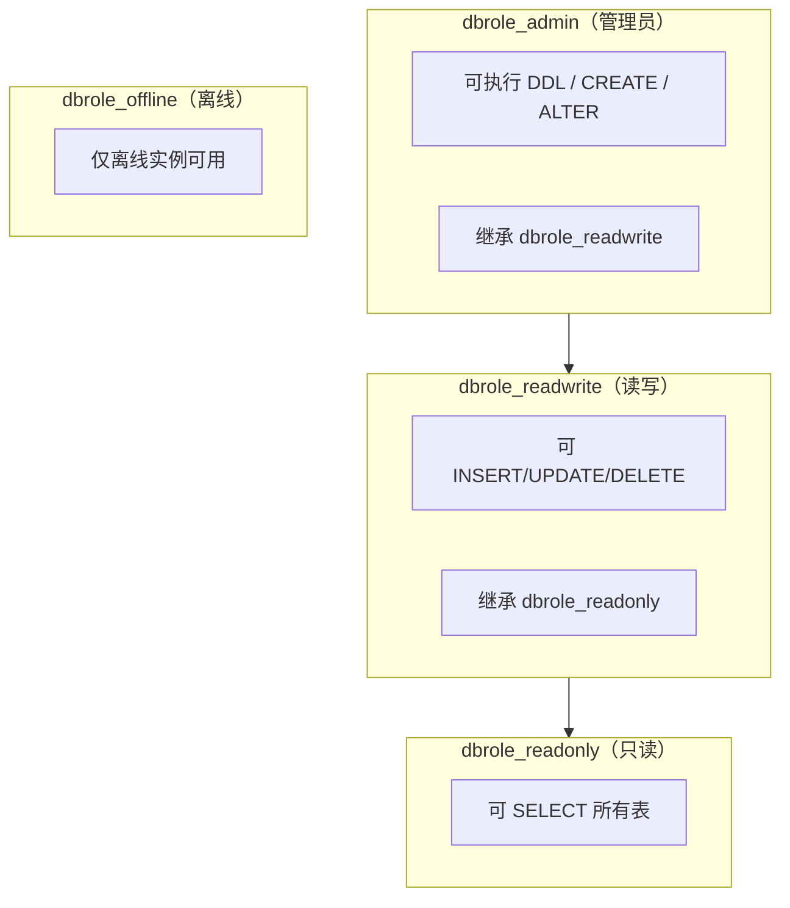

访问控制解决两个核心问题：

- **你能做什么**：读/写/DDL 的权限边界
- **你能访问哪些数据**：跨库、跨模式的隔离边界

Pigsty 通过 **RBAC 角色体系 + 默认权限策略** 将“最小权限”落实为默认行为。


---------------------

## 四层角色模型



**解决的问题**

- 生产账号天然拥有过高权限
- DDL 与 DML 不分离导致误操作风险


---------------------

## 默认角色与系统用户

Pigsty 默认提供四个角色与四个系统用户（来自源码默认值）：

| 角色/用户 | 属性 | 继承/角色 | 描述 |
|---|---|---|---|
| `dbrole_readonly` | `NOLOGIN` | - | 全局只读访问 |
| `dbrole_offline` | `NOLOGIN` | - | 受限只读（离线实例） |
| `dbrole_readwrite` | `NOLOGIN` | `dbrole_readonly` | 全局读写访问 |
| `dbrole_admin` | `NOLOGIN` | `pg_monitor, dbrole_readwrite` | 管理员 / 对象创建 |
| `postgres` | `SUPERUSER` | - | 系统超级用户 |
| `replicator` | `REPLICATION` | `pg_monitor, dbrole_readonly` | 复制用户 |
| `dbuser_dba` | `SUPERUSER` | `dbrole_admin` | 管理员用户 |
| `dbuser_monitor` | - | `pg_monitor, dbrole_readonly` | 监控用户 |
{.full-width}

这套默认角色可以覆盖绝大多数业务场景。


---------------------

## 默认权限策略

Pigsty 在初始化时写入默认权限（`pg_default_privileges`），确保新建对象自动具备合理权限。

**解决的问题**

- 新建对象未授权导致应用不可用
- 误授权给 `PUBLIC` 导致全库暴露

**思路**

- 只读角色：`SELECT/EXECUTE`
- 读写角色：`INSERT/UPDATE/DELETE`
- 管理员角色：`DDL` 权限


---------------------

## 对象所有权与 DDL 规范

默认权限仅对“**管理员角色创建的对象**”自动生效。

这意味着：

- 必须使用 `dbuser_dba`/`postgres` 执行 DDL
- 或业务管理员先 `SET ROLE dbrole_admin`

否则新对象会脱离默认权限体系，破坏最小权限原则。


---------------------

## 数据库隔离

数据库级别支持 `revokeconn`，可做到跨库隔离：

```yaml
pg_databases:
  - { name: appdb, owner: dbuser_app, revokeconn: true }
```

**解决的问题**

- 一个账号可以“穿透”访问所有数据库
- 多租户数据库缺乏边界


---------------------

## 公共权限收敛

Pigsty 初始化时撤销 `public` 模式的 `CREATE` 权限：

```
REVOKE CREATE ON SCHEMA public FROM PUBLIC;
```

**解决的问题**

- 非授权用户随意创建对象
- “影子表/影子函数”带来的安全风险


---------------------

## 离线角色的作用

`dbrole_offline` 只能访问离线实例（`pg_role=offline` 或 `pg_offline_query=true`）。

**解决的问题**

- ETL/分析任务影响生产性能
- 个人账号在主库执行高危查询


---------------------

## 最佳实践

- 业务账号默认使用 `dbrole_readwrite` 或 `dbrole_readonly`。
- 生产 DDL 必须经由管理员角色。
- 多租户业务启用 `revokeconn` 隔离。
- 报表/ETL 使用 `dbrole_offline`。


---------------------

## 接下来

- 🔑 [**身份认证**](../auth/)：HBA 规则与密码策略
- 🔐 [**加密通信**](../ca/)：TLS 与证书管理
- ✅ [**合规清单**](../compliance/)：等保与 SOC2 对照
