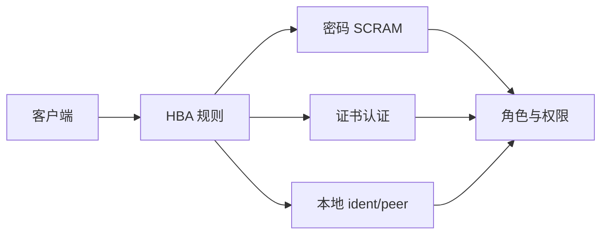

身份认证解决三个核心问题：

- **你是谁**：身份是否唯一可识别？
- **你怎么证明**：密码/证书是否足够安全？
- **你从哪里来**：来源是否受控？

Pigsty 使用 **HBA 规则 + 密码/证书** 完成身份认证，并以 SCRAM 为默认密码哈希方案。


---------------------

## 认证链路



HBA 决定“**谁能从哪里来**”，认证方式决定“**如何证明身份**”。


---------------------

## HBA 分层模型

Pigsty 默认 HBA 规则已经分层：

- **本地**使用 `ident/peer`，最安全。
- **内网**使用 `scram` 密码认证。
- **外网管理员**必须走 `ssl`。

这解决了“**同一个用户在不同来源使用不同认证强度**”的问题。

**HBA 规则的关键能力**

- **顺序优先**：支持 `order` 排序，数值越小优先级越高。
- **地址别名**：`local` / `localhost` / `intra` / `world` 等。
- **角色条件**：`primary/replica/offline` 可精细化控制。


---------------------

## 密码认证

默认密码哈希算法：

```yaml
pg_pwd_enc: scram-sha-256
```

**解决的问题**

- 明文密码存储风险
- 弱哈希被离线破解

**兼容性**

如需兼容老客户端可使用 `md5`，但会降低安全性。


---------------------

## 密码强度与轮换

Pigsty 支持启用密码强度检查扩展：

```yaml
pg_libs: '$libdir/passwordcheck, pg_stat_statements, auto_explain'
pg_extensions: [ passwordcheck, credcheck ]
```

通过 `expire_in` 控制账号过期时间：

```yaml
pg_users:
  - { name: dbuser_app, password: 'StrongPwd', expire_in: 365 }
```

**解决的问题**

- 弱口令与口令复用
- 长期不轮换的账号风险


---------------------

## 证书认证

证书认证解决“**密码被钓鱼/被拷贝**”的风险。

- HBA `auth: cert` 要求客户端证书。
- 证书 `CN` 通常对应数据库用户名。
- Pigsty 内置 `cert.yml` 用于签发客户端证书。


---------------------

## PgBouncer 认证

PgBouncer 使用独立 HBA 规则与 TLS 设置：

```yaml
pgbouncer_sslmode: disable   # 默认关闭，可设为 require/verify-full
pgb_default_hba_rules: [...] # 独立规则
```

这解决了“连接池入口与数据库入口不同步”的问题。


---------------------

## 默认账号与风险

| 用户 | 默认密码 | 风险 |
|---|---|---|
| `dbuser_dba` | `DBUser.DBA` | 管理账号默认密码 |
| `dbuser_monitor` | `DBUser.Monitor` | 监控账号易被滥用 |
| `replicator` | `DBUser.Replicator` | 复制账号被滥用可导致数据外泄 |
{.full-width}

生产环境必须修改默认密码。


---------------------

## 安全建议

- 对外入口全部启用 `ssl/cert`。
- 内网用户使用 `scram`，避免 `md5`。
- 启用 `passwordcheck` 强制复杂度。
- 定期轮换口令（`expire_in`）。


---------------------

## 接下来

- 👤 [**访问控制**](../ac/)：角色与权限模型
- 🔐 [**加密通信**](../ca/)：TLS 与证书管理
- ✅ [**合规清单**](../compliance/)：等保与 SOC2 对照
