安全不是一道墙，而是一座城。Pigsty 采用 **纵深防御** 策略，在七个层次上构建多重保护，即使某一层被突破，仍有其他层提供保护。


--------

## 概览


```
infographic sequence-pyramid-simple
data
  title 七层安全模型
  desc Pigsty 纵深防御体系：从物理安全到用户安全的多层保护
  items
    - label 物理安全
      value 100
      desc 数据校验和 · PGTDE 透明加密
      time L1
      icon mingcute/building-4-fill
      illus server-cluster
    - label 网络安全
      value 95
      desc 防火墙 · SSL/TLS 加密 · 本地 CA
      time L2
      icon mingcute/earth-2-fill
      illus secure-server
    - label 边界安全
      value 90
      desc HAProxy 代理 · Nginx 网关
      time L3
      icon mingcute/shield-fill
      illus firewall-protection
    - label 主机安全
      value 85
      desc SELinux · 最小权限 · 系统加固
      time L4
      icon mingcute/computer-fill
      illus server-status
    - label 应用安全
      value 80
      desc HBA 规则 · 密码策略 · 连接池
      time L5
      icon mingcute/safe-box-fill
      illus database-security
    - label 数据安全
      value 75
      desc 备份加密 · 审计日志 · PITR
      time L6
      icon mingcute/lock-fill
      illus data-encryption
    - label 用户安全
      value 70
      desc 四角色模型 · RBAC · 证书认证
      time L7
      icon mingcute/user-security-fill
      illus user-flow
theme light
  palette pigsty
```



--------

## 物理安全

> 物理访问失守，则其他层形同虚设。

物理安全是最基础的一层，涉及机房门禁、监控、环境控制、设备防盗、电力保障等。Pigsty 作为软件解决方案，在物理层面提供以下保护机制：

### 数据校验和

启用数据校验和可以检测存储层的静默数据损坏（如磁盘坏块、内存错误、固件 Bug）：

```yaml
pg_checksum: true  # v3.5+ 默认启用
```

**原理**：PostgreSQL 在每个数据页写入时计算校验和，读取时验证。发现损坏时报错而非返回错误数据。

**兜底机制**：从库副本提供坏块兜底，主库数据页损坏时可从从库恢复。

### 透明数据加密

对于有合规要求的场景，可使用 **PGTDE**（PostgreSQL Transparent Data Encryption）扩展：

```yaml
pg_extensions:
  - pg_tde  # 透明数据加密扩展
```

**效果**：数据在磁盘上以加密形式存储，即使物理介质被盗也无法读取数据。


--------

## 网络安全

> 控制数据包层面的访问和过滤。

### 防火墙

Pigsty 支持节点级防火墙配置，控制哪些端口对外开放：

```yaml
node_firewall_mode: zone       # off | none | zone
node_firewall_intranet:        # 内网 CIDR（信任区域）
  - 10.0.0.0/8
  - 172.16.0.0/12
  - 192.168.0.0/16
node_firewall_public_port:     # 公网开放端口
  - 22    # SSH
  - 80    # HTTP
  - 443   # HTTPS
```

**三种模式**：

| 模式 | 说明 | 适用场景 |
|:-----|:-----|:---------|
| `off` | 不配置防火墙（默认） | 开发环境、已有安全组 |
| `none` | 禁用 firewalld | 使用外部防火墙 |
| `zone` | 区域模式：内网信任，公网受限 | 生产环境推荐 |
{.full-width}

### SSL/TLS 加密

Pigsty 在多个层次提供 SSL/TLS 加密：

| 组件 | 参数 | 默认值 | 说明 |
|:-----|:-----|:-------|:-----|
| PostgreSQL | HBA `auth` | `pwd` | 支持 `ssl`（强制）、`cert`（证书） |
| Pgbouncer | `pgbouncer_sslmode` | `disable` | 可选 `require` / `verify-full` |
| Patroni | `patroni_ssl_enabled` | `false` | REST API 加密 |
| Nginx | `nginx_sslmode` | `enable` | 可选 `enforce`（强制 HTTPS） |
| MinIO | 默认启用 | 启用 | 使用本地 CA 证书 |
| etcd | 默认启用 | 启用 | TLS 加密通信 |
{.full-width}

**安全加固配置**：

```yaml
patroni_ssl_enabled: true    # 启用 Patroni SSL
pgbouncer_sslmode: require   # 强制 Pgbouncer SSL
nginx_sslmode: enforce       # 强制 HTTPS
```

### 本地 CA 证书基础设施

Pigsty 自动生成本地 CA 并签发证书，无需购买商业证书：

```
files/pki/ca/
├── ca.crt              # CA 证书（公开，分发到所有节点）
└── ca.key              # CA 私钥（⚠️ 保密！安全备份！）

/etc/pki/               # 节点上的证书目录
├── ca.crt              # CA 证书
├── server.crt          # 服务器证书
└── server.key          # 服务器私钥
```

**⚠️ 重要**：请安全备份 `ca.key`，丢失后需要重新签发所有证书！


--------

## 边界安全

> 处理内外网交界处的安全策略。

### HAProxy 安全

HAProxy 作为数据库流量的统一入口，提供以下安全功能：

```yaml
haproxy_admin_password: 'StrongPassword123'  # 管理界面密码
```

**安全特性**：
- 健康检查与流量控制，避免脑裂
- 连接限制与速率限制
- 管理界面密码保护

### Nginx 安全

Nginx 作为 Web 服务的统一网关，提供：

```yaml
nginx_sslmode: enforce  # 强制 HTTPS
infra_portal:           # 配置各组件域名
  grafana: { domain: g.pigsty.cc }
  alertmanager: { domain: a.pigsty.cc }
```

**安全特性**：
- 统一的 HTTPS 入口，便于审计
- 反向代理保护后端服务
- 可集成外部认证（OAuth、LDAP）


--------

## 主机安全

> 操作系统加固、补丁管理、最小化安装。

### SELinux 配置

Pigsty 正确配置 SELinux 策略，确保 PostgreSQL 等服务正常运行：

```yaml
node_selinux_mode: permissive  # disabled | permissive | enforcing
```

| 模式 | 说明 | 适用场景 |
|:-----|:-----|:---------|
| `disabled` | 完全禁用 | 开发环境 |
| `permissive` | 宽容模式（记录但不阻止） | 生产环境推荐 |
| `enforcing` | 强制模式 | 高安全要求环境 |
{.full-width}

### 操作系统加固

Pigsty 遵循最小权限原则设计：

- **文件权限**：敏感文件（如 CA 私钥）权限严格控制
- **用户组**：PostgreSQL、etcd 等服务使用专用用户运行
- **管理员配置**：

```yaml
node_admin_username: dba        # 管理员用户名
node_admin_sudo: nopasswd       # sudo 策略
```

### 系统更新

保持关键安全组件更新：
- `openssh`：SSH 服务
- `ca-certificates`：系统根证书
- `openssl`：加密库


--------

## 应用安全

> 数据库配置、认证授权、输入验证。

### 密码策略

#### 密码加密算法

```yaml
pg_pwd_enc: scram-sha-256  # 最安全的密码哈希算法
```

| 算法              | 安全性 | 兼容性            | 说明       |
|:----------------|:----|:---------------|:---------|
| `scram-sha-256` | ⭐⭐⭐ | PostgreSQL 10+ | 推荐，默认值   |
| `md5`           | ⭐   | 所有版本           | 仅用于老旧客户端 |
{.full-width}

#### 密码强度检查

启用 `passwordcheck` 扩展强制密码复杂度：

```yaml
pg_libs: '$libdir/passwordcheck, pg_stat_statements, auto_explain'
pg_extensions:
  - passwordcheck  # 强制密码复杂度
  - credcheck      # 额外的密码检查
```

#### 密码过期

```yaml
pg_users:
  - { name: dbuser_app, password: 'SecurePass123', expire_in: 365 }  # 1年后过期
```

### HBA 规则

HBA（Host-Based Authentication）控制"谁可以从哪里连接，使用什么方式认证"：

```yaml
pg_default_hba_rules:
  - {user: '${dbsu}'     ,db: all         ,addr: local     ,auth: ident ,title: 'dbsu local via ident'}
  - {user: '${dbsu}'     ,db: replication ,addr: local     ,auth: ident ,title: 'dbsu repl via ident'}
  - {user: '${repl}'     ,db: replication ,addr: localhost ,auth: pwd   ,title: 'repl via localhost'}
  - {user: '${repl}'     ,db: replication ,addr: intra     ,auth: pwd   ,title: 'repl from intranet'}
  - {user: '${repl}'     ,db: postgres    ,addr: intra     ,auth: pwd   ,title: 'repl from intranet'}
  - {user: '${monitor}'  ,db: all         ,addr: localhost ,auth: pwd   ,title: 'monitor via localhost'}
  - {user: '${monitor}'  ,db: all         ,addr: infra     ,auth: pwd   ,title: 'monitor from infra'}
  - {user: '${admin}'    ,db: all         ,addr: infra     ,auth: ssl   ,title: 'admin from infra'}
  - {user: '${admin}'    ,db: all         ,addr: world     ,auth: ssl   ,title: 'admin from world'}
  - {user: '+dbrole_readonly',db: all     ,addr: localhost ,auth: pwd   ,title: 'read from localhost'}
  - {user: '+dbrole_readonly',db: all     ,addr: intra     ,auth: pwd   ,title: 'read from intranet'}
  - {user: '+dbrole_offline' ,db: all     ,addr: intra     ,auth: pwd   ,title: 'offline from intranet'}
```

**认证方式**：

| 别名 | 说明 | 安全等级 |
|:-----|:-----|:---------|
| `ident/peer` | OS 用户映射 | ⭐⭐⭐ 仅本地 |
| `pwd` | 密码认证（scram-sha-256） | ⭐⭐ |
| `ssl` | 强制 SSL + 密码 | ⭐⭐⭐ |
| `cert` | 客户端证书认证 | ⭐⭐⭐⭐ 最高 |
| `deny` | 拒绝访问 | - |
{.full-width}

### 监听地址

限制 PostgreSQL 监听的网络接口：

```yaml
pg_listen: '${ip},${vip},${lo}'  # 仅监听特定 IP，而非 0.0.0.0
```


--------

## 数据安全

> 加密、备份、审计、完整性保护。

### 备份加密

pgBackRest 支持 AES-256 加密备份：

```yaml
pgbackrest_repo:
  minio:
    cipher_type: aes-256-cbc           # AES-256-CBC 加密
    cipher_pass: 'pgBR.${pg_cluster}'  # 使用集群名作为密码一部分
```

**效果**：备份文件在存储中以加密形式保存，即使存储被入侵也无法读取数据。

### 审计日志

#### PostgreSQL 审计扩展

```yaml
pg_extensions:
  - pgaudit           # SQL 审计日志
  - pgauditlogtofile  # 审计日志写入文件
  - pg_auth_mon       # 认证监控
  - pg_auditor        # 审计辅助
```

#### 连接日志

```yaml
# 在 pg_parameters 中配置
log_connections: on        # 记录连接建立
log_disconnections: on     # 记录连接断开
```

#### 慢查询日志

```yaml
log_min_duration_statement: 1000  # 记录 >1s 的查询
```

### 时间点恢复（PITR）

Pigsty 默认配置 pgBackRest 支持时间点恢复：

```yaml
pgbackrest_enabled: true
pgbackrest_repo:
  local:                           # 本地备份
    path: /pg/backup
    retention_full: 2
  minio:                           # 远程备份
    path: /pgbackrest
    retention_full_type: time
    retention_full: 14             # 保留 14 天
```


--------

## 用户安全

> 身份认证、权限管理、行为审计。

### 四角色模型

Pigsty 提供开箱即用的四层权限角色：

```mermaid
flowchart TB
    subgraph Admin["🔴 dbrole_admin（管理员）"]
        A1["继承 dbrole_readwrite"]
        A2["可以 CREATE/DROP/ALTER（DDL）"]
        A3["适用于：业务管理员、建表应用"]
    end
    subgraph RW["🟡 dbrole_readwrite（读写）"]
        RW1["继承 dbrole_readonly"]
        RW2["可以 INSERT/UPDATE/DELETE"]
        RW3["适用于：生产业务账号"]
    end
    subgraph RO["🟢 dbrole_readonly（只读）"]
        RO1["可以 SELECT 所有表"]
        RO2["适用于：报表查询、数据分析"]
    end
    subgraph Offline["🔵 dbrole_offline（离线）"]
        OFF1["只能访问离线实例"]
        OFF2["适用于：ETL、慢查询、个人分析"]
    end

    Admin --> |继承| RW
    RW --> |继承| RO
```



**创建业务用户**：

```yaml
pg_users:
  - { name: dbuser_report, password: 'ReportPass123', roles: [dbrole_readonly] }
  - { name: dbuser_app, password: 'AppPass456', roles: [dbrole_readwrite] }
  - { name: dbuser_admin, password: 'AdminPass789', roles: [dbrole_admin] }
```

### 默认用户与密码

| 用户 | 默认密码 | 用途 | 部署后操作 |
|:-----|:---------|:-----|:-----------|
| `postgres` | 无密码（仅本地） | 系统超级用户 | 保持无密码 |
| `dbuser_dba` | `DBUser.DBA` | 管理员用户 | **必须修改** |
| `dbuser_monitor` | `DBUser.Monitor` | 监控用户 | **必须修改** |
| `replicator` | `DBUser.Replicator` | 复制用户 | **必须修改** |
{.full-width}

**自动生成强密码**：

```bash
./configure -g  # 自动生成随机强密码
```

### 证书认证

最高安全级别，要求客户端提供有效证书：

```yaml
pg_hba_rules:
  - {user: admin, db: all, addr: world, auth: cert}  # 管理员使用证书认证
```

### ETCD 与 MinIO 安全

附属组件同样采用 RBAC 模型与 TLS 加密：

```yaml
# ETCD
etcd_root_password: 'Etcd.Root.Strong'  # 必须修改

# MinIO
minio_access_key: minioadmin
minio_secret_key: 'S3User.MinIO.Strong'  # 必须修改
minio_users:
  - { access_key: pgbackrest, secret_key: 'Min10.bAckup', policy: readwrite }
  - { access_key: dba, secret_key: 'S3User.DBA.Strong', policy: consoleAdmin }
```

### Watchdog 防护

防止脑裂，确保故障切换时主库强制关机：

```yaml
patroni_watchdog_mode: required  # off | automatic | required
```

**效果**：当 Patroni 进程异常时，watchdog 强制重启节点，避免双主脑裂。


--------

## 合规对照

### 等保三级（GB/T 22239-2019）

| 安全要求 | Pigsty 默认 | 可配置达到 | 实现方式 |
|:---------|:-----------:|:---------:|:---------|
| 身份鉴别唯一性 | ✅ | ✅ | 用户名唯一标识 |
| 口令复杂度 | ⚠️ | ✅ | `passwordcheck` 扩展 |
| 口令定期更换 | ⚠️ | ✅ | `expire_in` 属性 |
| 双因素认证 | ⚠️ | ✅ | 证书 + 密码 (`auth: cert`) |
| 访问控制 | ✅ | ✅ | HBA + 四层角色模型 |
| 最小权限原则 | ✅ | ✅ | `dbrole_readonly/readwrite/admin` |
| 通信加密 | ✅ | ✅ | SSL/TLS |
| 审计日志 | ✅ | ✅ | `pgaudit` + 连接日志 |
| 数据完整性 | ✅ | ✅ | `pg_checksum: true` |
| 备份恢复 | ✅ | ✅ | pgBackRest + PITR |
{.full-width}

### SOC 2 Type II

| 控制点 | Pigsty 支持 | 实现方式 |
|:-------|:-----------:|:---------|
| CC6.1 逻辑访问控制 | ✅ | HBA + RBAC |
| CC6.6 传输加密 | ✅ | SSL/TLS（可强制） |
| CC7.2 系统监控 | ✅ | Prometheus + Grafana |
| CC9.1 业务连续性 | ✅ | 高可用 + PITR |
| A1.2 数据恢复 | ✅ | pgBackRest 备份 |
{.full-width}

**图例**：✅ 默认满足 · ⚠️ 需要额外配置


--------

## 安全检查清单

### 部署前

- [ ] 准备强密码（使用 `./configure -g` 自动生成）
- [ ] 规划网络分区（内网/外网 CIDR）
- [ ] 确定 SSL 策略（自签名 CA 或外部 CA）
- [ ] 确定是否启用防火墙

### 部署后（必做）

- [ ] **修改所有默认密码**
- [ ] 验证 HBA 规则符合预期
- [ ] 测试 SSL 连接正常
- [ ] 配置认证失败告警
- [ ] 安全备份 CA 私钥

### 增强安全（可选）

- [ ] 启用 `passwordcheck` 扩展
- [ ] 强制 SSL（`pgbouncer_sslmode: require`）
- [ ] 启用证书认证（`auth: cert`）
- [ ] 启用 `pgaudit` 审计日志
- [ ] 启用备份加密
- [ ] 启用 Patroni SSL
- [ ] 启用 watchdog
- [ ] 配置防火墙规则
- [ ] 启用 SELinux 强制模式


--------

## 接下来

深入了解安全配置的细节：

- 👤 [**访问控制**](ac/)：角色系统与权限模型
- 🔐 [**加密通信**](ca/)：SSL/TLS 与证书管理

相关话题：

- ♾️ [**高可用**](../ha/)：业务连续性保障
- ⏰ [**备份恢复**](../pitr/)：数据恢复能力
