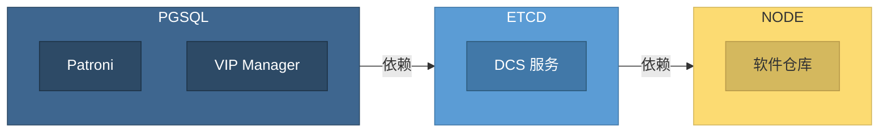

ETCD 是一个分布式的、可靠的键-值存储，用于存放系统中最为关键的配置数据。

Pigsty 使用 [**etcd**](https://etcd.io/) 作为 [**DCS**](https://patroni.readthedocs.io/en/latest/dcs_failsafe_mode.html)（分布式配置存储），它对于 PostgreSQL 的高可用性与自动故障转移至关重要。

[`ETCD`](/docs/etcd) 模块依赖 [`NODE`](/docs/node) 模块，同时被 [`PGSQL`](/docs/pgsql) 模块依赖。因此在安装 [`ETCD`](/docs/etcd) 模块之前，您需要安装 [`NODE`](/docs/node) 模块将节点纳管。
在部署任何 [`PGSQL`](/docs/pgsql) 集群之前，你必须先部署一套 [`ETCD`](/docs/etcd) 集群，因为 PostgreSQL 高可用所需的 `patroni` 和 `vip-manager` 会依赖 etcd 实现高可用与 L2 VIP 主库绑定。

在一套 Pigsty 部署中，只需要一套 etcd 集群。同一套 etcd 集群可以为多套 PostgreSQL 集群提供 DCS 服务支持。
Pigsty 中的 etcd 默认启用 RBAC，不同 PostgreSQL 集群使用独立的用户名与密码访问 etcd，从而实现多租户管理隔离。
管理员使用 etcd root 用户，拥有对所有 PostgreSQL 集群的管理权限。

