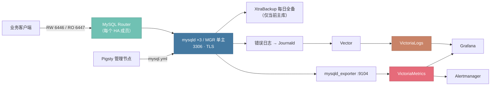

[MySQL](https://www.mysql.com/) 是世界上最流行的开源关系型数据库之一。Pigsty 的 **MYSQL** 模块在纳管节点上部署固定的 **原生 MySQL 8.4 LTS 平台**：单机实例，或基于 Group Replication 的三节点单主 InnoDB Cluster，并统一管理 TLS、备份、监控与生命周期。

{}
MYSQL 是补充性的试点模块，定位是「简单、廉价、够用」的 MySQL 集群，不追求与 PGSQL 模块同级的完备性。
核心能力（部署收敛、高可用切换、每日备份、监控告警）已经过系统性测试；
完全停机恢复、物理备份恢复等破坏性流程刻意保留为手工运维操作，参见 [日常管理](/docs/mysql/admin) 中的操作手册。
{}


--------

## 模块能力

MYSQL 模块当前提供：

- 固定的原生 MySQL 8.4 LTS 平台：Server、Client、Shell、Router、XtraBackup 版本一致，开箱即用
- 两种拓扑：单机实例，或三节点单主 InnoDB Cluster（MySQL Shell AdminAPI 创建与收敛）
- 每个 HA 成员本机部署 MySQL Router，提供拓扑感知的读写（`6446`）与只读（`6447`）入口
- 全链路强制 TLS：复用 Pigsty 共享 CA 签发节点叶证书，拒绝非加密连接
- 声明式业务对象：`mysql_databases` 与 `mysql_users` 增量收敛，不隐式删除数据
- `mysql_parameters` 参数覆盖：调整关键参数（如 `max_connections`），配置变更自动编排滚动重启
- 每日全量物理备份：XtraBackup 备份并完成整备（prepare），带保留策略、并发锁与原子提交
- 完整可观测性：mysqld_exporter 指标、68 条预置衍生规则、27 条告警规则、5 个 Grafana Dashboard、错误日志入 VictoriaLogs
- 默认启用 `sql_require_primary_key`：拦截无主键表，保护 MGR 复制与灾难恢复
- 收敛式运维：成员掉线、AdminAPI 状态漂移等场景重跑 `mysql.yml` 即可自愈；危险操作有安全护栏


--------

## 模块架构

MYSQL 模块依赖 [`NODE`](/docs/node) 完成节点纳管、软件仓库与共享 CA，依赖 [`INFRA`](/docs/infra) 提供 VictoriaMetrics、VictoriaLogs、Grafana 与 Alertmanager。不依赖 `ETCD` 与 `PGSQL`。



三节点模式下 `mysql_seq=1` 只是首次引导协调者：运行时 PRIMARY 由选举产生，重跑剧本不会把主库强制切回 1 号节点。


--------

## 组件与端口

| 组件 | 用途 | 固定端点 |
|:---|:---|:---|
| `mysqld` | 单机服务或 MGR 成员 | Classic `3306`、X Protocol `33060` |
| Group Replication | 三节点复制与共识（XCOM） | `33061` |
| MySQL Router | HA 拓扑感知入口，每个成员均部署 | RW `6446`、RO `6447` |
| MySQL Shell | AdminAPI 生命周期管理 | 本机控制面 |
| XtraBackup | 每日全量物理备份 | 本地备份仓库 |
| `mysqld_exporter` | MySQL 与 MGR 指标 | `9104` |
{.full-width}

角色创建并管理三个平台身份：

- `dbuser_cluster@'%'`：要求 TLS 的 AdminAPI 与 Router 引导身份（仅 HA 集群创建）；
- `dbuser_monitor@'127.0.0.1'`：最小权限 Exporter 身份；
- `dbuser_backup@'localhost'`：本地 XtraBackup 身份。


--------

## 平台支持

原生软件包平台门禁为：

| 架构 | 支持的系统 |
|:---|:---|
| `x86_64` | EL 8/9/10、Debian 12/13、Ubuntu 22/24 |
| `aarch64` | EL 9/10 |
{.full-width}

Debian/Ubuntu ARM64 会被预检拒绝：Oracle APT 仓库的 MySQL 8.4 组件没有 `arm64` 载荷。ARM 环境请使用 EL 9/10（如 Rocky Linux）。


--------

## 能力边界

MYSQL 是固定平台，不是通用 MySQL 安装器。以下事项 **有意不做**，使用前请确认可以接受：

- **拓扑固定为 1 或 3 节点**：不支持 1→3 原地升级、3→5 扩容或长期两节点拓扑；容量升级通过逻辑迁移完成，硬件更换通过 [同地址替换](/docs/mysql/admin#替换故障成员) 完成
- **版本、端口、目录、字符集固定**：不暴露相应参数；内存参数按节点规格自动推导，可用 [`mysql_parameters`](/docs/mysql/param#mysql_parameters) 覆盖关键参数
- **备份为每日本地全量**：无增量链、无 Binlog 连续归档、无 PITR；物理恢复是手工流程（附 [操作手册](/docs/mysql/admin#恢复物理备份)）
- **完全停机恢复保留为手工操作**：防止自动化误判造成脑裂，剧本失败信息会给出恢复指引
- **无 VIP / DNS / HAProxy 接入层**：客户端通过任一成员的 Router 端口或多地址 DSN 接入


--------

## 文档目录

| 文档 | 说明 |
|:---|:---|
| [集群配置](/docs/mysql/config) | 拓扑规划、身份参数、业务库表用户、参数覆盖与备份配置 |
| [参数参考](/docs/mysql/param) | 11 项公开参数与固定平台约定 |
| [日常管理](/docs/mysql/admin) | 状态检查、客户端接入、配置变更、故障处理与三份恢复手册 |
| [预置剧本](/docs/mysql/playbook) | `mysql.yml` 与 `mysql-rm.yml` 的用法、标签与安全护栏 |
| [监控告警](/docs/mysql/monitor) | Dashboard、衍生规则、告警规则与日志查询 |
| [指标定义](/docs/mysql/metric) | 标签模型与衍生指标字典 |
| [常见问题](/docs/mysql/faq) | 平台限制、主键要求、恢复与排障 |
{.full-width}


--------

## 快速开始

在清单中声明集群（完整模板见 [`conf/demo/mysql.yml`](https://github.com/pgsty/pigsty/blob/main/conf/demo/mysql.yml)）：

```yaml
all:
  children:
    my-test:
      hosts:
        10.10.10.11: { mysql_seq: 1 }
        10.10.10.12: { mysql_seq: 2 }
        10.10.10.13: { mysql_seq: 3 }
      vars:
        mysql_cluster: my-test
        mysql_databases: [ { name: app } ]
        mysql_users: [ { name: app, password: DBUser.App, priv: { 'app.*': 'ALL PRIVILEGES' } } ]

  vars:
    node_repo_modules: node,infra,mysql   # 软件仓库需包含 mysql 模块
    mysql_root_password: MySQL.Root       # 生产环境必须修改示例密码
    mysql_monitor_password: MySQL.Monitor
    mysql_cluster_password: MySQL.Cluster
```

完成 [`NODE`](/docs/node) 纳管后执行部署：

```bash
./node.yml  -l my-test             # 节点纳管：仓库、共享 CA、监控代理
./mysql.yml -l my-test --check     # 预检完整三节点集群
./mysql.yml -l my-test             # 真实部署，三节点约 2 分钟

mysql -h 10.10.10.11 -P 6446 -u app -pDBUser.App \
  --ssl-mode=VERIFY_CA --ssl-ca=/etc/pki/ca.crt app   # 通过 Router 读写入口接入
```

部署后访问 Grafana 的 [MySQL Overview](https://demo.pigsty.cc/ui/d/mysql-overview) Dashboard 查看集群状态。
