Pigsty 的 PostgreSQL 集群带有开箱即用的高可用方案，由 [**Patroni**](https://patroni.readthedocs.io/en/latest/)、[**Etcd**](https://etcd.io/) 和 [**HAProxy**](http://www.haproxy.org/) 强力驱动。

当您的 PostgreSQL 集群含有两个或更多实例时，您无需任何配置即拥有了硬件故障自愈的数据库高可用能力 —— 只要集群中有任意实例存活，集群就可以对外提供完整的服务，而客户端只要连接至集群中的任意节点，即可获得完整的服务，而无需关心主从拓扑变化。

在默认配置下，主库故障恢复时间目标 RTO ≈ 30s，数据恢复点目标 RPO < 1MB；从库故障 RPO = 0，RTO ≈ 0 (闪断)；在一致性优先模式下，可确保故障切换数据零损失：RPO = 0。以上指标均可通过参数，根据您的实际硬件条件与可靠性要求 [**按需配置**](#利弊权衡)。

Pigsty 内置了 HAProxy 负载均衡器用于自动流量切换，提供 DNS/VIP/LVS 等多种接入方式供客户端选用。故障切换与主动切换对业务侧除零星闪断外几乎无感知，应用不需要修改连接串重启。
极小的维护窗口需求带来了极大的灵活便利：您完全可以在无需应用配合的情况下滚动维护升级整个集群。硬件故障可以等到第二天再抽空善后处置的特性，让研发，运维与 DBA 都能在故障时安心睡个好觉。

许多大型组织与核心机构已经在生产环境中长时间使用 Pigsty ，最大的部署有 25K CPU 核心与 220+ PostgreSQL 超大规格实例（64c / 512g / 3TB NVMe SSD）；在这一部署案例中，五年内经历了数十次硬件故障与各类事故，但依然可以保持高于 **99.999%** 的总体可用性战绩。


-----------------

## 架构概览

Pigsty 高可用架构由四个核心组件构成，它们协同工作，实现故障自动检测、领导者选举与流量切换：

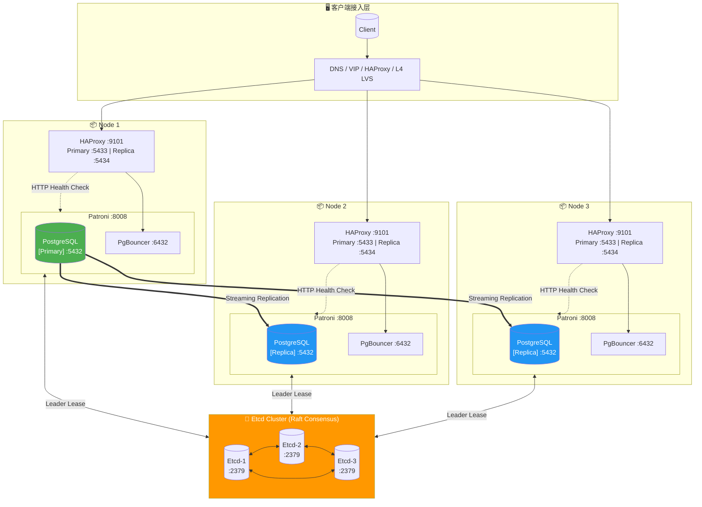


-----------------

## 组件详解

### PostgreSQL

PostgreSQL 是核心数据库服务，使用标准**流复制**（Streaming Replication）搭建物理从库：

- **主库（Primary）**：接受读写请求，生成 WAL 日志
- **从库（Replica）**：通过流复制实时接收 WAL，提供只读查询
- **复制槽（Replication Slot）**：确保 WAL 不被过早清理
- **同步提交**：可选的同步复制模式，确保 RPO = 0

关键配置（由 Patroni 动态管理）：

```yaml
wal_level: logical                    # 启用逻辑复制级别
max_wal_senders: 50                   # 最大 WAL 发送进程数
max_replication_slots: 50             # 最大复制槽数量
hot_standby: on                       # 从库可读
wal_log_hints: on                     # 支持 pg_rewind
track_commit_timestamp: on            # 追踪事务时间戳
synchronous_standby_names: ''         # 同步从库列表（动态管理）
```

-----------------

### Patroni

[Patroni](https://patroni.readthedocs.io/) 是高可用的核心引擎，负责管理 PostgreSQL 生命周期与集群状态：

**核心职责**：
- 管理 PostgreSQL 进程的启停与配置
- 维护领导者租约（Leader Lease）
- 执行自动故障切换（Failover）与主动切换（Switchover）
- 提供 REST API 用于健康检查与集群管理
- 处理从库的自动重建与 `pg_rewind`

**关键时序参数**（控制 RTO）：

| 参数 | 默认值 | 说明 |
|:-----|:------:|:-----|
| `ttl` | 30s | 领导者租约有效期，即故障检测时间窗口 |
| `loop_wait` | 10s | Patroni 主循环间隔 |
| `retry_timeout` | 10s | DCS 与 PostgreSQL 操作重试超时 |
| `primary_start_timeout` | 10s | 主库启动超时时间 |
| `primary_stop_timeout` | 30s | 主库优雅停止超时（同步模式下生效） |

这些参数由 [`pg_rto`](/docs/pgsql/param#pg_rto) 统一计算派生，默认 30s 的 RTO 对应：

```yaml
ttl: 30                               # 领导者租约 TTL
loop_wait: 10                         # 主循环间隔 = RTO/3
retry_timeout: 10                     # 重试超时 = RTO/3
primary_start_timeout: 10             # 主库启动超时 = RTO/3
```

**约束条件**：`ttl >= loop_wait + retry_timeout * 2`

**健康检查端点**（供 HAProxy 使用）：

| 端点 | 用途 | 返回 200 条件 |
|:-----|:-----|:-------------|
| `/primary` | 主库服务 | 当前节点是 Leader |
| `/replica` | 从库服务 | 当前节点是 Replica |
| `/read-only` | 只读服务 | 节点可读（主库或从库） |
| `/health` | 健康检查 | PostgreSQL 运行正常 |
| `/leader` | 领导者检查 | 持有领导者锁 |
| `/async` | 异步从库 | 异步复制从库 |
| `/sync` | 同步从库 | 同步复制从库 |

-----------------

### Etcd

[Etcd](https://etcd.io/) 作为分布式配置存储（DCS），提供集群共识能力：

**核心职责**：
- 存储集群配置与状态信息
- 提供领导者选举的原子操作
- 通过租约机制实现故障检测
- 存储 PostgreSQL 动态配置

**存储结构**（以 `/pg` 命名空间为例）：

```
/pg/
├── <cluster_name>/
│   ├── leader          # 当前领导者标识
│   ├── config          # 集群配置（DCS 配置）
│   ├── history         # 故障切换历史
│   ├── initialize      # 集群初始化标记
│   ├── members/        # 成员信息目录
│   │   ├── pg-test-1   # 实例 1 元数据
│   │   ├── pg-test-2   # 实例 2 元数据
│   │   └── pg-test-3   # 实例 3 元数据
│   └── sync            # 同步从库状态
```

**关键配置**：

```yaml
election_timeout: 1000ms              # 选举超时（影响 Etcd 自身 HA）
heartbeat_interval: 100ms             # 心跳间隔
quota_backend_bytes: 16GB             # 存储配额
auto_compaction_mode: periodic        # 自动压缩
auto_compaction_retention: 24h        # 保留 24 小时历史
```

**Etcd 集群要求**：
- **必须奇数节点**：3、5、7 个节点，确保多数派仲裁
- 推荐独立部署于管理节点，与 PostgreSQL 节点分离
- 网络延迟应保持在 10ms 以内

-----------------

### HAProxy

[HAProxy](http://www.haproxy.org/) 负责服务发现与流量分发：

**核心职责**：
- 通过 HTTP 健康检查发现主从角色
- 将流量路由到正确的后端节点
- 提供负载均衡与连接池功能
- 实现服务的自动故障转移

**默认服务定义**：

| 服务名 | 端口 | 目标 | 健康检查 | 用途 |
|:-------|:----:|:-----|:---------|:-----|
| primary | 5433 | pgbouncer | `/primary` | 读写服务，路由到主库 |
| replica | 5434 | pgbouncer | `/read-only` | 只读服务，优先路由到从库 |
| default | 5436 | postgres | `/primary` | 直连主库（绕过连接池） |
| offline | 5438 | postgres | `/replica` | 离线从库（ETL/备份） |

**健康检查配置**：

```haproxy
listen pg-test-primary
    bind *:5433
    mode tcp
    option httpchk
    http-check send meth OPTIONS uri /primary
    http-check expect status 200
    default-server inter 3s fastinter 1s downinter 5s rise 3 fall 3
                   on-marked-down shutdown-sessions slowstart 30s
                   maxconn 3000 maxqueue 128 weight 100
    server pg-test-1 10.10.10.11:6432 check port 8008
    server pg-test-2 10.10.10.12:6432 check port 8008 backup
    server pg-test-3 10.10.10.13:6432 check port 8008 backup
```

**健康检查时序参数**（影响 RTO 敏感度）：

| 参数 | 默认值 | 说明 |
|:-----|:------:|:-----|
| `inter` | 3s | 正常检查间隔 |
| `fastinter` | 1s | 状态变化后的快速检查间隔 |
| `downinter` | 5s | 节点宕机后的检查间隔 |
| `rise` | 3 | 节点恢复需要连续成功次数 |
| `fall` | 3 | 节点宕机需要连续失败次数 |

**流量切换时序**（主库故障）：
- 故障检测：`fall × inter` = 3 × 3s = 9s
- 快速探测：一旦发现异常，切换到 `fastinter`（1s）
- 服务恢复：新主库提升后，`rise × fastinter` = 3 × 1s = 3s

-----------------

### VIP Manager（可选）

[vip-manager](https://github.com/cybertec-postgresql/vip-manager) 提供可选的二层 VIP 支持：

**工作原理**：
1. 监听 Etcd 中的领导者键（`/pg/<cluster>/leader`）
2. 当本节点成为领导者时，绑定 VIP 到指定网卡
3. 发送免费 ARP 通告网络中的设备更新 MAC 映射
4. 当失去领导者地位时，解绑 VIP

**配置示例**：

```yaml
interval: 1000                        # 检查间隔（毫秒）
trigger-key: "/pg/pg-test/leader"     # 监听的 Etcd 键
trigger-value: "pg-test-1"            # 匹配的领导者值
ip: 10.10.10.100                      # VIP 地址
netmask: 24                           # 子网掩码
interface: eth0                       # 绑定网卡
dcs-type: etcd                        # DCS 类型
retry-num: 2                          # 重试次数
retry-after: 250                      # 重试间隔（毫秒）
```

**使用限制**：
- 要求所有节点在同一二层网络
- 云环境通常不支持，需使用云厂商 VIP 或 DNS 方案
- 切换时间约 1-2 秒

-----------------

## 控制流与数据流

### 正常运行状态

**控制流**：Patroni 与 Etcd 之间的心跳与租约管理

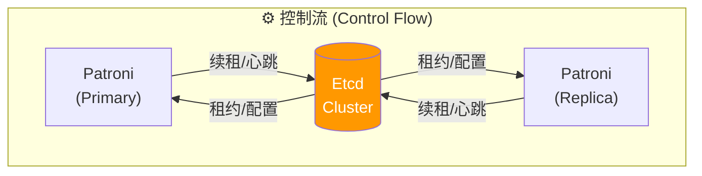

**数据流**：客户端请求与 WAL 复制

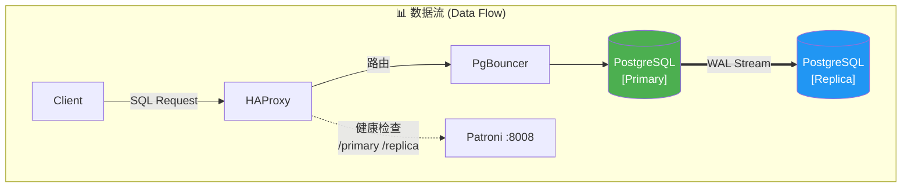

### 故障切换流程

当主库发生故障时，系统经历以下阶段：

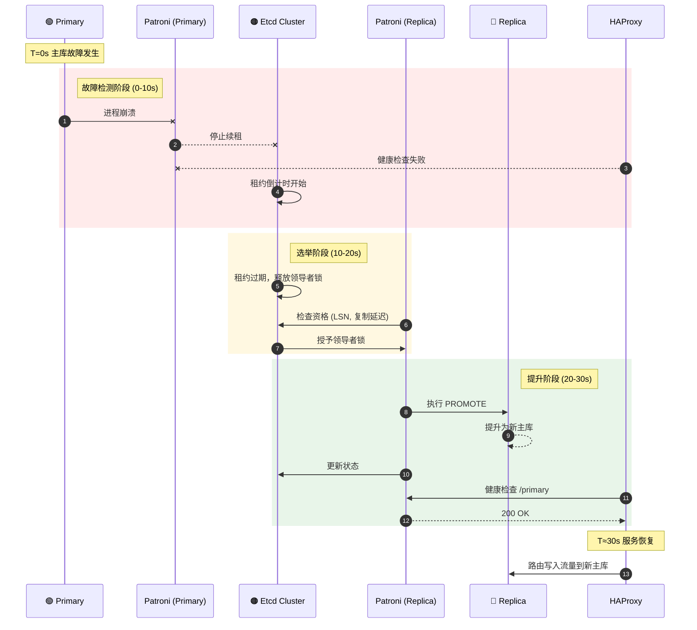

**关键时序公式**：

```
RTO ≈ TTL + Election_Time + Promote_Time + HAProxy_Detection

其中：
- TTL = pg_rto (默认 30s)
- Election_Time ≈ 1-2s
- Promote_Time ≈ 1-5s
- HAProxy_Detection = fall × inter + rise × fastinter ≈ 12s

实际 RTO 通常在 15-40s 之间，取决于：
- 网络延迟
- 从库 WAL 回放进度
- PostgreSQL 恢复速度
```

-----------------

## 高可用部署模式

### 三节点标准模式

**最推荐的生产部署模式**，提供完整的自动故障转移能力：

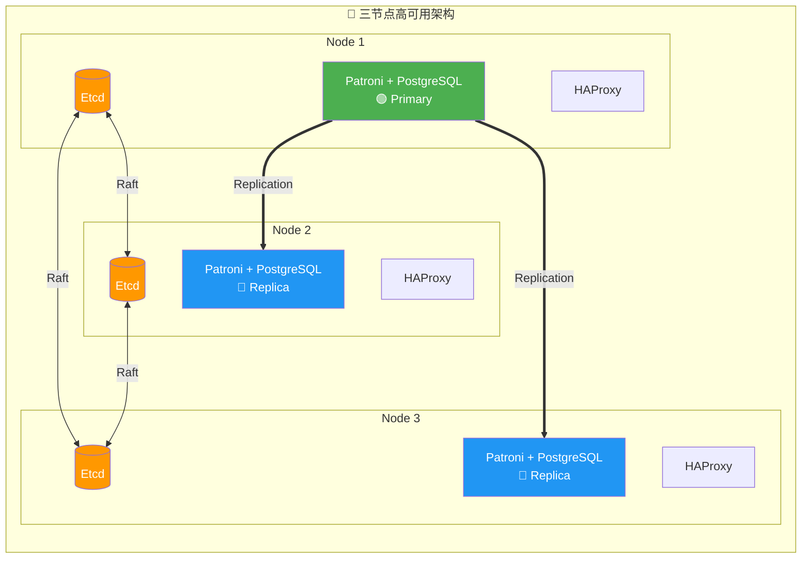

**故障容忍**：
- ✅ 任意 1 个节点故障：自动切换，服务继续
- ⚠️ 2 个节点故障：需要人工介入

**配置示例**：

```yaml
pg-test:
  hosts:
    10.10.10.11: { pg_seq: 1, pg_role: primary }
    10.10.10.12: { pg_seq: 2, pg_role: replica }
    10.10.10.13: { pg_seq: 3, pg_role: replica }
  vars:
    pg_cluster: pg-test
```

-----------------

### 五节点增强模式

**更高可用性要求的部署**，可容忍 2 个节点故障：

```mermaid
flowchart LR
    subgraph Cluster["🏛️ 五节点高可用架构"]
        direction TB

        subgraph Row1[""]
            direction LR
            N1["Node 1<br/>Etcd + 🟢 Primary"]
            N2["Node 2<br/>Etcd + 🔵 Replica"]
            N3["Node 3<br/>Etcd + 🔵 Replica"]
            N4["Node 4<br/>Etcd + 🔵 Replica"]
            N5["Node 5<br/>Etcd + 🔵 Replica"]
        end
    end

    N1 ==> N2 & N3 & N4 & N5

    N1 <-.->|"Etcd Raft"| N2
    N2 <-.->|"Etcd Raft"| N3
    N3 <-.->|"Etcd Raft"| N4
    N4 <-.->|"Etcd Raft"| N5

    style N1 fill:#4CAF50,color:#fff
    style N2 fill:#2196F3,color:#fff
    style N3 fill:#2196F3,color:#fff
    style N4 fill:#2196F3,color:#fff
    style N5 fill:#2196F3,color:#fff
```

**Etcd 仲裁**：3/5 多数派 | **PostgreSQL**：1 主 4 从

**故障容忍**：
- ✅ 任意 2 个节点故障：自动切换
- ⚠️ 3 个节点故障：需要人工介入

**适用场景**：
- 金融核心系统
- 跨机房部署（2+2+1 分布）
- 需要专用离线从库的场景

-----------------

### 两节点半高可用模式

**资源受限时的折中方案**，提供有限的自动切换能力：

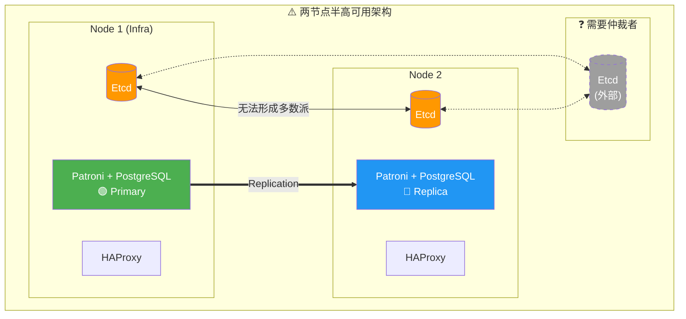

**问题**：Etcd 只有 2 节点，无法形成多数派

**解决方案**：
1. 在外部添加第 3 个 Etcd 节点（纯仲裁）
2. 使用 failsafe_mode 防止脑裂
3. 接受非对称故障切换

**非对称故障切换**：
- **从库故障**：✅ 自动处理，主库继续服务
- **主库故障**：⚠️ 需要人工介入（无法自动选举）

**配置建议**：

```yaml
# 启用 failsafe 模式防止误切换
patroni_watchdog_mode: off            # 禁用 watchdog
pg_rto: 60                            # 增大 RTO 减少误报
```

-----------------

### 同城双中心模式

**同城容灾部署**，机房级故障容忍：

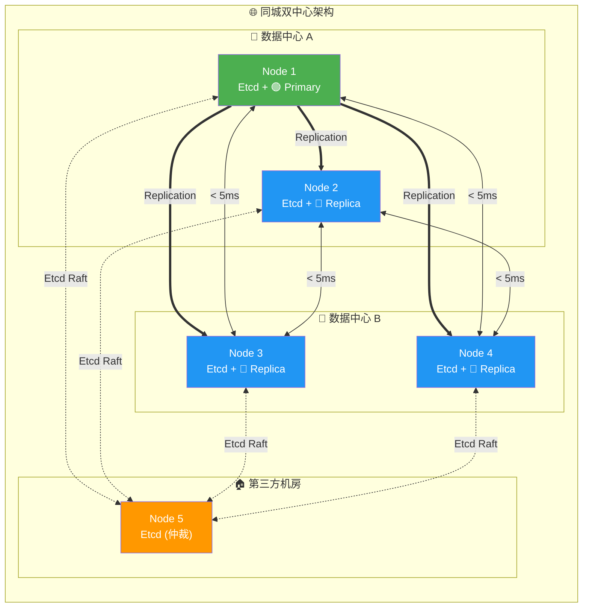

**网络要求**：
- 机房间延迟 < 5ms（同步复制）或 < 20ms（异步复制）
- 带宽充足，确保 WAL 传输
- 仲裁节点可以是轻量级 VM

**故障场景**：

| 故障 | 影响 | 恢复方式 |
|:-----|:-----|:---------|
| DC-A 单节点故障 | 无影响 | 自动 |
| DC-B 单节点故障 | 无影响 | 自动 |
| DC-A 整体故障 | 切换到 DC-B | 自动（需仲裁节点） |
| DC-B 整体故障 | 无影响 | 自动 |
| 仲裁节点故障 | 降级为 4 节点 | 可容忍 1 节点故障 |

-----------------

### 异地多活模式

**跨地域部署**，需要考虑延迟与带宽：

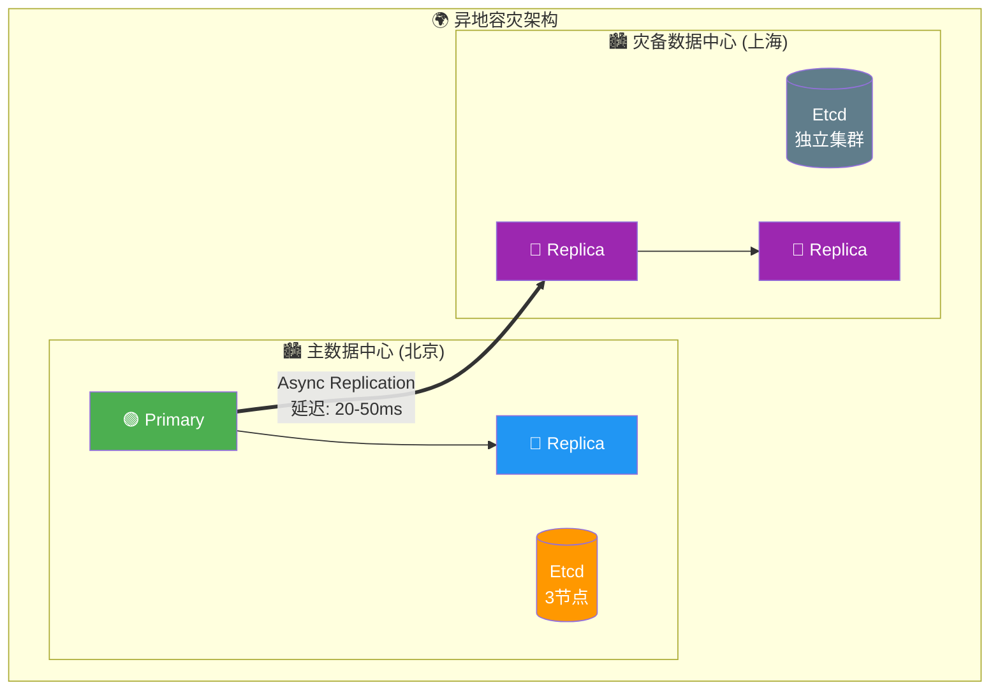

**部署策略**：
1. 主中心：完整 HA 集群（3+ 节点）
2. 灾备中心：级联从库（Standby Cluster）
3. 异步复制：容忍网络延迟
4. 独立 Etcd：避免跨地域仲裁

**级联从库配置**：

```yaml
# 灾备集群配置
pg-standby:
  hosts:
    10.20.10.11: { pg_seq: 1, pg_role: primary }  # 级联领导者
    10.20.10.12: { pg_seq: 2, pg_role: replica }
  vars:
    pg_cluster: pg-standby
    pg_upstream: 10.10.10.11          # 指向主集群
    pg_delay: 1h                       # 可选：延迟复制
```

-----------------

## 故障场景分析

### 单节点故障

#### 主库进程崩溃

**场景**：PostgreSQL 主库进程被 `kill -9` 或发生崩溃

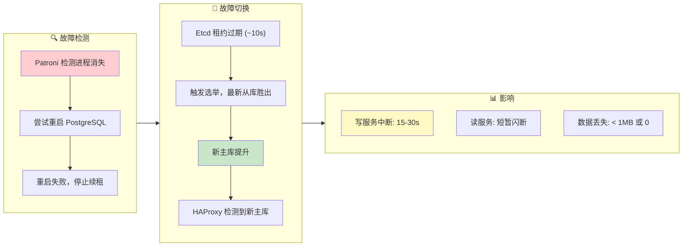

#### Patroni 进程故障

**场景**：Patroni 进程被杀或崩溃

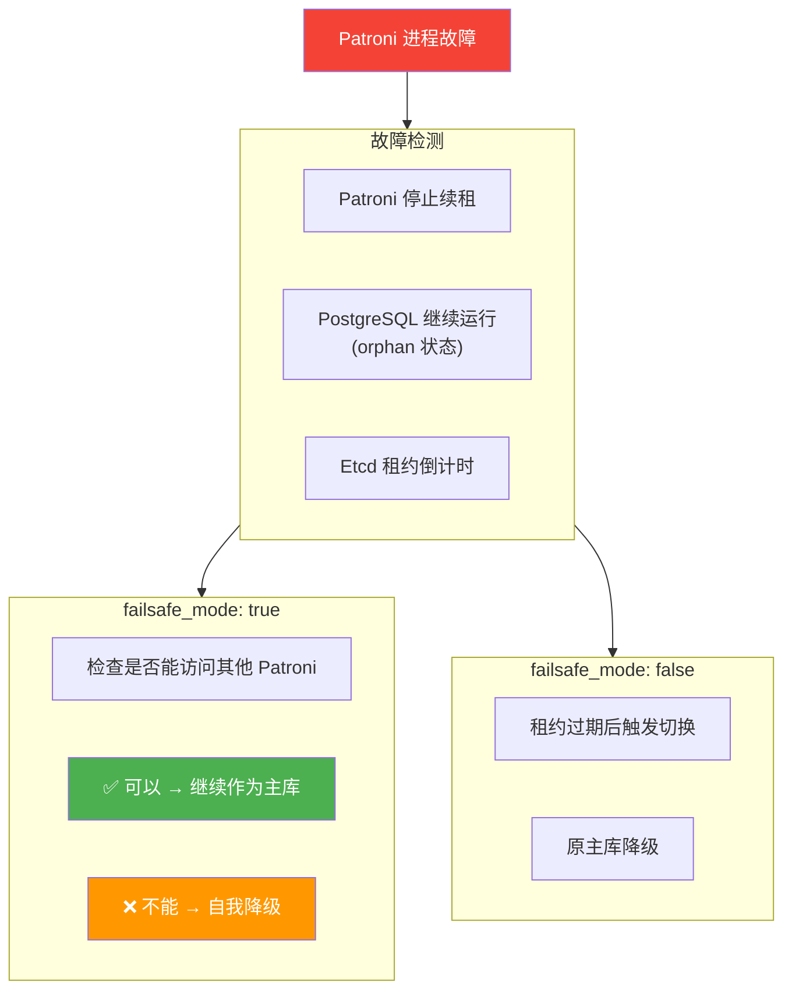

#### 从库故障

**场景**：任意从库节点故障

**影响**：
- 只读流量重新分配到其他从库
- 如果无其他从库，主库承担只读流量
- ✅ 写服务完全不受影响

**恢复**：
- 节点恢复后 Patroni 自动启动
- 自动从主库重新同步
- 恢复为从库角色

-----------------

### 多节点故障

#### 三节点坏两个（2/3 故障）

**场景**：3 节点集群，2 个节点同时故障

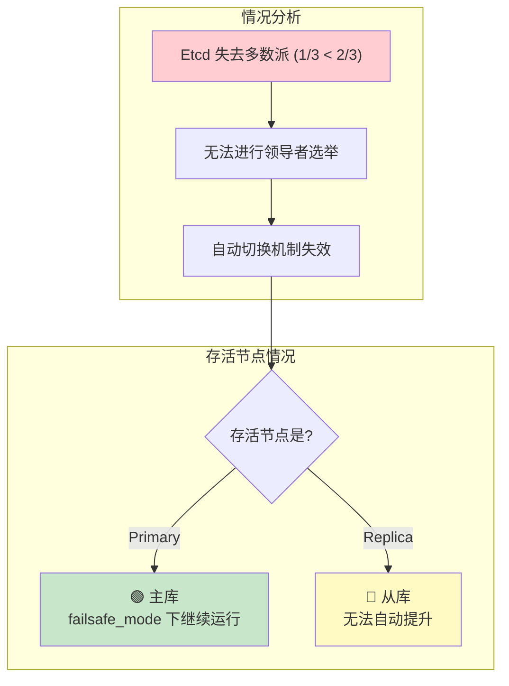

**紧急恢复流程**：

```bash
# 1. 确认存活节点状态
patronictl -c /etc/patroni/patroni.yml list

# 2. 如果存活节点是从库，手动提升
pg_ctl promote -D /pg/data

# 3. 或者使用 pg-promote 脚本
/pg/bin/pg-promote

# 4. 修改 HAProxy 配置，直接指向存活节点
# 注释掉健康检查，硬编码路由

# 5. 恢复 Etcd 集群后，重新初始化
```

#### 两节点坏一个（1/2 故障）

**场景**：2 节点集群，主库故障

**问题**：
- Etcd 只有 2 节点，无多数派
- 无法完成选举
- 从库无法自动提升

**解决方案**：
1. 方案 1：添加外部 Etcd 仲裁节点
2. 方案 2：人工介入提升从库
3. 方案 3：使用 Witness 节点

**手动提升步骤**：
1. 确认主库确实不可恢复
2. 停止从库 Patroni：`systemctl stop patroni`
3. 手动提升：`pg_ctl promote -D /pg/data`
4. 直接启动 PostgreSQL：`systemctl start postgres`
5. 更新应用连接串或 HAProxy 配置

-----------------

### Etcd 集群故障

#### Etcd 单节点故障

**场景**：3 节点 Etcd 集群，1 节点故障

**影响**：
- ✅ Etcd 仍有多数派（2/3）
- ✅ 服务正常运行
- ✅ PostgreSQL HA 不受影响

**恢复**：
- 修复故障节点
- 使用 etcd-add 重新加入
- 或替换为新节点

#### Etcd 多数派丢失

**场景**：3 节点 Etcd 集群，2 节点故障

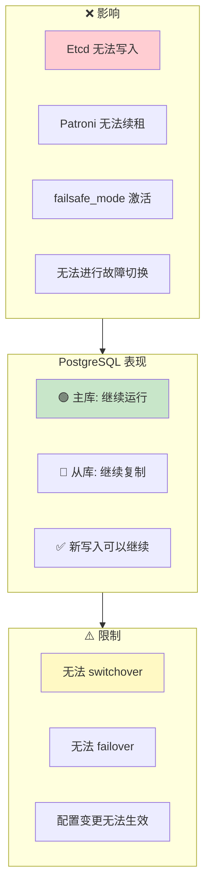

**恢复优先级**：
1. 恢复 Etcd 多数派
2. 验证 PostgreSQL 状态
3. 检查 Patroni 是否正常续租

-----------------

### 网络分区

#### 主库网络隔离

**场景**：主库与 Etcd/其他节点网络不通

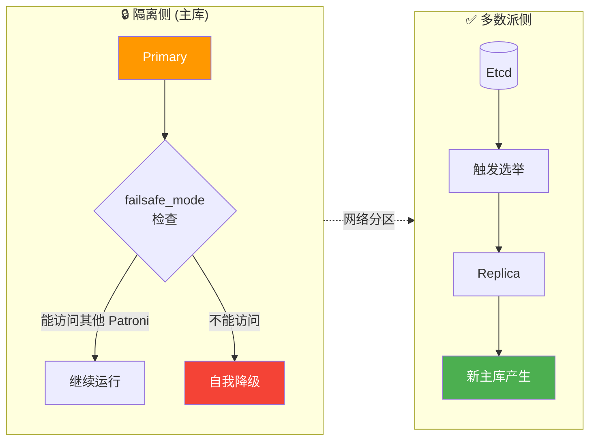

**脑裂防护**：
- Patroni failsafe_mode
- 旧主库自我检测
- fencing（可选）
- Watchdog（可选）

#### Watchdog 机制

**用于极端情况下的防护**：

```yaml
watchdog:
  mode: automatic                     # off|automatic|required
  device: /dev/watchdog
  safety_margin: 5                    # 安全边际（秒）
```

**工作原理**：
- Patroni 定期向 watchdog 设备写入
- 如果 Patroni 无响应，内核触发重启
- 确保旧主库不会继续服务
- 防止严重的脑裂场景

-----------------

## RTO / RPO 深度分析

### RTO 时序分解

**恢复时间目标（RTO）** 由多个阶段组成：

```mermaid
gantt
    title RTO 时间分解 (默认配置 pg_rto=30s)
    dateFormat ss
    axisFormat %S秒

    section 故障检测
    Patroni 检测/停止续租    :a1, 00, 10s

    section 选举阶段
    Etcd 租约过期           :a2, after a1, 2s
    候选者竞选 (比较 LSN)    :a3, after a2, 3s

    section 提升阶段
    执行 promote            :a4, after a3, 3s
    更新 Etcd 状态          :a5, after a4, 2s

    section 流量切换
    HAProxy 检测新主库      :a6, after a5, 5s
    HAProxy 确认 (rise)     :a7, after a6, 3s
    服务恢复                :milestone, after a7, 0s
```

### 影响 RTO 的关键参数

| 参数 | 影响 | 调优建议 |
|:-----|:-----|:---------|
| `pg_rto` | TTL/loop_wait/retry_timeout 的基准 | 网络稳定可减小到 15-20s |
| `ttl` | 故障检测时间窗口 | = pg_rto |
| `loop_wait` | Patroni 检查间隔 | = pg_rto / 3 |
| `inter` | HAProxy 健康检查间隔 | 可减小到 1-2s |
| `fall` | 故障判定次数 | 可减小到 2 |
| `rise` | 恢复判定次数 | 可减小到 2 |

**激进配置（RTO ≈ 15s）**：

```yaml
pg_rto: 15                            # 更短的 TTL

# HAProxy 配置
default-server inter 1s fastinter 500ms fall 2 rise 2
```

**警告**：过短的 RTO 会增加误报切换的风险！

-----------------

### RPO 时序分解

**恢复点目标（RPO）** 取决于复制模式：

#### 异步复制模式（默认）

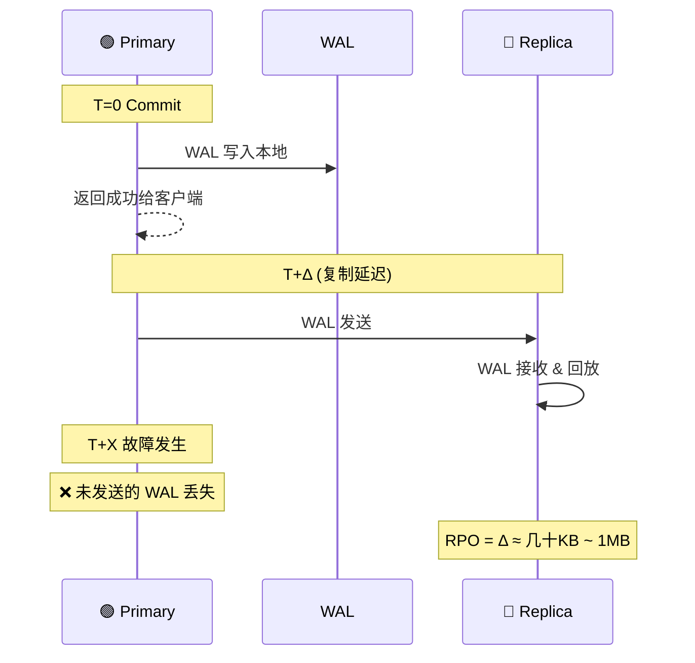

**复制延迟监控**：

```sql
-- 查看复制延迟
SELECT client_addr,
       state,
       sent_lsn,
       write_lsn,
       flush_lsn,
       replay_lsn,
       pg_wal_lsn_diff(sent_lsn, replay_lsn) AS lag_bytes
FROM pg_stat_replication;
```

#### 同步复制模式（RPO = 0）

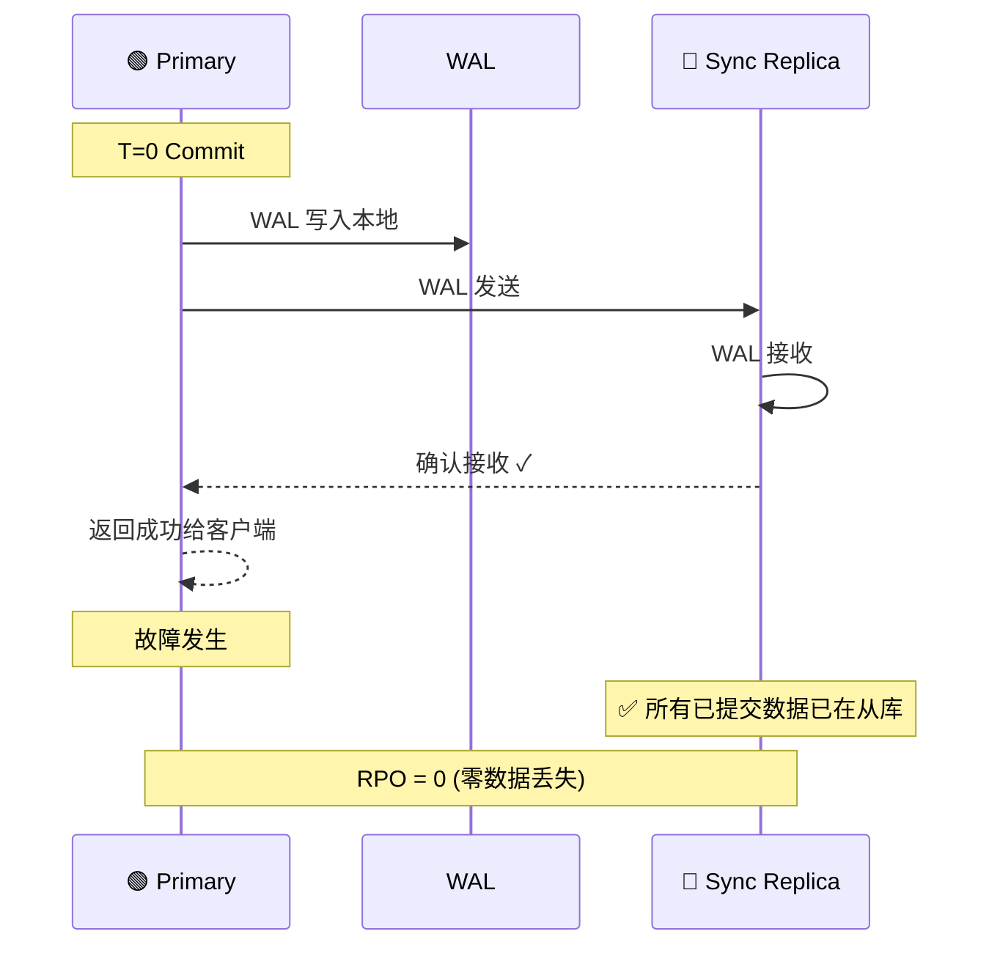

**启用同步复制**：

```yaml
# 使用 crit.yml 模板
pg_conf: crit.yml

# 或设置 RPO = 0
pg_rpo: 0

# Patroni 将自动配置：
# synchronous_mode: true
# synchronous_standby_names: '*'
```

-----------------

### RTO / RPO 权衡矩阵

| 配置模式 | pg_rto | pg_rpo | 实际 RTO | 实际 RPO | 适用场景 |
|:---------|:------:|:------:|:--------:|:--------:|:---------|
| 默认 (OLTP) | 30s | 1MB | 20-40s | < 1MB | 常规业务系统 |
| 快速切换 | 15s | 1MB | 10-20s | < 1MB | 低延迟要求 |
| 零丢失 (CRIT) | 30s | 0 | 20-40s | 0 | 金融核心系统 |
| 保守模式 | 60s | 1MB | 40-80s | < 1MB | 不稳定网络 |

**配置示例**：

```yaml
# 快速切换模式
pg_rto: 15
pg_rpo: 1048576
pg_conf: oltp.yml

# 零丢失模式
pg_rto: 30
pg_rpo: 0
pg_conf: crit.yml

# 保守模式（不稳定网络）
pg_rto: 60
pg_rpo: 1048576
pg_conf: oltp.yml
```

-----------------

## 利弊权衡

### 可用性优先 vs 一致性优先

| 维度 | 可用性优先 (默认) | 一致性优先 (crit) |
|:-----|:------------------|:------------------|
| 同步复制 | 关闭 | 开启 |
| 故障切换 | 快速，可能丢数据 | 谨慎，零数据丢失 |
| 写延迟 | 低 | 高（多一次网络往返） |
| 吞吐量 | 高 | 较低 |
| 从库故障影响 | 无 | 可能阻塞写入 |
| RPO | < 1MB | = 0 |

### RTO 权衡

| 较小 RTO | 较大 RTO |
|:---------|:---------|
| ✅ 故障恢复快 | ✅ 误报风险低 |
| ✅ 业务中断短 | ✅ 网络抖动容忍度高 |
| ❌ 误报切换风险高 | ❌ 故障恢复慢 |
| ❌ 网络要求严格 | ❌ 业务中断长 |

### RPO 权衡

| 较大 RPO | RPO = 0 |
|:---------|:--------|
| ✅ 高性能 | ✅ 零数据丢失 |
| ✅ 高可用（单从库故障无影响） | ✅ 金融合规 |
| ❌ 故障可能丢数据 | ❌ 写延迟增加 |
| | ❌ 同步从库故障影响写入 |

-----------------

## 最佳实践

### 生产环境检查清单

**基础设施**：
- [ ] 至少 3 个节点（PostgreSQL）
- [ ] 至少 3 个节点（Etcd，可与 PG 共用）
- [ ] 节点分布在不同故障域（机架/可用区）
- [ ] 网络延迟 < 10ms（同城）或 < 50ms（异地）
- [ ] 万兆网络（推荐）

**参数配置**：
- [ ] `pg_rto` 根据网络状况调整（15-60s）
- [ ] `pg_rpo` 根据业务需求设置（0 或 1MB）
- [ ] `pg_conf` 选择合适的模板（oltp/crit）
- [ ] `patroni_watchdog_mode` 评估是否需要

**监控告警**：
- [ ] Patroni 状态监控（领导者/复制延迟）
- [ ] Etcd 集群健康监控
- [ ] 复制延迟告警（lag > 1MB）
- [ ] failsafe_mode 激活告警

**灾备演练**：
- [ ] 定期执行故障切换演练
- [ ] 验证 RTO/RPO 是否符合预期
- [ ] 测试备份恢复流程
- [ ] 验证监控告警有效性

### 常见问题排查

**故障切换失败**：
```bash
# 检查 Patroni 状态
patronictl -c /etc/patroni/patroni.yml list

# 检查 Etcd 集群健康
etcdctl endpoint health

# 检查复制延迟
psql -c "SELECT * FROM pg_stat_replication"

# 查看 Patroni 日志
journalctl -u patroni -f
```

**脑裂场景处理**：
```bash
# 1. 确认哪个是"真正"的主库
psql -c "SELECT pg_is_in_recovery()"

# 2. 停止"错误"的主库
systemctl stop patroni

# 3. 使用 pg_rewind 同步
pg_rewind --target-pgdata=/pg/data --source-server="host=<true_primary>"

# 4. 重启 Patroni
systemctl start patroni
```

-----------------

## 相关参数

### [**`pg_rto`**](/docs/pgsql/param#pg_rto)

参数名称： `pg_rto`， 类型： `int`， 层次：`C`

以秒为单位的恢复时间目标（RTO）。默认为 `30` 秒。

此参数用于派生 Patroni 的关键时序参数：
- `ttl` = pg_rto
- `loop_wait` = pg_rto / 3
- `retry_timeout` = pg_rto / 3
- `primary_start_timeout` = pg_rto / 3

减小此值可以加快故障恢复，但会增加误报切换的风险。

### [**`pg_rpo`**](/docs/pgsql/param#pg_rpo)

参数名称： `pg_rpo`， 类型： `int`， 层次：`C`

以字节为单位的恢复点目标（RPO），默认为 `1048576`（1MB）。

- 设为 `0` 启用同步复制，确保零数据丢失
- 设为较大值允许更多复制延迟，提高可用性
- 此值也用于 `maximum_lag_on_failover` 参数

### [**`pg_conf`**](/docs/pgsql/param#pg_conf)

参数名称： `pg_conf`， 类型： `string`， 层次：`C`

Patroni 配置模板，默认为 `oltp.yml`。可选值：

| 模板 | 用途 | 同步复制 | 适用场景 |
|:-----|:-----|:--------:|:---------|
| `oltp.yml` | OLTP 负载 | 否 | 常规业务系统 |
| `olap.yml` | OLAP 负载 | 否 | 分析型应用 |
| `crit.yml` | 关键系统 | 是 | 金融核心系统 |
| `tiny.yml` | 微型实例 | 否 | 开发测试环境 |

### [**`patroni_watchdog_mode`**](/docs/pgsql/param#patroni_watchdog_mode)

参数名称： `patroni_watchdog_mode`， 类型： `string`， 层次：`C`

Watchdog 模式，默认为 `off`。可选值：

- `off`：禁用 watchdog
- `automatic`：如果可用则使用
- `required`：必须使用，否则拒绝启动

Watchdog 用于在极端情况下（如 Patroni 挂起）确保节点自我重启，防止脑裂。

### [**`pg_vip_enabled`**](/docs/pgsql/param#pg_vip_enabled)

参数名称： `pg_vip_enabled`， 类型： `bool`， 层次：`C`

是否启用 L2 VIP，默认为 `false`。

启用后需要配置：
- `pg_vip_address`：VIP 地址（CIDR 格式）
- `pg_vip_interface`：绑定网卡

注意：云环境通常不支持 L2 VIP。

-----------------

## 参考资料

- [Patroni 官方文档](https://patroni.readthedocs.io/)
- [Etcd 官方文档](https://etcd.io/docs/)
- [HAProxy 配置手册](https://www.haproxy.org/download/2.6/doc/configuration.txt)
- [PostgreSQL 流复制](https://www.postgresql.org/docs/current/warm-standby.html)
- [Pigsty 故障演练](/docs/pgsql/tutorial/drill)
