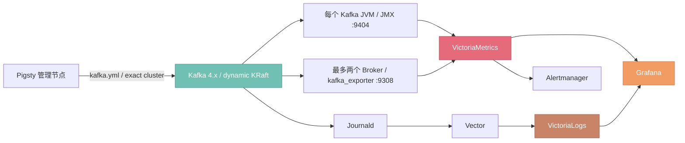

[Kafka](https://kafka.apache.org/) 是一个分布式事件流平台。Pigsty 的 [`KAFKA`](/docs/pilot/kafka) 模块使用 RPM/DEB 软件包，在纳管节点上部署 **Apache Kafka 4.x dynamic KRaft** 集群，并统一管理安全、资源、生命周期与可观测性。

{}
当前 Kafka 模块仍然处于 Pilot / Beta 状态。用于严肃生产环境前请务必充分测试，确保满足业务需求。
包括 dynamic KRaft、严格滚动、TLS/SCRAM/ACL、声明式 Topic/User、凭据与证书轮换，以及完整监控链路。
{}

--------

## 模块能力

KAFKA 模块当前提供：

- 使用原生 dynamic KRaft，不安装 ZooKeeper，也不渲染静态 `controller.quorum.voters`
- 支持 `combined`、`broker`、`controller` 三种原生角色和复合/分离拓扑
- 为新集群随机生成 Cluster ID 与 Controller Directory ID，并以最小 Bootstrap Manifest 保护身份
- 根据实时健康状态选择冷启动/修复、纯 Broker 串行准入或严格单节点滚动路径
- 在滚动前后检查 Controller 多数派与 Voter 追平、Offline Partition、Under Min ISR 与 ISR 追平
- 提供 `plaintext` 与生产 `scram` 两种安全档位；后者启用 TLS、SCRAM-SHA-512、Controller mTLS、ACL 与默认拒绝授权
- 声明式收敛 Topic、用户凭据、ACL 与 Quota，不隐式删除业务 Topic
- 保护性轮换内部凭据与证书，并在失败时保留当前有效材料
- 采集 JMX、Broker、请求、复制、KRaft、Topic、Partition 与 Consumer Group 指标
- 将 Kafka 与 Exporter 日志接入 VictoriaLogs，并提供三个 Grafana Dashboard 与配套告警

--------

## 模块架构

KAFKA 模块依赖 [`NODE`](/docs/node) 完成节点纳管、仓库与基础监控，依赖 [`INFRA`](/docs/infra) 提供 VictoriaMetrics、VictoriaLogs、Grafana 与 Alertmanager。

每个 Kafka JVM 都注入 JMX Exporter 并注册为 `job=kafka`。协议型 `kafka_exporter` 只在按 `kafka_seq` 排序后的前两个 Broker-capable 节点运行；单 Broker 集群只运行一个，纯 Controller 不运行。它们返回的是同一逻辑集群视图，Recording Rule 会先去重再聚合。

--------

## 文档导航

| 文档                                 | 内容                                    |
|:-----------------------------------|:--------------------------------------|
| [快速上手](/docs/pilot/kafka/start)    | 从单节点到三节点安全集群、客户端接入、参数修改与上线检查          |
| [集群配置](/docs/pilot/kafka/config)   | 拓扑、dynamic KRaft、网络、存储、安全与资源声明        |
| [参数参考](/docs/pilot/kafka/param)    | 15 项持久公开参数及临时运维变量                     |
| [日常管理](/docs/pilot/kafka/admin)    | 状态检查、Topic、消息、Consumer Group 与拓扑变更    |
| [预置剧本](/docs/pilot/kafka/playbook) | `kafka.yml` 生命周期、任务标签、轮换与清理保护         |
| [监控告警](/docs/pilot/kafka/monitor)  | 指标链路、Dashboard、日志查询与告警规则              |
| [指标定义](/docs/pilot/kafka/metric)   | JMX、协议 Exporter 与 Recording Rule 指标字典 |
| [常见问题](/docs/pilot/kafka/faq)      | 角色、身份、安全、Exporter 与扩缩容答疑              |
{.full-width}

--------

## 第一次使用

[快速上手](/docs/pilot/kafka/start) 提供一条从零开始、由浅入深的完整路径：

1. 部署一个 combined 单节点开发集群，完成 Topic 与消息读写；
2. 部署独立的三节点 dynamic KRaft 集群，启用 TLS/SCRAM/ACL；
3. 创建应用 Principal、Topic、Quota，并从外部客户端安全接入；
4. 修改 Heap、Broker 与 Topic 参数，观察在线收敛和严格滚动；
5. 按 Quorum、ISR、网络、安全、监控和运行手册完成上线检查。

如果您已经熟悉 Kafka/Pigsty，可以直接进入 [集群配置](/docs/pilot/kafka/config) 或 [参数参考](/docs/pilot/kafka/param)。

--------

## 默认端口

|   端口   | 服务               | 部署范围                   | `plaintext` | `scram`                  |
|:------:|:-----------------|:-----------------------|:------------|:-------------------------|
| `9092` | Kafka Broker     | Broker-capable 节点      | PLAINTEXT   | SASL_SSL + SCRAM-SHA-512 |
| `9093` | KRaft Controller | Controller-capable 节点  | PLAINTEXT   | 双向 TLS                   |
| `9308` | kafka_exporter   | 最多两个 Broker-capable 节点 | HTTP 指标     | HTTP 指标，后端使用 TLS/SCRAM   |
| `9404` | JMX Exporter     | 所有 Kafka 节点            | HTTP 指标     | HTTP 指标                  |
{.full-width}

四个端口必须彼此不同。注意 `9093` 与 Pigsty Infra 节点上 Alertmanager 的默认端口相同：若 Kafka 与 Infra 复用节点，请调整 [`kafka_controller_port`](/docs/pilot/kafka/param#kafka_controller_port)。JMX 与协议 Exporter 的 HTTP 端口仍应通过防火墙限制在监控网络内。

--------

## 当前边界

当前角色提供的是 Kafka 核心生产基线，不替代完整的流平台或托管服务。下列能力仍需显式运行手册或独立组件：

- Controller 增删/替换：集群使用 dynamic quorum，但成员变更必须显式执行格式化、追平与 `add-controller`/`remove-controller` 流程；修改清单本身不会加入或移除 Voter
- Broker 扩容后的既有 Partition Reassignment、Broker 退役与副本再均衡
- 扩容后提升冻结的 `default.replication.factor`：Kafka 4.3 需要显式数据迁移与静态配置维护窗口
- 已有 Topic 的副本因子变更、Topic 删除与用户删除
- 已格式化集群从 `plaintext` 在线迁移到 `scram`
- Kafka 版本升级、Feature Level 终结、数据备份、恢复与灾难演练
- 多 Listener、NAT/公网地址、同一 Broker 多客户端网络、Tiered Storage
- Kafka Connect、Schema Registry、MirrorMaker 2、Cruise Control 与 Web UI

这些边界应在生产方案、审批流程与演练中明确记录，不能用普通清单重跑代替。
